# 🔒 Sistema de Locks

## Conceito

O sistema de locks previne conflitos quando múltiplos agentes precisam acessar os mesmos recursos.

## Políticas de Lock

### Leitura (Read)
- **Múltiplos leitores:** Permitido
- **Lock:** Não requerido
- **Uso:** Auditar, analisar, gerar relatórios

### Escrita (Write)
- **Lock exclusivo:** Requerido
- **Apenas 1 agente:** Por vez
- **Uso:** Modificar arquivos (quando aprovado)

## Estrutura de Lock

```json
{
  "resource": "src/components/Button.tsx",
  "holder": "01",
  "acquired_at": "2025-10-25T10:30:00Z",
  "expires_at": "2025-10-25T10:30:30Z",
  "type": "write"
}
```

## Fluxo de Aquisição

```mermaid
sequenceDiagram
    participant Agent
    participant LockManager
    participant Resource
    
    Agent->>LockManager: acquireLock(resource, agentId)
    LockManager->>Resource: Check if locked
    alt Resource Available
        LockManager->>Resource: Create lock file
        LockManager->>Agent: Lock acquired ✅
        Agent->>Resource: Access resource
        Agent->>LockManager: releaseLock(resource, agentId)
        LockManager->>Resource: Delete lock file
    else Resource Locked
        LockManager->>Agent: Lock failed ❌
        Agent->>Agent: Wait or retry
    end
```



## Implementação

### Adquirir Lock

```typescript
async function acquireLock(
  resource,
  agentId,
  timeout = 30000
) {
  const lockPath = getLockPath(resource);
  const startTime = Date.now();
  
  while (Date.now() - startTime < timeout) {
    if (!fs.existsSync(lockPath)) {
      const lock = {
        resource,
        holder: agentId,
        acquired_at: new Date().toISOString(),
        expires_at: new Date(Date.now() + timeout).toISOString(),
        type: 'write'
      };
      
      fs.writeFileSync(lockPath, JSON.stringify(lock, null, 2));
      return true;
    }
    
    // Aguardar 100ms antes de tentar novamente
    await new Promise(r => setTimeout(r, 100));
  }
  
  return false;
}
```

### Liberar Lock

```typescript
function releaseLock(resource, agentId) {
  const lockPath = getLockPath(resource);
  
  if (!fs.existsSync(lockPath)) {
    return false;
  }
  
  const lock = JSON.parse(fs.readFileSync(lockPath, 'utf8'));
  
  if (lock.holder !== agentId) {
    console.error('Lock não pertence a ' + agentId);
    return false;
  }
  
  fs.unlinkSync(lockPath);
  return true;
}
```

### Verificar Lock

```typescript
function isLocked(resource) {
  const lockPath = getLockPath(resource);
  
  if (!fs.existsSync(lockPath)) {
    return false;
  }
  
  // Verificar se expirou
  const lock = JSON.parse(fs.readFileSync(lockPath, 'utf8'));
  const expiresAt = new Date(lock.expires_at);
  
  if (expiresAt < new Date()) {
    // Lock expirado - remover
    fs.unlinkSync(lockPath);
    return false;
  }
  
  return true;
}
```

## Timeout e Expiração

- **Timeout padrão:** 30 segundos
- **Auto-expiração:** Previne deadlocks
- **Renovação:** Lock pode ser renovado se necessário

## Recursos Críticos

Lista de recursos que **SEMPRE** requerem lock para escrita:

```json
[
  "package.json",
  "tsconfig.json",
  "vite.config.ts",
  "tailwind.config.js",
  "src/components/oraclusx-ds/**/*",
  "src/App.tsx",
  "supabase/migrations/**/*"
]
```

## Boas Práticas

✅ **Sempre** verificar se lock foi adquirido antes de escrever  
✅ **Sempre** liberar lock após uso  
✅ **Nunca** manter lock por mais de 30 segundos  
✅ **Sempre** tratar falha na aquisição de lock  
❌ **Nunca** forçar escrita sem lock  
❌ **Nunca** deletar lock de outro agente  
