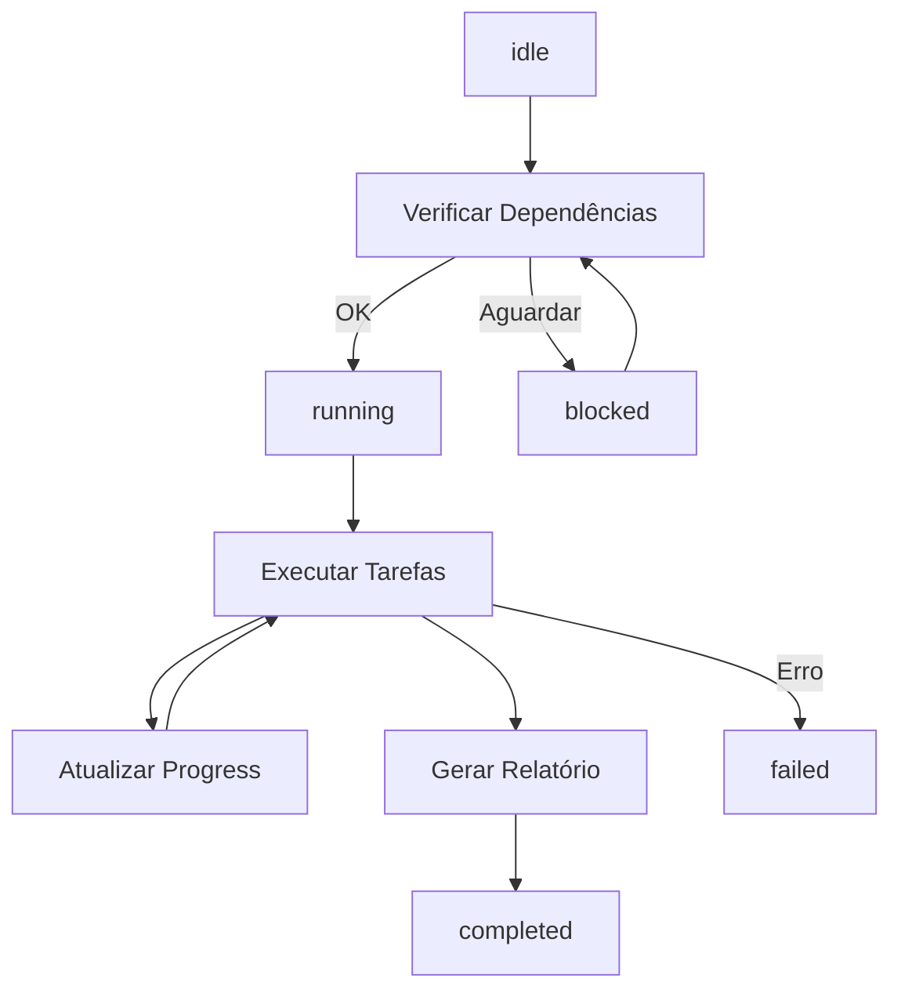

# 🔄 Protocolo de Sincronização

## Estados dos Agentes

Cada agente mantém um arquivo `STATUS.json` com os seguintes estados:

### Estados Possíveis

```typescript
type AgentStatus = 
  | 'idle'       // Aguardando início
  | 'running'    // Em execução
  | 'completed'  // Concluído com sucesso
  | 'failed'     // Falhou (erro crítico)
  | 'blocked';   // Bloqueado (aguardando dependências)
```

### Estrutura do STATUS.json

```json
{
  "agent_id": "01",
  "status": "running",
  "progress": 45,
  "current_task": "Auditando componentes OraclusX DS",
  "locked_resources": ["src/components/oraclusx-ds/*"],
  "errors": [],
  "warnings": ["5 componentes sem testes"]
}
```

## Fluxo de Execução



## Atualização de Status

### 1. Início
```typescript
status.status = 'running';
status.start_time = new Date().toISOString();
status.progress = 0;
```

### 2. Durante Execução
```typescript
status.progress = Math.floor((completedTasks / totalTasks) * 100);
status.current_task = 'Descrição da tarefa atual';
```

### 3. Finalização
```typescript
status.status = 'completed';
status.end_time = new Date().toISOString();
status.progress = 100;
```

## Dependências

Antes de iniciar, verificar se todas as dependências foram satisfeitas:

```typescript
function checkDependencies(agentId) {
  const plan = require('../config/execution-plan.json');
  const deps = []; // implementar getDependencies se necessário
  
  return deps.every(depId => {
    const depStatus = loadStatus(depId);
    return depStatus.status === 'completed';
  });
}
```
