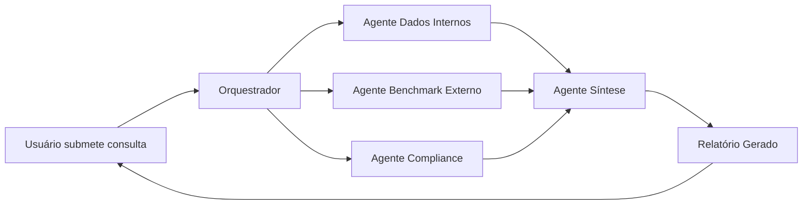

# Arquitetura ICARUS v5.0 (OraclusX) — Documentação Técnica

## 📋 Índice

1. [Visão Geral](#visão-geral)
2. [Componentes Principais](#componentes-principais)
3. [Fluxo de Dados](#fluxo-de-dados)
4. [Pipeline de Agentes](#pipeline-de-agentes)
5. [Metadados e Rastreabilidade](#metadados-e-rastreabilidade)
6. [Stack Tecnológico](#stack-tecnológico)
7. [Rotas e Navegação](#rotas-e-navegação)

---

## 🏗️ Visão Geral

O ICARUS v5.0 é uma plataforma de gestão hospitalar e OPME com arquitetura moderna baseada em:

- **Frontend**: React 18 + TypeScript + Vite
- **Backend**: Supabase (BaaS) + PostgreSQL 15
- **IA**: Pipeline de Agentes Autônomos + GPT-Researcher
- **Integrações**: IoT/RFID, Blockchain, ANVISA, SEFAZ

### Diagrama de Arquitetura


---

## 🔧 Componentes Principais

### 1. Frontend (React 18/TypeScript)

**Responsabilidades:**

- Interface de usuário neumórfica (OraclusX Design System)
- Dashboards interativos
- Painel de controle de agentes
- Formulários inteligentes com validação
- Visualização de dados em tempo real

**Tecnologias:**

- React 18.3 + TypeScript 5.6
- Vite 5.4 (Build Tool)
- Tailwind CSS 3.4 + Neumorphism
- Radix UI Primitives
- React Router v6
- React Hook Form + Zod
- Recharts + Nivo (Gráficos)

**Estrutura de Pastas:**

```
src/
├── components/
│   ├── oraclusx-ds/        # Design System
│   ├── modules/            # Módulos funcionais
│   └── layout/             # Layout (Sidebar, Topbar)
├── pages/                  # Páginas principais
├── hooks/                  # Hooks customizados
├── services/               # Camada de serviços
└── lib/                    # Bibliotecas e utilitários
```

---

### 2. Backend (Supabase + Edge Functions)

**Responsabilidades:**

- Autenticação e autorização (JWT + RLS)
- Business API (CRUD + Lógica de Negócio)
- Banco de dados PostgreSQL
- Storage de arquivos
- Realtime Subscriptions

**Características:**

- **Multi-tenant**: Isolamento por organização
- **RBAC**: Controle de acesso baseado em roles
- **RLS (Row Level Security)**: Segurança a nível de linha
- **Auditoria**: Logs completos de todas as operações

**Banco de Dados:**

- PostgreSQL 15
- pgvector (Embeddings para IA)
- Triggers e Stored Procedures
- Materialized Views para performance
- Índices otimizados

---

### 3. Pipeline de Agentes IA

**Arquitetura:**

```
Usuário → Orquestrador → [Agente 1, Agente 2, Agente 3, ...] → Agente Síntese → Relatório
```

#### 3.1 Orquestrador Central

**Função:** Cérebro do sistema que coordena todos os agentes

**Responsabilidades:**

- Recebe consulta do usuário
- Analisa intenção e contexto
- Cria plano de subtarefas
- Distribui tarefas para agentes especializados
- Monitora progresso em tempo real
- Gera logs de auditoria

**Implementação:** `/src/lib/edr/orchestrator.ts`

#### 3.2 Agentes Especializados

##### Agente Dados Internos

- Consulta banco de dados
- Integra com IoT/RFID
- Analisa histórico
- Identifica padrões
- Calcula KPIs

##### Agente Benchmark Externo

- Pesquisa de preços
- Análise de concorrência
- Tendências de mercado
- Benchmarks setoriais
- Índices de referência

##### Agente Compliance

- Valida com ANVISA
- Verifica UDI/Device ID
- Checa certificações
- Audita documentação
- Gera alertas críticos

##### Agente Síntese

- Agrega dados processados
- Identifica insights chave
- Gera visualizações
- Formata relatório final
- Aplica templates personalizados

---

### 4. Integrações Externas

#### 4.1 IoT/RFID/Blockchain

- **Rastreabilidade**: Tracking de dispositivos médicos
- **Blockchain**: Imutabilidade de registros críticos
- **IoT**: Sensores de temperatura, localização

#### 4.2 Compliance/Regulação

- **ANVISA**: Validação de UDI/Device Registry
- **SEFAZ**: Integração com NFe/NFSe
- **Brasil API**: CEP, CNPJ, Banco Central

#### 4.3 Comunicação

- **SendGrid**: Envio de emails transacionais
- **Twilio**: SMS e WhatsApp
- **Microsoft 365**: Integração com Outlook/Teams

---

## 🔄 Fluxo de Dados

### Fluxo Principal: Usuário → Relatório



### Etapas Detalhadas

1. **Entrada do Usuário**
   - Usuário interage com UI React
   - Formulário valida dados (React Hook Form + Zod)
   - Requisição enviada para backend

2. **Autenticação & Autorização**
   - JWT Token validado
   - Permissões verificadas (RBAC)
   - RLS aplicado automaticamente

3. **Processamento Business API**
   - Validação de regras de negócio
   - Transformação de dados
   - Orquestração de lógica complexa

4. **Persistência no PostgreSQL**
   - Dados salvos com transações ACID
   - Triggers executados
   - Logs de auditoria gerados

5. **Pipeline de Agentes (Opcional)**
   - Orquestrador cria plano
   - Agentes executam em paralelo
   - Resultados consolidados

6. **Resposta ao Cliente**
   - Dados formatados e otimizados
   - Cache aplicado quando possível
   - UI atualizada em tempo real

---

## 📊 Metadados e Rastreabilidade

### Estrutura de Dados

#### Tabela: `agent_tasks`

```sql
CREATE TABLE agent_tasks (
  id UUID PRIMARY KEY DEFAULT uuid_generate_v4(),
  titulo VARCHAR(200) NOT NULL,
  status VARCHAR(20) DEFAULT 'pending', -- pending, running, completed, failed
  plano JSONB, -- Plano de subtarefas
  prioridade INTEGER DEFAULT 5,
  created_at TIMESTAMP DEFAULT NOW(),
  updated_at TIMESTAMP DEFAULT NOW()
);
```

#### Tabela: `agent_logs`

```sql
CREATE TABLE agent_logs (
  id UUID PRIMARY KEY DEFAULT uuid_generate_v4(),
  task_id UUID REFERENCES agent_tasks(id),
  nome_agente VARCHAR(100) NOT NULL,
  timestamp TIMESTAMP DEFAULT NOW(),
  fonte_dados VARCHAR(200),
  tipo_operacao VARCHAR(50),
  resultado JSONB,
  duracao_ms INTEGER
);
```

#### Tabela: `agent_reports`

```sql
CREATE TABLE agent_reports (
  id UUID PRIMARY KEY DEFAULT uuid_generate_v4(),
  task_id UUID REFERENCES agent_tasks(id),
  status VARCHAR(20) DEFAULT 'draft', -- draft, published
  conteudo TEXT,
  metadados JSONB,
  versao INTEGER DEFAULT 1,
  created_at TIMESTAMP DEFAULT NOW(),
  published_at TIMESTAMP
);
```

### Benefícios

✅ **Supervisão Humana**: Usuário pode intervir após orquestrador gerar plano
✅ **Transparência Total**: Saber exatamente quais agentes, fontes e passos foram executados
✅ **Automação com Controle**: Reduz esforço manual mantendo auditoria de processos críticos
✅ **Rastreabilidade OPME**: Compliance completo para dispositivos médicos

---

## 🛠️ Stack Tecnológico Completo

### Frontend

- React 18.3 + TypeScript 5.6
- Vite 5.4 (Build Tool)
- Tailwind CSS 3.4
- Radix UI Primitives
- React Router v6
- React Hook Form + Zod
- Recharts + Nivo (Gráficos)
- Lucide React (Ícones)

### Backend & Database

- Supabase (BaaS)
- PostgreSQL 15
- Supabase Auth + RLS
- Edge Functions (Deno)
- Realtime Subscriptions
- Storage (Arquivos)

### Integrações & APIs

- ANVISA (UDI/Device Registry)
- SEFAZ (NFe/NFSe)
- Brasil API (CEP/CNPJ)
- SendGrid (Email)
- Twilio (SMS/WhatsApp)
- Tesseract.js (OCR)
- MeiliSearch (Search)

### IA & Machine Learning

- GPT-Researcher (Research)
- Ollama (Local LLMs)
- pgvector (Embeddings)
- Agentes Autônomos
- Análise Preditiva

### DevOps & Infraestrutura

- Vercel (Hosting)
- GitHub Actions (CI/CD)
- Docker (Containers)
- PM2 (Process Manager)
- Nginx (Reverse Proxy)

### Qualidade & Testes

- Vitest (Unit Tests)
- Playwright (E2E Tests)
- ESLint + Prettier
- Lighthouse (Performance)
- Axe (Acessibilidade)

---

## 🗺️ Rotas e Navegação

### Rotas Públicas

- `/login` - Login de usuários
- `/signup` - Cadastro de novos usuários
- `/reset-password` - Recuperação de senha
- `/contato` - Formulário de contato

### Rotas Protegidas (Requerem Autenticação)

#### Dashboard

- `/` ou `/dashboard` - Dashboard Principal

#### Cadastros

- `/cadastros` - Dashboard de Cadastros
- `/cadastros/medicos` - Cadastro de Médicos
- `/cadastros/hospitais` - Cadastro de Hospitais
- `/cadastros/pacientes` - Cadastro de Pacientes
- `/cadastros/convenios` - Cadastro de Convênios
- `/cadastros/fornecedores` - Cadastro de Fornecedores
- `/cadastros/produtos` - Cadastro de Produtos OPME
- `/cadastros/equipes` - Cadastro de Equipes Médicas
- `/cadastros/transportadoras` - Cadastro de Transportadoras
- `/cadastros/tabelas-precos` - Tabelas de Preços

#### Compras

- `/compras` - Dashboard de Compras
- `/compras/cotacoes` - Gestão de Cotações
- `/compras/pedidos` - Pedidos de Compra
- `/compras/notas` - Notas Fiscais de Compra
- `/compras/pesquisa` - Pesquisa de Preços

#### Operacional

- `/cirurgias` - Gestão de Cirurgias e Procedimentos
- `/estoque` - Gestão de Estoque com IA
- `/estoque/consignacao` - Consignação Avançada
- `/vendas` - CRM e Vendas

#### Financeiro

- `/financeiro` - Dashboard Financeiro
- `/financeiro/contas-pagar` - Contas a Pagar
- `/financeiro/contas-receber` - Contas a Receber
- `/financeiro/fluxo-caixa` - Fluxo de Caixa

#### Compliance & Relatórios

- `/compliance` - Compliance e Auditoria
- `/relatorios` - Relatórios Regulatórios

#### IA & Automação

- `/chatbot` - Assistente IA (GPT-Researcher)
- `/dashboard-ia` - Dashboard de Inteligência Artificial
- `/agentes` - **Fluxo de Agentes** (NOVO)
- `/modules/workflow-builder` - Construtor de Workflows
- `/modules/campanhas` - Gestão de Campanhas

#### Administração

- `/usuarios` - Gestão de Usuários e Permissões
- `/configuracoes` - Configurações do Sistema
- `/arquitetura` - **Arquitetura do Sistema** (NOVO)
- `/integracoes/credenciais` - Gerenciador de Credenciais
- `/modules/system-health` - Monitoramento de Sistema

---

## 📝 Exemplo de Uso: Análise de Estoque

### Cenário

Usuário solicita: **"Gere relatório de estoque de OPME com análise de compliance"**

### Fluxo de Execução

1. **Requisição Recebida**
   - Frontend envia POST para `/api/agents/tasks`
   - JWT validado, permissões verificadas

2. **Orquestrador Cria Plano**

   ```json
   {
     "taskId": "task-001",
     "plan": [
       { "agent": "internal-data", "action": "query-stock" },
       { "agent": "compliance", "action": "verify-udi" },
       { "agent": "benchmark", "action": "price-analysis" },
       { "agent": "synthesis", "action": "generate-report" }
     ]
   }
   ```

3. **Agentes Executam em Paralelo**
   - **Agente Dados Internos**: Consulta estoque no PostgreSQL
   - **Agente Compliance**: Valida UDI com ANVISA
   - **Agente Benchmark**: Pesquisa preços no mercado

4. **Logs Gerados**

   ```sql
   INSERT INTO agent_logs (task_id, nome_agente, fonte_dados, resultado)
   VALUES ('task-001', 'internal-data', 'postgresql', '{"items": 150, ...}');
   ```

5. **Agente Síntese Consolida**
   - Agrega resultados
   - Identifica insights
   - Formata relatório executivo

6. **Relatório Disponível em Draft**
   - Status: `draft`
   - Usuário pode revisar antes de publicar
   - Opção de editar ou republish

7. **Publicação Final**
   - Status: `published`
   - PDF gerado
   - Email enviado aos stakeholders

---

## 🚀 Como Executar

### Desenvolvimento

```bash
# Instalar dependências
pnpm install

# Iniciar servidor de desenvolvimento
pnpm dev

# Abrir em http://localhost:5173
```

### Build para Produção

```bash
# Verificar tipos
pnpm type-check

# Build otimizado
pnpm build

# Preview da build
pnpm preview
```

### Testes

```bash
# Testes unitários
pnpm test

# Testes E2E
pnpm test:e2e

# Coverage
pnpm test:coverage
```

---

## 📞 Contato e Suporte

- **Email**: contato@icarus.com.br
- **Telefone**: (11) 3456-7890
- **Documentação**: `/arquitetura` e `/agentes` (no sistema)

---

## 📄 Licença

© 2024 ICARUS v5.0 (OraclusX) - Todos os direitos reservados.
