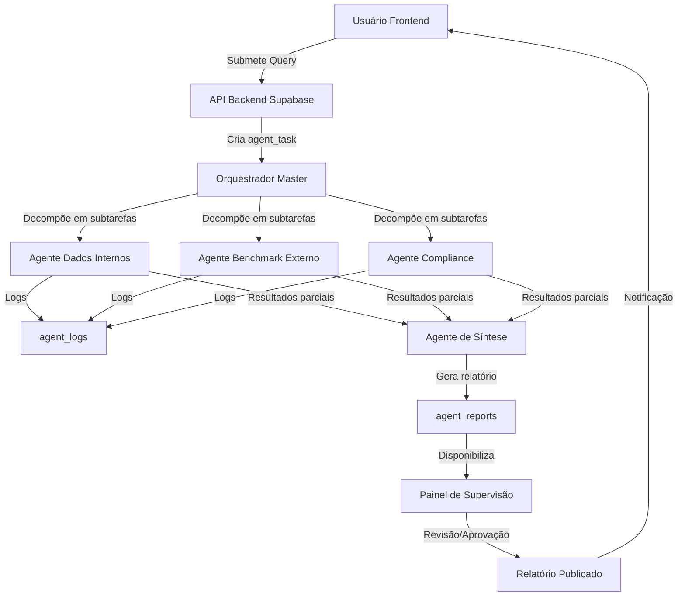

# Arquitetura Técnica — Sistema ICARUS v5.0 (OraclusX)

**Data**: 2025-10-26  
**Versão**: 1.0.0  
**Autor**: Equipe OraclusX DS

## 1. Visão Geral

Este documento descreve a arquitetura técnica para integração de um sistema de **agentes multi-agente orientados para análise profunda** inspirado no framework Enterprise Deep Research (EDR) da Salesforce AI Research. O objetivo é habilitar no ICARUS capacidades de decomposição adaptativa de consultas, orquestração de agentes especializados, rastreabilidade e geração automática de relatórios para o domínio de OPME (órteses, próteses e materiais especiais), estoque, rastreabilidade, IoT, compliance e cadeia médica.

## 2. Camadas Principais da Arquitetura

### 2.1 Apresentação (Frontend)

- **Tecnologias**: React 18 + TypeScript 5.6 + Vite 5.4 + TailwindCSS v3.4 (já presentes no ICARUS)
- **Responsabilidades**: interface de usuário, dashboards, relatórios, painel de controle dos agentes, supervisão humana (steering)
- **Módulo específico**: «Painel de Controle de Agentes» — nova rota `/agentes` onde usuários poderão ver status de tarefas dos agentes, intervir, revisar relatórios gerados

### 2.2 Backend de Aplicação

- **Tecnologias**: Supabase (PostgreSQL + Auth + Realtime + Edge Functions) — já em uso no ICARUS
- **Responsabilidades**:
  - Autenticação/Autorização (RBAC)
  - APIs CRUD para negócio (cadastros, cirurgias, estoque, consignação, compliance)
  - Endpoints para orquestração de agentes (iniciar consulta, status, revisão, relatório)
  - Storage de logs e metadados de execução dos agentes (ex: `agent_tasks`, `agent_logs`, `agent_reports`)

### 2.3 Pipeline de Agentes Multi-Agente

Inspirado no EDR:

- **Orquestrador ("Master Planning Agent")**: recebe solicitação do usuário/painel, decomõe em sub-tarefas, define prioridades, designa agentes.
- **Agentes Especializados** (exemplos):
  - agente de _Recuperação de Dados Internos_ (ERP/IoT/Estoque)
  - agente de _Benchmark Externo_ (publicações, fornecedores, mercado)
  - agente de _Compliance/Regulação_ (ex: ANVISA, UDI, RDC)
  - agente de _Síntese & Relatório_ (gera texto, gráficos, PDF)
- **Reflexão / Controle Humano**: O sistema armazena um arquivo de tarefas pendentes (ex: `todo.md`) que pode ser revisado e ajustado por usuários-supervisores.
- **Fluxo**:
  1. Usuário submete consulta (via frontend) → backend registra e aciona orquestrador
  2. Orquestrador gera plano de ação → grava em `agent_tasks`
  3. Paralelamente agentes especializados executam subtarefas → gravam logs em `agent_logs`
  4. Agente de síntese consolida resultados → gera relatório → grava em `agent_reports`
  5. Painel frontend apresenta status, permite intervenção humana (aprovar/editar) → relatório final disponibilizado ao usuário.

## 3. Esquema de Dados Principais

### 3.1 Tabelas de Orquestração

```sql
CREATE TABLE agent_tasks (
  task_id UUID PRIMARY KEY DEFAULT gen_random_uuid(),
  query_text TEXT NOT NULL,
  status TEXT DEFAULT 'pending', -- pending / in_progress / completed / failed
  created_at TIMESTAMP WITH TIME ZONE DEFAULT now(),
  updated_at TIMESTAMP WITH TIME ZONE DEFAULT now(),
  metadata JSONB -- plano gerado, subtarefas, prioridades
);

CREATE TABLE agent_logs (
  log_id UUID PRIMARY KEY DEFAULT gen_random_uuid(),
  task_id UUID REFERENCES agent_tasks(task_id) ON DELETE CASCADE,
  agent_name TEXT NOT NULL,
  event_time TIMESTAMP WITH TIME ZONE DEFAULT now(),
  action TEXT NOT NULL,
  details JSONB
);

CREATE TABLE agent_reports (
  report_id UUID PRIMARY KEY DEFAULT gen_random_uuid(),
  task_id UUID REFERENCES agent_tasks(task_id) ON DELETE CASCADE,
  created_at TIMESTAMP WITH TIME ZONE DEFAULT now(),
  report_type TEXT, -- e.g., 'consumo_opme', 'compliance_summary'
  content TEXT, -- markdown ou html
  status TEXT DEFAULT 'draft', -- draft / reviewed / published
  reviewer_user_id UUID REFERENCES profiles(id),
  published_at TIMESTAMP WITH TIME ZONE
);
```

### 3.2 Integrações com o Modelo de Negócio

As tabelas acima se relacionam com as tabelas de negócio existentes (ex: `estoque`, `cirurgias`, `consignacao_materiais`). Os agentes poderão executar queries ou APIs internas para extrair dados e compor os relatórios.

## 4. Componentes Técnicos / Ferramentas

### 4.1 Orquestração de Agentes

- Pode ser implementado como uma função Edge/Serverless no Supabase que aciona o orquestrador (ex: `functions/orchestrator.ts`).
- O orquestrador utiliza modelo LLM (por exemplo via API OpenAI/Azure/Anthropic) para decompor consultas.
- Usa fila ou estado (ex: registros em banco) para gerenciar subtarefas.

### 4.2 Agentes Especializados

Cada agente seria um micro-serviço ou função que:

- Recebe subtarefa (via DB ou mensagem)
- Executa operação: consulta base de dados, busca web, aplica modelo AI, etc
- Grava log e resultado parcial

### 4.3 Síntese e Relatório

- Um agente final coleta todos resultados das subtarefas, normaliza as informações, aplica lógica de template, gera saída em Markdown ou HTML e converte para PDF se necessário.
- O frontend disponibiliza relatório ao usuário e permite revisão.

### 4.4 Dashboard de Supervisão

- Rota `/agentes` no frontend
- Mostra lista de `agent_tasks`, status, logs selecionáveis
- Permite ao usuário intervir: cancelar tarefa, reespecificar query, alterar prioridade, aprovar relatório.

## 5. Fluxo de Dados & Integração com Negócio

1. Usuário no frontend preenche "Nova Análise" → envia query e parâmetros (ex: hospital, período, materiais OPME)
2. Backend cria `agent_tasks` registro
3. Orquestrador analisa query, gera plano, subdivide → grava subtasks em metadata
4. Sub-agentes executam:
   - **Dados internos (ERP/IoT)** → SQL/REST → retorna dataset
   - **Benchmark externo** → busca web/publicações → retorna links/resumos
   - **Compliance** → valida regras (ex: UDI/RDC 925) → retorna conformidade
5. Agente de síntese recebe dados → compila relatório → grava em `agent_reports`
6. Frente de interface permite usuário visualizar, revisar, aprovar → muda status para "published" e envia notificação (e-mail/SMS)
7. Relatório arquivado, logs mantidos, histórico acessível para auditoria

## 6. Segurança, Compliance e Governança

- Todas interações com agentes gravam logs com metadados para **rastreabilidade completa**.
- Funções de "steering" permitem **intervenção humana** em qualquer etapa, atendendo exigências regulatórias.
- Uso de **RLS (Row Level Security)** e **RBAC** no Supabase já implementado no ICARUS garante segregação de dados multi-tenant.
- Acesso aos LLMs / agentes deve registrar **consumo e custos**.
- Priorização de dados sensíveis: se agente buscar dados externos, revisar termos de uso, anonimização se necessário.

## 7. Considerações de Implementação

- Começar com um **MVP**: por exemplo, agente unificado simples (entrada → busca dados internos → relatório) antes de escalar para multi-agente completo.
- **Monitorar** uso de tokens/custos de LLMs e paralelização de agentes.
- Garantir que a arquitetura de agentes possa **crescer** (adicionar novos agentes) sem refatorar toda a orquestração — modularização é crítica.
- Manter **interface de logs** e painel de supervisão para dar visibilidade aos usuários e auditores.

## 8. Tecnologias Recomendadas

- **LLM Provider**: OpenAI (GPT-4), Anthropic (Claude), ou modelos locais conforme orçamento.
- **Orquestração**: função Edge ou micro-serviço Node/TS com chamada à LLM e controle de subtarefas.
- **Mensageria**: banco (Supabase) ou fila leve (ex: Redis, BullMQ) para subtarefas paralelas.
- **Relatórios**: Markdown → HTML/PDF via biblioteca (ex: `markdown-pdf`, `puppeteer`).
- **Frontend**: módulo `/agentes`, reutilizando OraclusX DS componentes.

## 9. Cronograma Sugerido

| Fase                                  | Entrega                                                       | Duração estimada |
| ------------------------------------- | ------------------------------------------------------------- | ---------------- |
| **Fase 1 – MVP**                      | Agente unificado básico + relatório simples                   | 2 semanas        |
| **Fase 2 – Multi-agente básico**      | Orquestrador + 2 agentes especializados + painel supervisão   | 4 semanas        |
| **Fase 3 – Integrações completas**    | Agentes para benchmark externo, compliance, painel refinado   | 6 semanas        |
| **Fase 4 – Escalonamento & produção** | Monitoramento, logs, custo, otimização, customização refinada | 4 semanas        |

## 10. Mapa de Benefícios EDR Adaptado ao OraclusX

| Nº  | Benefício EDR                                                                                                                                                    | Aplicação no seu contexto                                                                                                                                                                                                                                             | Passos para implementação                                                                                                                                                                                                                                                          |
| --- | ---------------------------------------------------------------------------------------------------------------------------------------------------------------- | --------------------------------------------------------------------------------------------------------------------------------------------------------------------------------------------------------------------------------------------------------------------- | ---------------------------------------------------------------------------------------------------------------------------------------------------------------------------------------------------------------------------------------------------------------------------------- |
| 1   | Multi-agente orquestração + decomposição adaptativa da tarefa (Master Planning Agent)                                                                            | No ICARUS/OraclusX, você pode ter um agente "Planejamento" que recebe consultas como "Analisar consumo de materiais OPME para hospitais X,Y no trimestre" e que decomponha em subtarefas: dados internos ERP, IoT + estoque, benchmark fornecedor, compliance ANVISA. | a) Definir "perguntas-chave" que seu sistema deve responder.<br>b) Modelar subtarefas e agentes correspondentes (ex: Agente ERP, Agente IoT, Agente Benchmark externo).<br>c) Integrar via API ou serviço de orquestração (ex: Node/TS ou Python).                                 |
| 2   | Capacidade de agregar fontes heterogêneas (web, bases internas, arquivos, documentos) e trabalhar com análise de arquivos externas + ferramentas "MCP ecosystem" | Você lida com dados de estoque, rastreabilidade, logs de IoT, relatórios clínicos, fornecedores, regulatórias — o EDR permite buscar/mesclar tudo isso em relatórios.                                                                                                 | a) Mapear fontes de dados (ERP, RFID/IoT, fornecedores, publicações clínicas, regulatórias).<br>b) Construir conectores ou "tools" para ingestão/consulta (ex: APIs, SQL, arquivos CSV/JSON).<br>c) Implementar agente de integração que execute "busca + normalização + síntese". |
| 3   | Transparência, rastreabilidade e "steerability" — intervenção humana durante execução + rastreamento de proveniência                                             | Para setor médico/OPME, compliance e auditoria são críticos: você poderá demonstrar "quem/como" o relatório foi gerado, o que justificou determinada recomendação, permitindo auditoria.                                                                              | a) Gerar logs detalhados de execução (ex: tarefa X, agente Y, fonte Z, timestamp).<br>b) Interface para intervenção humana (ex: painel de controle "revisar subtarefas").<br>c) Armazenar metadados de proveniência junto com o output (relatório).                                |
| 4   | Geração automática de relatórios estruturados (Markdown, visualização) com evidências                                                                            | Você poderá automatizar relatórios para hospitais, operadoras, fornecedores — por exemplo: "relatório trimestral de consumo vs previsão vs glosas detectadas".                                                                                                        | a) Definir template(s) de relatório (estrutura, seções, gráficos).<br>b) Implementar função de síntese que combine dados + gráficos + textos.<br>c) Automatizar publicação ou envio (ex: e-mail, portal).                                                                          |
| 5   | Escalabilidade empresarial (projetado para ambientes corporativos, "enterprise analytics")                                                                       | O seu sistema já está orientado para multi-tenants, vários hospitais/operadoras, grandes volumes de dados, rastreabilidade IoT/Blockchain — essa arquitetura acelera maturidade.                                                                                      | a) Verificar infraestrutura para suportar múltiplas "empresas"/tenants.<br>b) Dimensionar serviços de agentes e pipelines de dados.<br>c) Monitorar desempenho + custo + segurança.                                                                                                |
| 6   | Suporte à compliance/monitoramento contínuo                                                                                                                      | No contexto de OPME, rastreabilidade (RDC 925, UDI), ANVISA exigências, auditorias serão facilitadas com esse tipo de sistema.                                                                                                                                        | a) Mapear regras de compliance aplicáveis (ex: rastreabilidade, validade, contratos de consignação).<br>b) Criar agente de "Compliance Monitor" que faz validação contínua.<br>c) Integrar alertas e painéis de conformidade para gestores.                                        |

## 11. Próximos Passos Sugeridos

1. **Workshop interno** com stakeholders (gestão de OPME, TI, compliance) para validar quais perguntas de negócio devem ser automatizadas via esse sistema de agentes.
2. **Prototipagem rápida** de um caso de uso piloto — por exemplo: "Relatório de consumo + previsão de demanda + custo evitado para hospital X no próximo trimestre".
3. **Mapeamento técnico** de fontes de dados (já estão em ICARUS: estoque, consignação, cirurgias etc) para ver qual agente vai operar.
4. **Desenho arquitetural**: definir como vai se orquestrar os agentes (escolha de framework, linguagem, API, filas, logs).
5. **Construção do módulo mínimo viável (MVP)**: 1 agente, 1 relatório automático, 1 painel de controle humano.
6. **Avaliação e refinamento**: testar usabilidade, performance, acurácia das previsões/relatórios; depois escalar para múltiplos casos.

## 12. Diagrama de Fluxo (Conceitual)



## 13. Conclusão

Esta arquitetura permitirá ao ICARUS v5.0 incorporar capacidades avançadas de análise impulsionadas por IA, mantendo cumprimento regulatório, rastreabilidade, e entregando relatórios de valor para médicos, hospitais, operadoras e distribuidores. A modularidade permite escalar, adicionar novos agentes e adaptar a novos casos de uso no futuro.

---

**Referências**:

- Salesforce AI Research - Enterprise Deep Research (EDR) Framework
- Arquitetura ICARUS v5.0 existente
- Documentação OraclusX Design System
- Requisitos regulatórios ANVISA (RDC 925, UDI)
