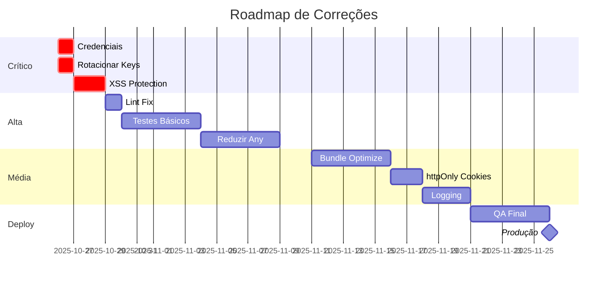

# 🔍 AUDITORIA DE CÓDIGO - DOCUMENTAÇÃO COMPLETA

**Data da Auditoria:** 26 de Outubro de 2025  
**Versão:** 1.0.0  
**Status do Projeto:** 🔴 NÃO PRONTO PARA PRODUÇÃO

---

## 📚 DOCUMENTOS DISPONÍVEIS

### 1️⃣ Para Executivos e Gestores

#### 📊 [SUMARIO_EXECUTIVO_AUDITORIA.md](./SUMARIO_EXECUTIVO_AUDITORIA.md)

**Leitura: 3 minutos**

Visão geral com scores, principais problemas e timeline de correções.

- Score geral: 72/100
- 3 bloqueadores críticos
- Tempo para produção: 4-6 semanas

👉 **Comece por aqui se você é:**

- CEO / CTO
- Product Manager
- Stakeholder não-técnico

---

### 2️⃣ Para Desenvolvedores

#### 🔧 [ACOES_IMEDIATAS_AUDITORIA.md](./ACOES_IMEDIATAS_AUDITORIA.md)

**Leitura: 10 minutos**

Guia prático passo-a-passo para correções.

- Comandos prontos para executar
- Exemplos de código correto
- Checklist de execução

👉 **Use este se você vai:**

- Implementar correções
- Executar tarefas P0/P1
- Precisa de código de exemplo

#### 📋 [RELATORIO_AUDITORIA_CODIGO.md](./RELATORIO_AUDITORIA_CODIGO.md)

**Leitura: 20 minutos**

Relatório técnico completo e detalhado.

- Análise profunda de cada issue
- Métricas detalhadas
- Recomendações arquiteturais

👉 **Leia este se você é:**

- Tech Lead
- Arquiteto de Software
- Senior Developer

---

### 3️⃣ Para Ferramentas e Integração

#### 📁 [RELATORIO_AUDITORIA_CODIGO.json](./RELATORIO_AUDITORIA_CODIGO.json)

**Formato: JSON estruturado**

Dados completos da auditoria em formato processável.

- Importar em dashboards
- Integrar com CI/CD
- Análise automatizada

👉 **Use para:**

- Integração com Jira/Linear
- Dashboards de métricas
- Scripts de automação

---

### 4️⃣ Para Segurança

#### 🔒 [.github/SECURITY_CHECKLIST.md](./.github/SECURITY_CHECKLIST.md)

**Checklist interativo**

Lista de verificação de segurança com progresso.

- Items P0, P1, P2
- Tracking de progresso
- Responsáveis

👉 **Use para:**

- Tracking de correções
- Security reviews
- Auditorias de compliance

---

### 5️⃣ Automação

#### ⚙️ [scripts/audit/fix-critical-issues.sh](./scripts/audit/fix-critical-issues.sh)

**Script de correção automática**

Automatiza correções onde possível.

- Instala dependências
- Executa lint fix
- Cria backups
- Gera patches

**Executar:**

```bash
bash scripts/audit/fix-critical-issues.sh
```

---

## 🚨 COMEÇAR AGORA - GUIA RÁPIDO

### Se você tem apenas 5 minutos:

1. Leia: [SUMARIO_EXECUTIVO_AUDITORIA.md](./SUMARIO_EXECUTIVO_AUDITORIA.md)
2. Execute:
   ```bash
   # Verificar problemas críticos
   grep "ttswvavcisdnonytslom" env.example
   ```

### Se você tem 30 minutos:

1. Leia: [ACOES_IMEDIATAS_AUDITORIA.md](./ACOES_IMEDIATAS_AUDITORIA.md) - Seção P0
2. Execute:
   ```bash
   bash scripts/audit/fix-critical-issues.sh
   ```
3. Corrija manualmente: credenciais no env.example

### Se você tem 2 horas:

1. Leia: [RELATORIO_AUDITORIA_CODIGO.md](./RELATORIO_AUDITORIA_CODIGO.md)
2. Execute:

   ```bash
   # Correções automáticas
   bash scripts/audit/fix-critical-issues.sh

   # Instalar DOMPurify
   pnpm add dompurify @types/dompurify

   # Corrigir lint
   pnpm lint --fix
   ```

3. Implementar sanitização XSS (3 arquivos)

---

## 📊 VISÃO GERAL DOS PROBLEMAS

### 🔴 CRÍTICOS (Bloqueiam Deploy)

| ID       | Problema             | Impacto    | Esforço | Arquivo     |
| -------- | -------------------- | ---------- | ------- | ----------- |
| SEC-001  | Credenciais expostas | 🔴 CRÍTICO | 5 min   | env.example |
| QUAL-002 | Testes < 10%         | 🔴 CRÍTICO | 2 sem   | -           |
| SEC-002  | XSS vulnerável       | 🔴 ALTO    | 2h      | 3 arquivos  |

### 🟠 ALTOS (Urgentes)

| ID       | Problema        | Impacto  | Esforço |
| -------- | --------------- | -------- | ------- |
| QUAL-001 | 109 'any' types | 🟠 ALTO  | 1 sem   |
| QUAL-003 | 28 erros lint   | 🟠 MÉDIO | 1 dia   |
| PERF-001 | Bundle 1.7MB    | 🟠 MÉDIO | 1 sem   |

### 🟡 MÉDIOS (Importantes)

| ID       | Problema        | Impacto  | Esforco |
| -------- | --------------- | -------- | ------- |
| SEC-003  | localStorage    | 🟡 MÉDIO | 2 dias  |
| PERF-002 | 867 console.log | 🟡 BAIXO | 3 dias  |
| ARQ-001  | Organização     | 🟡 BAIXO | 1 dia   |

---

## 🎯 ROADMAP DE CORREÇÕES



---

## 📈 MÉTRICAS DO PROJETO

### Tamanho do Código

- **Arquivos:** 498
- **Linhas de código:** 114.731
- **Componentes:** 569
- **Hooks:** 38
- **Services:** 51

### Scores por Categoria

```
Segurança:     ████████████████░░░░  65/100 🔴
Performance:   ████████████████████░  82/100 🟢
Qualidade:     ███████████░░░░░░░░░  58/100 🟡
Arquitetura:   █████████████████████  85/100 🟢
```

### Distribuição de Issues

- 🔴 Críticas: 3
- 🟠 Altas: 4
- 🟡 Médias: 3
- ⚪ Baixas: 2

---

## 🔄 PROCESSO DE CORREÇÃO

### 1. Priorização

```
P0 (Bloqueadores) → P1 (Alta) → P2 (Média) → P3 (Baixa)
```

### 2. Workflow

```
Issue → Branch → Fix → Test → PR → Review → Merge
```

### 3. Critérios de Aceitação

- [ ] Testes passando
- [ ] Lint sem erros
- [ ] Type check OK
- [ ] Code review aprovado
- [ ] Documentação atualizada

---

## 🛠️ FERRAMENTAS ÚTEIS

### Verificação Rápida

```bash
# Status geral
pnpm validate:all

# Apenas lint
pnpm lint

# Apenas types
pnpm type-check

# Testes
pnpm test

# Testes com cobertura
pnpm test:coverage
```

### Correções Automáticas

```bash
# Lint fix
pnpm lint --fix

# Prettier
pnpm format

# Script de auditoria
bash scripts/audit/fix-critical-issues.sh
```

### Análise

```bash
# Bundle analyzer
pnpm build
npx vite-bundle-visualizer

# Dependências
pnpm audit

# Outdated packages
pnpm outdated
```

---

## 📞 CONTATOS E RESPONSÁVEIS

### Time de Correções

| Área        | Responsável     | Tarefas                |
| ----------- | --------------- | ---------------------- |
| Segurança   | [DevOps Lead]   | P0 - Credenciais, Keys |
| Frontend    | [Frontend Lead] | XSS, Lint, Types       |
| QA          | [QA Lead]       | Testes, Coverage       |
| Arquitetura | [Tech Lead]     | Code Review, Padrões   |

### Canais

- 🚨 **Urgente:** #icarus-security
- 💬 **Discussão:** #icarus-audit
- 📊 **Updates:** #icarus-progress

---

## 📅 CRONOGRAMA

### Semana 1 (26/10 - 01/11)

- ✅ Auditoria completa
- 🔴 P0 - Segurança crítica
- 🟠 P1 - Início testes

### Semana 2-3 (02/11 - 15/11)

- 🟠 P1 - Testes + Qualidade
- 🟡 P2 - Otimizações

### Semana 4-5 (16/11 - 29/11)

- 🟡 P2 - Continuação
- ✅ QA Final

### Semana 6 (30/11 - 06/12)

- 🚀 Deploy Staging
- 🚀 Deploy Produção

---

## ✅ CRITÉRIOS DE SUCESSO

### Para Deploy em Produção

#### Obrigatórios (Must Have)

- [x] Auditoria completa ✅
- [ ] Credenciais removidas 🔴
- [ ] Chaves rotacionadas 🔴
- [ ] XSS corrigido 🔴
- [ ] Testes > 30% 🔴
- [ ] Lint 0 erros 🔴

#### Recomendados (Should Have)

- [ ] Testes > 50% 🟠
- [ ] Any types < 20 🟠
- [ ] Bundle < 1.2MB 🟠
- [ ] httpOnly cookies 🟡

#### Desejáveis (Nice to Have)

- [ ] Testes > 80% 🟡
- [ ] Any types < 10 🟡
- [ ] Bundle < 1MB 🟡
- [ ] Logging estruturado 🟡

---

## 🎓 RECURSOS DE APRENDIZADO

### Segurança

- [OWASP Top 10](https://owasp.org/www-project-top-ten/)
- [Supabase Security](https://supabase.com/docs/guides/auth/auth-deep-dive/auth-deep-dive-jwts)
- [React Security](https://react.dev/learn/security)

### Testing

- [Vitest Documentation](https://vitest.dev/)
- [Testing Library](https://testing-library.com/docs/react-testing-library/intro/)
- [Playwright E2E](https://playwright.dev/)

### TypeScript

- [TypeScript Handbook](https://www.typescriptlang.org/docs/handbook/intro.html)
- [Type Challenges](https://github.com/type-challenges/type-challenges)

---

## ❓ FAQ

**Q: Por que o projeto não está pronto para produção?**  
A: Credenciais expostas no Git, baixa cobertura de testes (< 10%), e vulnerabilidades XSS.

**Q: Quanto tempo para corrigir?**  
A: 4-6 semanas para todas as correções e validações.

**Q: Posso fazer deploy em staging?**  
A: Apenas após corrigir P0 (credenciais + XSS + rotação de keys).

**Q: Qual a prioridade máxima?**  
A: Remover credenciais do env.example e rotacionar keys do Supabase.

**Q: Como acompanhar o progresso?**  
A: Execute `bash scripts/audit/fix-critical-issues.sh` para gerar relatório atualizado.

---

## 📝 PRÓXIMA AUDITORIA

**Quando:** Após conclusão das correções P0 e P1  
**Estimativa:** ~3 semanas (meados de novembro)

**Checklist pré-auditoria:**

- [ ] Todas correções P0 implementadas
- [ ] Testes > 30%
- [ ] Lint sem erros
- [ ] Build de produção OK

---

## 📄 CHANGELOG

### v1.0.0 - 2025-10-26

- ✅ Auditoria completa realizada
- ✅ 4 relatórios gerados
- ✅ Script de correção criado
- ✅ Documentação completa

---

**Próximos Passos:** Leia o [SUMARIO_EXECUTIVO_AUDITORIA.md](./SUMARIO_EXECUTIVO_AUDITORIA.md) para começar.

---

_Gerado pelo Agente Auditor de Código AI v1.0.0_
