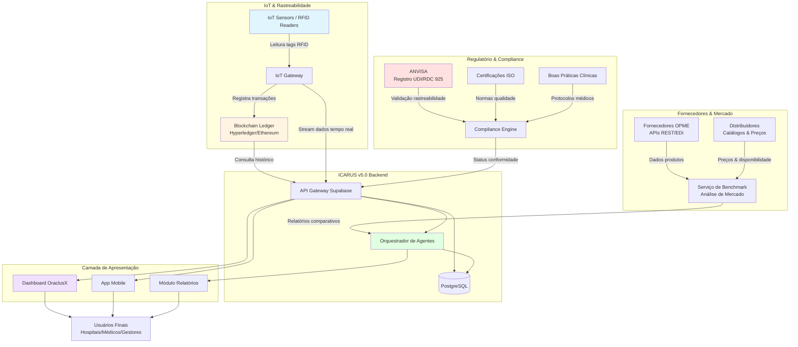
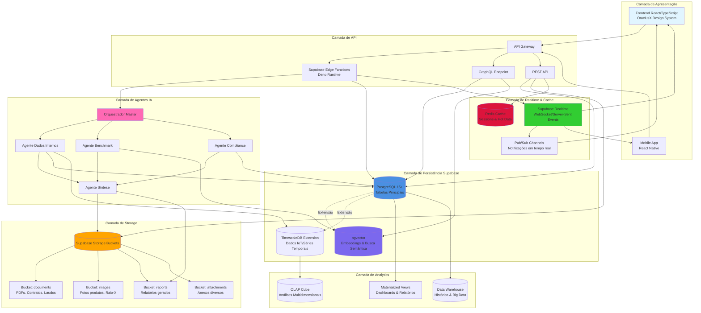
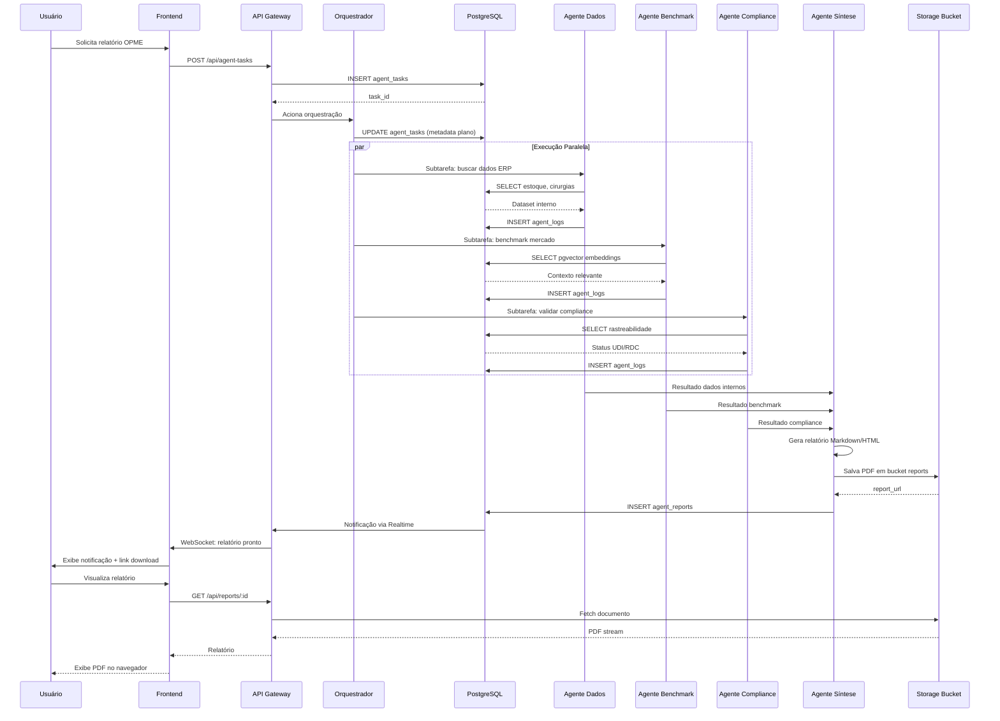
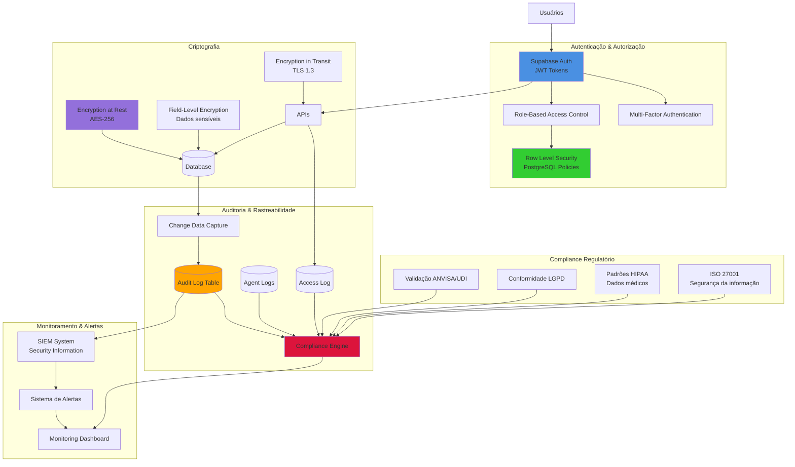
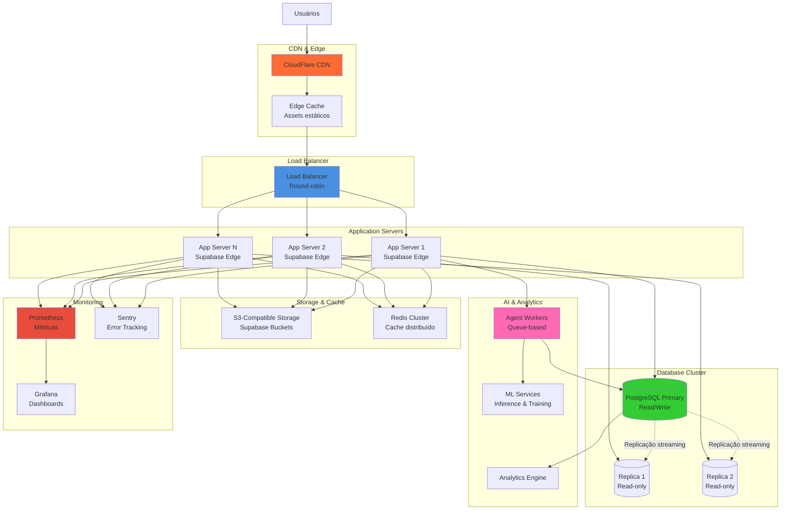

# Diagramas de Arquitetura — ICARUS v5.0 (OraclusX)

**Data**: 2025-10-26  
**Versão**: 1.0.0  
**Complemento**: ARQUITETURA_ICARUS_V5_EDR.md

---

## 1. Diagrama de Integrações Externas

### IoT/RFID/Blockchain + Fornecedores + Regulatórios

Este diagrama mostra como o ICARUS v5.0 se integra com sistemas externos críticos para rastreabilidade de OPME, compliance regulatório e inteligência de mercado.

### Descrição dos Fluxos:

#### 1. IoT & Rastreabilidade

- **RFID Readers** capturam dados de materiais OPME em tempo real
- **IoT Gateway** agrega e normaliza dados de múltiplos sensores
- **Blockchain** registra transações imutáveis para rastreabilidade completa
- Dados fluem para API do ICARUS para processamento e armazenamento

#### 2. Fornecedores & Mercado

- **APIs de Fornecedores** fornecem catálogos, preços, disponibilidade
- **Distribuidores** compartilham informações de estoque e logística
- **Serviço de Benchmark** analisa e compara dados de mercado
- Agente de Benchmark usa essas informações para relatórios estratégicos

#### 3. Regulatório & Compliance

- **ANVISA** valida rastreabilidade via UDI (Unique Device Identification)
- **Certificações ISO** garantem conformidade com normas internacionais
- **Boas Práticas** asseguram protocolos clínicos adequados
- **Compliance Engine** consolida todas validações

---

## 2. Diagrama de Camada de Dados

### Banco de Dados, Buckets, Realtime, Storage & Vector Store

Este diagrama detalha a arquitetura de dados do ICARUS v5.0, incluindo persistência, cache, streaming e busca vetorial.

### Descrição das Camadas:

#### 1. Camada de Apresentação

- **Frontend React**: Interface principal do sistema (desktop/web)
- **Mobile App**: Aplicativo nativo para dispositivos móveis
- Comunicação via REST API, GraphQL e WebSocket (Realtime)

#### 2. Camada de API

- **API Gateway**: Ponto único de entrada, autenticação, rate limiting
- **Edge Functions**: Lógica serverless em Deno para processamento
- **GraphQL**: Consultas flexíveis e eficientes
- **REST API**: Endpoints tradicionais para CRUD

#### 3. Camada de Agentes IA

- **Orquestrador Master**: Decompõe consultas e coordena agentes
- **Agentes Especializados**: Executam subtarefas específicas
- **Agente Síntese**: Consolida resultados e gera relatórios
- Acesso direto a diferentes camadas de dados conforme necessidade

#### 4. Camada de Persistência

- **PostgreSQL 15+**: Banco de dados relacional principal
- **pgvector**: Extensão para embeddings e busca semântica (RAG)
- **TimescaleDB**: Extensão para séries temporais (dados IoT)
- Suporte a JSONB, Full-Text Search, e índices avançados

#### 5. Camada de Storage

- **Supabase Storage**: Sistema de arquivos S3-compatible
- **Buckets organizados por tipo**: Documentos, imagens, relatórios, anexos
- Controle de acesso via RLS (Row Level Security)
- Suporte a CDN para distribuição global

#### 6. Camada de Realtime & Cache

- **Supabase Realtime**: WebSocket para atualizações em tempo real
- **Redis Cache**: Cache de sessões e dados frequentes
- **Pub/Sub**: Canais para notificações e eventos
- Redução de latência e carga no banco principal

#### 7. Camada de Analytics

- **Materialized Views**: Pré-agregações para dashboards rápidos
- **OLAP Cube**: Análises multidimensionais complexas
- **Data Warehouse**: Armazenamento histórico para big data

---

## 3. Fluxo de Dados Detalhado: Tarefa de Agente

### Etapas do Fluxo:

1. **Iniciação**: Usuário solicita relatório via frontend
2. **Registro**: API cria registro em `agent_tasks` com status "pending"
3. **Orquestração**: Orquestrador analisa query e gera plano de subtarefas
4. **Execução Paralela**: Múltiplos agentes executam simultaneamente
5. **Logging**: Cada agente registra ações em `agent_logs`
6. **Síntese**: Agente de síntese consolida todos os resultados
7. **Geração**: Relatório é gerado em Markdown/HTML/PDF
8. **Armazenamento**: Documento salvo em Storage Bucket
9. **Notificação**: Frontend recebe atualização via Realtime
10. **Entrega**: Usuário visualiza/baixa relatório finalizado

---

## 4. Diagrama de Segurança & Compliance

### Controles de Segurança Implementados:

#### Autenticação & Autorização

- JWT tokens com refresh automático
- RBAC com perfis: Admin, Médico, Enfermeiro, Gestor, Operadora
- RLS no PostgreSQL para segregação multi-tenant
- MFA opcional para usuários críticos

#### Auditoria & Rastreabilidade

- Logs de todas operações CRUD
- Registro completo de ações dos agentes
- Log de acesso com IP, timestamp, usuário
- Change Data Capture para histórico de alterações

#### Criptografia

- AES-256 para dados em repouso
- TLS 1.3 para dados em trânsito
- Criptografia em nível de campo para CPF, dados médicos sensíveis

#### Compliance

- Validação automática de requisitos ANVISA
- Conformidade LGPD (Lei Geral de Proteção de Dados)
- Padrões HIPAA para dados de saúde
- Certificação ISO 27001 para segurança da informação

---

## 5. Diagrama de Deployment (Produção)

---

## 6. Referências & Ferramentas

### Ferramentas de Visualização

- **Mermaid Live Editor**: https://mermaid.live
- **PlantUML**: https://plantuml.com
- **Draw.io**: https://app.diagrams.net

### Documentação Técnica

- Supabase Architecture: https://supabase.com/docs/guides/platform
- PostgreSQL Extensions: https://www.postgresql.org/docs/current/extensions.html
- pgvector: https://github.com/pgvector/pgvector
- TimescaleDB: https://docs.timescale.com

### Framework EDR

- Salesforce AI Research - Enterprise Deep Research
- Multi-Agent Orchestration Patterns
- RAG (Retrieval-Augmented Generation) Architecture

---

**Última Atualização**: 2025-10-26  
**Mantenedor**: Equipe OraclusX DS  
**Versão do Sistema**: ICARUS v5.0
