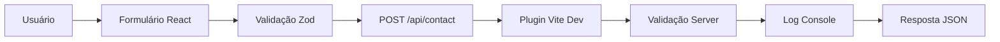
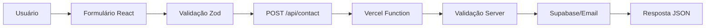

# 📧 Guia Rápido - Formulário de Contato

**ICARUS v5.0** | Formulário de contato com validação completa

---

## 🚀 Quick Start

### Desenvolvimento Local

```bash
# 1. Iniciar servidor de desenvolvimento
pnpm dev

# 2. Acessar formulário
# http://localhost:5174/contato

# 3. Testar API (opcional)
./test-contact-form.sh
```

### Produção (Vercel)

```bash
# Deploy para Vercel
pnpm deploy:vercel:prod

# URL de produção
# https://seu-projeto.vercel.app/contato
```

---

## 📂 Arquivos Envolvidos

| Arquivo                 | Descrição                    | Tipo     |
| ----------------------- | ---------------------------- | -------- |
| `api/contact.ts`        | Serverless function (Vercel) | Backend  |
| `src/pages/Contato.tsx` | Componente do formulário     | Frontend |
| `vite.config.ts`        | Plugin dev API               | Dev      |
| `test-contact-form.sh`  | Testes automatizados         | QA       |

---

## 🎯 Como Funciona

### Fluxo de Desenvolvimento



**Dev Mode (localhost:5174):**

- ✅ Plugin Vite (`vite.config.ts`)
- ✅ Validação completa
- ✅ Logs no console
- ✅ Delay simulado (500ms)

### Fluxo de Produção



**Production Mode (Vercel):**

- ✅ Serverless function (`api/contact.ts`)
- ✅ Validação completa
- ✅ Integração Supabase (opcional)
- ✅ SendGrid/Resend (opcional)

---

## 📝 Uso do Formulário

### Campos Obrigatórios

| Campo        | Validação      | Mensagem de Erro             |
| ------------ | -------------- | ---------------------------- |
| **Nome**     | 2-100 chars    | "Nome muito curto/longo"     |
| **Email**    | Formato válido | "E-mail inválido"            |
| **Assunto**  | 3-120 chars    | "Assunto muito curto/longo"  |
| **Mensagem** | 10-4000 chars  | "Mensagem muito curta/longa" |

### Campos Opcionais

- `phone` - Telefone de contato
- `source` - Origem da mensagem (ex: "web", "mobile")

### Exemplo de Uso

```javascript
// Frontend - React Hook Form
const onSubmit = async (data) => {
  const response = await fetch("/api/contact", {
    method: "POST",
    headers: { "Content-Type": "application/json" },
    body: JSON.stringify(data),
  });

  const result = await response.json();
  // { ok: true, message: "Mensagem enviada com sucesso!" }
};
```

```bash
# Backend - curl
curl -X POST http://localhost:5174/api/contact \
  -H "Content-Type: application/json" \
  -d '{
    "name": "João Silva",
    "email": "joao@example.com",
    "subject": "Dúvida sobre produto",
    "message": "Gostaria de mais informações..."
  }'
```

**Resposta de Sucesso:**

```json
{
  "ok": true,
  "message": "Mensagem enviada com sucesso!"
}
```

**Resposta de Erro:**

```json
{
  "ok": false,
  "error": "Email inválido"
}
```

---

## 🧪 Testes Automatizados

### Executar Todos os Testes

```bash
./test-contact-form.sh
```

**Testes Incluídos:**

1. ✅ Envio com dados válidos (200)
2. ✅ Rejeição de nome vazio (400)
3. ✅ Rejeição de email inválido (400)
4. ✅ Rejeição de mensagem vazia (400)
5. ✅ Rejeição de método GET (405)
6. ✅ CORS Preflight OPTIONS (200)

### Testes Manuais

```bash
# 1. Teste válido
curl -X POST http://localhost:5174/api/contact \
  -H "Content-Type: application/json" \
  -d '{"name":"Test","email":"test@example.com","message":"Test message"}'

# 2. Teste email inválido
curl -X POST http://localhost:5174/api/contact \
  -H "Content-Type: application/json" \
  -d '{"name":"Test","email":"invalid-email","message":"Test message"}'

# 3. Teste método GET (deve retornar 405)
curl -X GET http://localhost:5174/api/contact
```

---

## 🔧 Configuração

### Desenvolvimento Local

O plugin Vite (`vite.config.ts`) já está configurado! Basta rodar `pnpm dev`.

**Features do Plugin:**

- ✅ Endpoint `/api/contact` automático
- ✅ Validação idêntica ao Vercel
- ✅ CORS habilitado
- ✅ Logs detalhados no console

### Produção (Vercel)

**1. Deploy Básico:**

```bash
pnpm deploy:vercel:prod
```

**2. Integração com Supabase (Opcional):**

Descomentar linhas 92-109 em `api/contact.ts`:

```typescript
if (process.env.VITE_SUPABASE_URL && process.env.VITE_SUPABASE_ANON_KEY) {
  const { createClient } = await import("@supabase/supabase-js");
  const supabase = createClient(
    process.env.VITE_SUPABASE_URL,
    process.env.VITE_SUPABASE_ANON_KEY,
  );

  await supabase.from("mensagens_contato").insert({
    nome: data.name,
    email: data.email,
    telefone: data.phone,
    assunto: data.subject,
    mensagem: data.message,
    status: "novo",
  });
}
```

**3. Criar Tabela no Supabase:**

```sql
CREATE TABLE mensagens_contato (
  id UUID PRIMARY KEY DEFAULT uuid_generate_v4(),
  nome TEXT NOT NULL,
  email TEXT NOT NULL,
  telefone TEXT,
  assunto TEXT,
  mensagem TEXT NOT NULL,
  status TEXT DEFAULT 'novo',
  created_at TIMESTAMPTZ DEFAULT NOW()
);

-- Índices para performance
CREATE INDEX idx_mensagens_status ON mensagens_contato(status);
CREATE INDEX idx_mensagens_created_at ON mensagens_contato(created_at DESC);

-- RLS (Row Level Security)
ALTER TABLE mensagens_contato ENABLE ROW LEVEL SECURITY;

-- Permitir inserção anônima (apenas insert)
CREATE POLICY "Permitir inserção pública" ON mensagens_contato
  FOR INSERT
  TO anon
  WITH CHECK (true);
```

**4. Integração com Email (SendGrid/Resend):**

```typescript
// Adicionar no api/contact.ts após validação
import { Resend } from "resend";

const resend = new Resend(process.env.RESEND_API_KEY);

await resend.emails.send({
  from: "contato@icarusai.com.br",
  to: "suporte@icarusai.com.br",
  subject: `[Contato] ${data.subject}`,
  html: `
    <h2>Nova mensagem de contato</h2>
    <p><strong>Nome:</strong> ${data.name}</p>
    <p><strong>Email:</strong> ${data.email}</p>
    <p><strong>Telefone:</strong> ${data.phone || "Não informado"}</p>
    <p><strong>Assunto:</strong> ${data.subject}</p>
    <p><strong>Mensagem:</strong></p>
    <p>${data.message}</p>
  `,
});
```

---

## 🎨 Personalização

### Customizar Validação

Edite o schema Zod em `src/pages/Contato.tsx`:

```typescript
const contactSchema = z.object({
  name: z.string().min(2).max(100),
  email: z.string().email(),
  phone: z.string().optional(), // Adicionar validação de telefone
  subject: z.string().min(3).max(120),
  message: z.string().min(10).max(4000),
});
```

### Customizar Mensagens

Edite as mensagens em `api/contact.ts`:

```typescript
if (!data.name) {
  return res.status(400).json({
    ok: false,
    error: "Sua mensagem personalizada aqui",
  });
}
```

### Customizar Design

Edite `src/pages/Contato.tsx`:

```tsx
<input
  className="neumorphic-input w-full custom-class"
  style={
    {
      /* seu estilo aqui */
    }
  }
/>
```

---

## 🔒 Segurança

### Implementado ✅

- ✅ Validação client-side (Zod)
- ✅ Validação server-side (TypeScript)
- ✅ CORS configurado
- ✅ Sanitização de tipos
- ✅ Tratamento de erros

### Recomendado (Próximos Passos) ⏳

**1. Rate Limiting (Upstash):**

```typescript
import { Ratelimit } from "@upstash/ratelimit";
import { Redis } from "@upstash/redis";

const ratelimit = new Ratelimit({
  redis: Redis.fromEnv(),
  limiter: Ratelimit.slidingWindow(5, "1 h"),
});

const { success } = await ratelimit.limit(data.email);
if (!success) {
  return res.status(429).json({
    ok: false,
    error: "Muitas tentativas. Aguarde 1 hora.",
  });
}
```

**2. CAPTCHA (hCaptcha/Turnstile):**

```tsx
// Frontend
<HCaptcha
  sitekey={process.env.HCAPTCHA_SITE_KEY}
  onVerify={(token) => setCaptchaToken(token)}
/>;

// Backend
const captchaResponse = await fetch("https://hcaptcha.com/siteverify", {
  method: "POST",
  body: new URLSearchParams({
    secret: process.env.HCAPTCHA_SECRET_KEY,
    response: req.body.captcha_token,
  }),
});
```

**3. Honeypot Anti-Bot:**

```tsx
// Campo oculto - bots preenchem, humanos não
<input
  type="text"
  name="website"
  style={{ display: "none" }}
  tabIndex={-1}
  autoComplete="off"
/>;

// Backend
if (req.body.website) {
  return res.status(400).json({ ok: false, error: "Bot detected" });
}
```

---

## 📊 Monitoramento

### Logs de Desenvolvimento

```bash
# Ver logs do servidor dev
tail -f /tmp/vite-dev.log | grep "Nova mensagem"
```

**Exemplo de log:**

```
📧 [DEV] Nova mensagem de contato: {
  name: 'João Silva',
  email: 'joao@example.com',
  phone: undefined,
  subject: 'Teste',
  message: 'Mensagem de teste',
  timestamp: '2025-10-26T15:30:00.000Z'
}
```

### Logs de Produção (Vercel)

```bash
# Ver logs da function
vercel logs --app=icarus-make --function=api/contact

# Filtrar apenas erros
vercel logs --app=icarus-make --function=api/contact | grep ERROR
```

---

## 🐛 Troubleshooting

### Problema: API retorna 404

**Causa:** Servidor preview rodando (porta 5173) em vez de dev (porta 5174)

**Solução:**

```bash
# Parar preview
pkill -f "vite preview"

# Rodar dev
pnpm dev
```

### Problema: CORS error no browser

**Causa:** Headers CORS não configurados

**Solução:** Verificar se o plugin Vite está ativo (`vite.config.ts` linha 11-19)

### Problema: Validação não funciona

**Causa:** Schema Zod desatualizado

**Solução:** Verificar schema em `src/pages/Contato.tsx` (linha 6-23)

### Problema: Email não envia

**Causa:** Integração Supabase/Email não configurada

**Solução:** Ver seção "Configuração > Produção > Integração"

---

## 📚 Documentação Adicional

- **Relatório Completo:** `WEBDESIGN_EXPERT_REPORT.md`
- **Código Backend:** `api/contact.ts`
- **Código Frontend:** `src/pages/Contato.tsx`
- **Testes:** `test-contact-form.sh`

---

## ✅ Checklist de Deploy

Antes de fazer deploy para produção:

- [ ] Testar localmente (`./test-contact-form.sh`)
- [ ] Configurar variáveis de ambiente no Vercel
- [ ] Criar tabela no Supabase (se usar)
- [ ] Configurar SendGrid/Resend (se usar)
- [ ] Testar no preview Vercel
- [ ] Adicionar rate limiting
- [ ] Adicionar CAPTCHA (opcional)
- [ ] Configurar monitoramento de erros
- [ ] Documentar endpoints para equipe
- [ ] Testar no mobile/desktop

---

## 🚀 Deploy em 3 Passos

```bash
# 1. Testar localmente
pnpm dev
./test-contact-form.sh

# 2. Build e validar
pnpm build
pnpm preview

# 3. Deploy para Vercel
pnpm deploy:vercel:prod
```

**🎉 Pronto! Seu formulário está no ar!**

---

_Guia criado pelo Agente WebDesign Expert_  
_ICARUS v5.0 - Gestão elevada pela IA_
