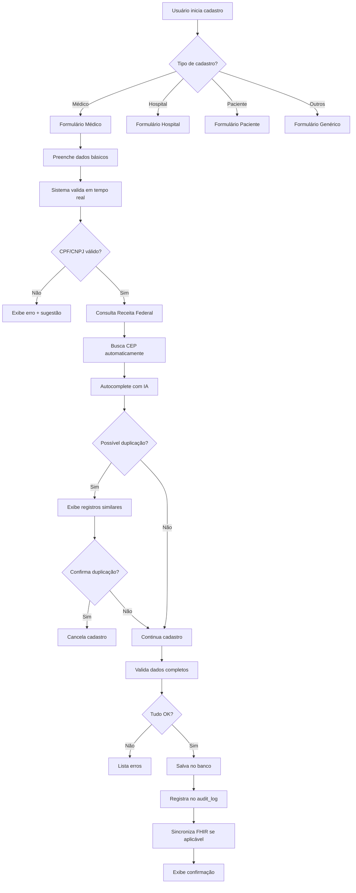

# 📋 MÓDULOS CADASTROS INTELIGENTES E COMPRAS - DOCUMENTAÇÃO COMPLETA

**Sistema**: ICARUS v5.0  
**Categoria**: Core / Operacional  
**Versão**: 5.0.0  
**Última Atualização**: Outubro 2025  
**Idioma**: Português Brasileiro (pt-BR)

---

## 📑 ÍNDICE GERAL

### PARTE I - MÓDULO CADASTROS INTELIGENTES (GESTÃO DE CADASTROS)
1. [Visão Geral Cadastros](#1-visão-geral-cadastros)
2. [Arquitetura Cadastros](#2-arquitetura-cadastros)
3. [Sub-módulos Cadastros](#3-sub-módulos-cadastros)
4. [Dashboard Cadastros](#4-dashboard-cadastros)
5. [Cadastro de Médicos](#5-cadastro-de-médicos)
6. [Cadastro de Hospitais](#6-cadastro-de-hospitais)
7. [Cadastro de Pacientes](#7-cadastro-de-pacientes)
8. [Cadastro de Convênios](#8-cadastro-de-convênios)
9. [Cadastro de Fornecedores](#9-cadastro-de-fornecedores)
10. [Cadastro de Produtos OPME](#10-cadastro-de-produtos-opme)
11. [Equipes Médicas](#11-equipes-médicas)
12. [Transportadoras](#12-transportadoras)
13. [Validações e IA](#13-validações-e-ia)
14. [Importação em Massa](#14-importação-em-massa)

### PARTE II - MÓDULO COMPRAS E FORNECEDORES
15. [Visão Geral Compras](#15-visão-geral-compras)
16. [Arquitetura Compras](#16-arquitetura-compras)
17. [Sub-módulos Compras](#17-sub-módulos-compras)
18. [Dashboard Compras](#18-dashboard-compras)
19. [Gestão de Cotações](#19-gestão-de-cotações)
20. [Pedidos de Compra](#20-pedidos-de-compra)
21. [Notas de Compra](#21-notas-de-compra)
22. [Compras Internacionais](#22-compras-internacionais)
23. [IA para Compras](#23-ia-para-compras)
24. [Integração com Fornecedores](#24-integração-com-fornecedores)

### PARTE III - INTEGRAÇÕES E ANALYTICS
25. [Integrações Externas](#25-integrações-externas)
26. [Relatórios e Analytics](#26-relatórios-e-analytics)
27. [Contexto e Justificativas](#27-contexto-e-justificativas)
28. [Casos de Uso](#28-casos-de-uso)

---

# PARTE I - MÓDULO CADASTROS INTELIGENTES

## 1. VISÃO GERAL CADASTROS

### 1.1. Descrição

**Arquivo Principal**: `/components/modules/GestãoCadastros.tsx`

O módulo **Gestão de Cadastros** (também chamado de **Cadastros Inteligentes**) é o coração do sistema de dados mestres do ICARUS v5.0. Centraliza o cadastramento, validação, atualização e manutenção de todas as entidades críticas do negócio OPME: médicos, hospitais, pacientes, convênios, fornecedores, produtos OPME, equipes médicas e transportadoras.

### 1.2. Objetivos

```yaml
Objetivos Principais:
  - Centralizar todos os cadastros em um único módulo
  - Garantir 100% de qualidade dos dados
  - Validação automática com IA e APIs governamentais
  - Evitar duplicações (matching inteligente)
  - Autocomplete e sugestões baseadas em IA
  - Importação em massa com validação
  - Rastreabilidade de alterações (audit log)
  - Integração com sistemas externos (FHIR, TUSS, ANVISA)

Métricas de Sucesso:
  - 100% dos dados validados
  - 0% de duplicações
  - Tempo médio de cadastro < 2 minutos
  - 95% de dados enriquecidos automaticamente
  - 100% de rastreabilidade
```

### 1.3. Importância para Negócio OPME

```yaml
Por que é crítico:

  Qualidade de Dados:
    - Dados mestres = base de todo o sistema
    - Erro no cadastro = erro em toda operação
    - CPF errado = problema no faturamento
    - CRM errado = glosa de cirurgia
    - Código ANVISA errado = produto não rastreável

  Compliance e Auditoria:
    - ANS exige dados precisos de médicos
    - ANVISA exige rastreabilidade de produtos
    - Auditoria de convênios verifica cadastros
    - LGPD exige consentimento e rastreabilidade

  Eficiência Operacional:
    - Autocomplete economiza 80% do tempo
    - Validação evita retrabalho
    - Importação em massa agiliza migração
    - Dados enriquecidos melhoram decisões

  Integração com Sistemas:
    - FHIR HL7 (padrão internacional)
    - TUSS (códigos ANS)
    - ANVISA (produtos regulamentados)
    - Receita Federal (validação CPF/CNPJ)
```

---

## 2. ARQUITETURA CADASTROS

### 2.1. Diagrama de Componentes

```
┌─────────────────────────────────────────────────────────────────┐
│              CADASTROS INTELIGENTES - ARQUITETURA                │
├─────────────────────────────────────────────────────────────────┤
│                                                                  │
│  ┌────────────────────────────────────────────────────────┐    │
│  │                  PRESENTATION LAYER                     │    │
│  │  ┌──────────────┐  ┌──────────────┐  ┌──────────────┐ │    │
│  │  │  Dashboard   │  │   Médicos    │  │  Hospitais   │ │    │
│  │  │  Cadastros   │  │              │  │              │ │    │
│  │  └──────────────┘  └──────────────┘  └──────────────┘ │    │
│  │                                                         │    │
│  │  ┌──────────────┐  ┌──────────────┐  ┌──────────────┐ │    │
│  │  │  Pacientes   │  │  Convênios   │  │ Fornecedores │ │    │
│  │  │              │  │              │  │              │ │    │
│  │  └──────────────┘  └──────────────┘  └──────────────┘ │    │
│  │                                                         │    │
│  │  ┌──────────────┐  ┌──────────────┐  ┌──────────────┐ │    │
│  │  │ Produtos OPME│  │   Equipes    │  │Transportadoras│ │    │
│  │  │              │  │   Médicas    │  │              │ │    │
│  │  └──────────────┘  └──────────────┘  └──────────────┘ │    │
│  └────────────────────────────────────────────────────────┘    │
│                           ▼                                      │
│  ┌────────────────────────────────────────────────────────┐    │
│  │                  BUSINESS LOGIC LAYER                   │    │
│  │  ┌──────────────────────────────────────────────────┐  │    │
│  │  │         CadastrosService.ts                       │  │    │
│  │  │  - CRUD de entidades                              │  │    │
│  │  │  - Validações de negócio                          │  │    │
│  │  │  - Regras de duplicação                           │  │    │
│  │  └──────────────────────────────────────────────────┘  │    │
│  │                                                         │    │
│  │  ┌──────────────────────────────────────────────────┐  │    │
│  │  │         AutocompleteService.ts (IA)              │  │    │
│  │  │  - Sugestões inteligentes                         │  │    │
│  │  │  - Aprendizado com dados históricos               │  │    │
│  │  │  - Matching fuzzy (Levenshtein)                   │  │    │
│  │  └──────────────────────────────────────────────────┘  │    │
│  │                                                         │    │
│  │  ┌──────────────────────────────────────────────────┐  │    │
│  │  │         ValidacaoService.ts                      │  │    │
│  │  │  - Validação CPF/CNPJ (Receita Federal)          │  │    │
│  │  │  - Validação CRM (CFM)                            │  │    │
│  │  │  - Validação ANVISA                               │  │    │
│  │  │  - Validação CEP (ViaCEP)                         │  │    │
│  │  └──────────────────────────────────────────────────┘  │    │
│  └────────────────────────────────────────────────────────┘    │
│                           ▼                                      │
│  ┌────────────────────────────────────────────────────────┐    │
│  │              INTEGRATION LAYER (APIs)                   │    │
│  │                                                         │    │
│  │  ┌──────────────┐  ┌──────────────┐  ┌──────────────┐ │    │
│  │  │Receita Federal│  │   ViaCEP    │  │  CFM (CRM)   │ │    │
│  │  │ (CPF/CNPJ)   │  │  (Endereço)  │  │ (Validação)  │ │    │
│  │  └──────────────┘  └──────────────┘  └──────────────┘ │    │
│  │                                                         │    │
│  │  ┌──────────────┐  ┌──────────────┐  ┌──────────────┐ │    │
│  │  │  ANS TUSS    │  │   ANVISA     │  │ CNES (SUS)   │ │    │
│  │  │(Especialidade)│  │  (Produtos)  │  │  (Hospitais) │ │    │
│  │  └──────────────┘  └──────────────┘  └──────────────┘ │    │
│  │                                                         │    │
│  │  ┌──────────────┐  ┌──────────────┐  ┌──────────────┐ │    │
│  │  │ FHIR HL7     │  │Google Places │  │   GPT-4      │ │    │
│  │  │ (Padrão Med) │  │    (Maps)    │  │(Autocomplete)│ │    │
│  │  └──────────────┘  └──────────────┘  └──────────────┘ │    │
│  └────────────────────────────────────────────────────────┘    │
│                           ▼                                      │
│  ┌────────────────────────────────────────────────────────┐    │
│  │                    DATA LAYER                           │    │
│  │  ┌──────────────────────────────────────────────────┐  │    │
│  │  │            Supabase PostgreSQL                    │  │    │
│  │  │  - medicos                                        │  │    │
│  │  │  - hospitais                                      │  │    │
│  │  │  - pacientes                                      │  │    │
│  │  │  - convenios                                      │  │    │
│  │  │  - fornecedores                                   │  │    │
│  │  │  - produtos_opme                                  │  │    │
│  │  │  - equipes_medicas                                │  │    │
│  │  │  - transportadoras                                │  │    │
│  │  │  - audit_log (rastreabilidade)                    │  │    │
│  │  └──────────────────────────────────────────────────┘  │    │
│  └────────────────────────────────────────────────────────┘    │
└─────────────────────────────────────────────────────────────────┘
```

### 2.2. Fluxo de Cadastro



---

## 3. SUB-MÓDULOS CADASTROS

### 3.1. Lista de Sub-módulos

```typescript
/**
 * Sub-módulos da Gestão de Cadastros
 * 
 * Total: 8 sub-módulos principais
 */

interface SubModulosCadastros {
  '3.1.1': 'Médicos',
  '3.1.2': 'Hospitais',
  '3.1.3': 'Pacientes',
  '3.1.4': 'Convênios',
  '3.1.5': 'Fornecedores',
  '3.1.6': 'Produtos OPME',
  '3.1.7': 'Equipes Médicas',
  '3.1.8': 'Transportadoras'
}
```

---

## 4. DASHBOARD CADASTROS

### 4.1. Visão Geral dos Cadastros

```typescript
/**
 * Dashboard de Cadastros
 * 
 * KPIS PRINCIPAIS:
 * 1. Total de Médicos Ativos
 * 2. Total de Hospitais Ativos
 * 3. Total de Pacientes
 * 4. Total de Convênios Ativos
 * 5. Total de Fornecedores
 * 6. Total de Produtos OPME
 * 7. Cadastros Pendentes de Validação
 * 8. Cadastros Atualizados (últimos 30 dias)
 * 
 * WIDGETS:
 * - Gráfico de cadastros por mês (últimos 12 meses)
 * - Top 10 médicos (por volume de cirurgias)
 * - Top 10 hospitais (por faturamento)
 * - Alertas de cadastros incompletos
 * - Sugestões de atualização (IA)
 * - Duplicatas detectadas
 */

export const DashboardCadastros: React.FC = () => {
  const { kpis, loading } = useCadastrosKPIs();
  const { alertas } = useAlertasCadastros();
  const { duplicatas } = useDuplicatasDetectadas();

  return (
    <div className="space-y-6">
      {/* KPIs */}
      <div className="grid grid-cols-1 md:grid-cols-4 gap-6">
        <KPICard
          label="Médicos Ativos"
          value={kpis.medicosAtivos}
          icon={<Stethoscope />}
          onClick={() => navigate('/cadastros/medicos')}
        />
        
        <KPICard
          label="Hospitais Ativos"
          value={kpis.hospitaisAtivos}
          icon={<Building />}
          onClick={() => navigate('/cadastros/hospitais')}
        />
        
        <KPICard
          label="Pacientes"
          value={kpis.totalPacientes}
          icon={<Users />}
          onClick={() => navigate('/cadastros/pacientes')}
        />
        
        <KPICard
          label="Produtos OPME"
          value={kpis.produtosOPME}
          icon={<Package />}
          onClick={() => navigate('/cadastros/produtos')}
        />
      </div>

      {/* Alertas */}
      {alertas.length > 0 && (
        <Card title="Alertas de Cadastros" padding="md">
          <div className="space-y-3">
            {alertas.map((alerta, idx) => (
              <Alert key={idx} variant={alerta.severidade}>
                <AlertTriangle className="h-4 w-4" />
                <AlertTitle>{alerta.titulo}</AlertTitle>
                <AlertDescription>{alerta.descricao}</AlertDescription>
              </Alert>
            ))}
          </div>
        </Card>
      )}

      {/* Duplicatas Detectadas */}
      {duplicatas.length > 0 && (
        <Card 
          title="Possíveis Duplicatas Detectadas" 
          padding="md"
          icon={<Copy />}
        >
          <DuplicatasList duplicatas={duplicatas} />
        </Card>
      )}

      {/* Gráficos */}
      <div className="grid grid-cols-1 lg:grid-cols-2 gap-6">
        {/* Evolução de Cadastros */}
        <Card title="Evolução de Cadastros - 12 Meses" padding="md">
          <LineChart
            data={kpis.evolucaoCadastros}
            xAxis="mes"
            yAxes={['medicos', 'hospitais', 'pacientes']}
          />
        </Card>

        {/* Top Médicos */}
        <Card title="Top 10 Médicos (Cirurgias)" padding="md">
          <BarChart
            data={kpis.topMedicos}
            xAxis="nome"
            yAxis="cirurgias"
            horizontal
          />
        </Card>

        {/* Top Hospitais */}
        <Card title="Top 10 Hospitais (Faturamento)" padding="md">
          <BarChart
            data={kpis.topHospitais}
            xAxis="nome"
            yAxis="faturamento"
            horizontal
            formatY={(value) => formatCurrency(value)}
          />
        </Card>

        {/* Distribuição de Produtos */}
        <Card title="Produtos OPME por Categoria" padding="md">
          <PieChart
            data={kpis.produtosPorCategoria}
            label="categoria"
            value="quantidade"
          />
        </Card>
      </div>

      {/* Sugestões IA */}
      <Card 
        title="Sugestões de Atualização (IA)" 
        padding="md"
        icon={<Sparkles />}
      >
        <SugestoesAtualizacaoIA />
      </Card>
    </div>
  );
};
```

---

## 5. CADASTRO DE MÉDICOS

### 5.1. Formulário de Médico Avançado

**Arquivo**: `/components/formularios/FormularioMedicoAvancado.tsx`

```typescript
/**
 * Formulário Avançado de Médico
 * 
 * SEÇÕES:
 * 1. Dados Pessoais
 *    - Nome Completo (obrigatório)
 *    - CPF (validação Receita Federal)
 *    - RG
 *    - Data de Nascimento
 *    - Sexo
 * 
 * 2. Dados Profissionais
 *    - CRM (validação CFM + check duplicação)
 *    - UF do CRM
 *    - Especialidade (autocomplete TUSS)
 *    - Subespecialidades (múltipla escolha)
 *    - Registro ANS (se aplicável)
 * 
 * 3. Contato
 *    - Telefone Fixo
 *    - Celular (WhatsApp)
 *    - Email (validação + verificação)
 *    - LinkedIn (opcional)
 * 
 * 4. Endereço
 *    - CEP (busca automática ViaCEP)
 *    - Logradouro
 *    - Número
 *    - Complemento
 *    - Bairro
 *    - Cidade
 *    - UF
 * 
 * 5. Dados Bancários (para pagamentos)
 *    - Banco
 *    - Agência
 *    - Conta
 *    - Tipo de Conta (Corrente/Poupança)
 *    - PIX (opcional)
 * 
 * 6. Documentos
 *    - Upload de Diploma
 *    - Upload de RQE (Registro de Qualificação Especialista)
 *    - Upload de Certificados
 * 
 * 7. Observações
 *    - Campo livre para anotações
 * 
 * VALIDAÇÕES EM TEMPO REAL:
 * - CPF: Validação de dígitos + consulta Receita Federal
 * - CRM: Formato correto + consulta CFM + check duplicação
 * - Email: Formato + verificação de existência
 * - CEP: Formato + busca automática de endereço
 * - Telefone: Formato brasileiro
 * 
 * INTEGRATIONS:
 * - Receita Federal API (validar CPF)
 * - CFM API (validar CRM)
 * - ViaCEP (buscar endereço)
 * - ANS TUSS (especialidades)
 * - FHIR HL7 (sincronização)
 * 
 * IA FEATURES:
 * - Autocomplete de especialidade baseado em digitação
 * - Sugestão de subespecialidades baseado em especialidade
 * - Detecção de duplicatas (matching fuzzy)
 * - Enriquecimento de dados (LinkedIn, Lattes)
 */

export const FormularioMedicoAvancado: React.FC<FormularioMedicoProps> = ({
  medicoId,
  onSuccess,
  onCancel
}) => {
  const [formData, setFormData] = useState<MedicoFormData>(INITIAL_STATE);
  const [validationErrors, setValidationErrors] = useState<ValidationErrors>({});
  const [loading, setLoading] = useState(false);
  const [possiveisDuplicatas, setPossiveisDuplicatas] = useState<Medico[]>([]);

  // Validação de CPF em tempo real
  const handleCPFChange = async (cpf: string) => {
    setFormData({ ...formData, cpf });

    if (cpf.length === 14) { // CPF formatado: 999.999.999-99
      // 1. Validar dígitos
      if (!isValidCPF(cpf)) {
        setValidationErrors({
          ...validationErrors,
          cpf: 'CPF inválido'
        });
        return;
      }

      // 2. Consultar Receita Federal
      try {
        const resultado = await consultarReceitaFederal(cpf);
        if (!resultado.valido) {
          setValidationErrors({
            ...validationErrors,
            cpf: 'CPF não encontrado na Receita Federal'
          });
          return;
        }

        // 3. Enriquecer dados automaticamente
        setFormData({
          ...formData,
          cpf,
          nome_completo: resultado.nome || formData.nome_completo,
          data_nascimento: resultado.dataNascimento || formData.data_nascimento
        });

        // Limpar erro
        const { cpf: _, ...rest } = validationErrors;
        setValidationErrors(rest);

      } catch (error) {
        console.warn('Erro ao validar CPF na Receita Federal:', error);
      }
    }
  };

  // Validação de CRM em tempo real
  const handleCRMChange = async (crm: string, uf: string) => {
    setFormData({ ...formData, crm, uf_crm: uf });

    if (crm && uf) {
      // 1. Validar formato
      if (!isValidCRM(crm, uf)) {
        setValidationErrors({
          ...validationErrors,
          crm: 'CRM inválido para este estado'
        });
        return;
      }

      // 2. Consultar CFM
      try {
        const resultado = await consultarCFM(crm, uf);
        if (!resultado.ativo) {
          setValidationErrors({
            ...validationErrors,
            crm: 'CRM não encontrado ou inativo no CFM'
          });
          return;
        }

        // 3. Check duplicação
        const { data: existente } = await supabase
          .from('medicos')
          .select('id, nome_completo')
          .eq('crm', crm)
          .eq('uf_crm', uf)
          .neq('id', medicoId || '');

        if (existente && existente.length > 0) {
          setValidationErrors({
            ...validationErrors,
            crm: `CRM já cadastrado para: ${existente[0].nome_completo}`
          });
          return;
        }

        // 4. Enriquecer dados
        setFormData({
          ...formData,
          crm,
          uf_crm: uf,
          nome_completo: resultado.nome || formData.nome_completo,
          especialidade: resultado.especialidade || formData.especialidade
        });

        // Limpar erro
        const { crm: _, ...rest } = validationErrors;
        setValidationErrors(rest);

      } catch (error) {
        console.warn('Erro ao validar CRM no CFM:', error);
      }
    }
  };

  // Autocomplete de Especialidade
  const handleEspecialidadeSearch = async (query: string) => {
    if (query.length < 3) return [];

    try {
      const especialidades = await searchEspecialidadesTUSS(query);
      return especialidades;
    } catch (error) {
      console.error('Erro ao buscar especialidades:', error);
      return [];
    }
  };

  // Busca de CEP
  const handleCEPChange = async (cep: string) => {
    const cepLimpo = cep.replace(/\D/g, '');

    if (cepLimpo.length === 8) {
      try {
        const response = await fetch(`https://viacep.com.br/ws/${cepLimpo}/json/`);
        const data = await response.json();

        if (!data.erro) {
          setFormData({
            ...formData,
            endereco: {
              ...formData.endereco,
              cep: cepLimpo,
              logradouro: data.logradouro,
              bairro: data.bairro,
              cidade: data.localidade,
              uf: data.uf
            }
          });
        }
      } catch (error) {
        console.error('Erro ao buscar CEP:', error);
      }
    }
  };

  // Detecção de Duplicatas
  useEffect(() => {
    const detectarDuplicatas = async () => {
      if (formData.nome_completo.length < 5) return;

      try {
        const duplicatas = await detectPossibleDuplicates({
          tipo: 'medico',
          nome: formData.nome_completo,
          cpf: formData.cpf,
          crm: formData.crm
        });

        setPossiveisDuplicatas(duplicatas);
      } catch (error) {
        console.error('Erro ao detectar duplicatas:', error);
      }
    };

    const debounce = setTimeout(detectarDuplicatas, 500);
    return () => clearTimeout(debounce);
  }, [formData.nome_completo, formData.cpf, formData.crm]);

  // Submit
  const handleSubmit = async (e: React.FormEvent) => {
    e.preventDefault();
    setLoading(true);

    try {
      // Validações finais
      const errors = await validateFormComplete(formData);
      if (Object.keys(errors).length > 0) {
        setValidationErrors(errors);
        setLoading(false);
        return;
      }

      // Salvar
      if (medicoId) {
        // Atualizar
        const { data, error } = await supabase
          .from('medicos')
          .update(formData)
          .eq('id', medicoId)
          .select()
          .single();

        if (error) throw error;

        // Sincronizar FHIR
        await syncToFHIR('medico', data);

        toast.success('Médico atualizado com sucesso!');
        onSuccess?.(data);
      } else {
        // Criar
        const { data, error } = await supabase
          .from('medicos')
          .insert(formData)
          .select()
          .single();

        if (error) throw error;

        // Sincronizar FHIR
        await syncToFHIR('medico', data);

        toast.success('Médico cadastrado com sucesso!');
        onSuccess?.(data);
      }
    } catch (error) {
      console.error('Erro ao salvar médico:', error);
      toast.error('Erro ao salvar médico');
    } finally {
      setLoading(false);
    }
  };

  return (
    <FormularioContainer
      title={medicoId ? 'Editar Médico' : 'Novo Médico'}
      onSubmit={handleSubmit}
      onCancel={onCancel}
    >
      {/* Alerta de Duplicatas */}
      {possiveisDuplicatas.length > 0 && (
        <Alert variant="warning">
          <AlertTriangle className="h-4 w-4" />
          <AlertTitle>Possíveis Duplicatas Detectadas</AlertTitle>
          <AlertDescription>
            Encontramos {possiveisDuplicatas.length} médico(s) similar(es):
            <ul className="list-disc ml-6 mt-2">
              {possiveisDuplicatas.map((dup, idx) => (
                <li key={idx}>
                  {dup.nome_completo} - CRM: {dup.crm}/{dup.uf_crm}
                  <Button 
                    variant="link" 
                    size="sm"
                    onClick={() => handleVerDuplicata(dup.id)}
                  >
                    Ver detalhes
                  </Button>
                </li>
              ))}
            </ul>
          </AlertDescription>
        </Alert>
      )}

      {/* Seção 1: Dados Pessoais */}
      <Card title="Dados Pessoais" padding="lg">
        <div className="grid grid-cols-1 md:grid-cols-2 gap-4">
          <Input
            label="Nome Completo"
            value={formData.nome_completo}
            onChange={(e) => setFormData({ ...formData, nome_completo: e.target.value })}
            required
            error={validationErrors.nome_completo}
          />

          <ValidationInput
            label="CPF"
            value={formData.cpf}
            onChange={handleCPFChange}
            mask="999.999.999-99"
            validationType="cpf"
            required
            error={validationErrors.cpf}
          />

          <Input
            label="RG"
            value={formData.rg}
            onChange={(e) => setFormData({ ...formData, rg: e.target.value })}
          />

          <Input
            label="Data de Nascimento"
            type="date"
            value={formData.data_nascimento}
            onChange={(e) => setFormData({ ...formData, data_nascimento: e.target.value })}
          />

          <Select
            label="Sexo"
            value={formData.sexo}
            onChange={(value) => setFormData({ ...formData, sexo: value })}
            options={[
              { value: 'M', label: 'Masculino' },
              { value: 'F', label: 'Feminino' },
              { value: 'Outro', label: 'Outro' }
            ]}
          />
        </div>
      </Card>

      {/* Seção 2: Dados Profissionais */}
      <Card title="Dados Profissionais" padding="lg">
        <div className="grid grid-cols-1 md:grid-cols-3 gap-4">
          <CRMValidationInput
            label="CRM"
            value={formData.crm}
            uf={formData.uf_crm}
            onChange={(crm, uf) => handleCRMChange(crm, uf)}
            required
            error={validationErrors.crm}
          />

          <AutocompleteInput
            label="Especialidade"
            value={formData.especialidade}
            onChange={(value) => setFormData({ ...formData, especialidade: value })}
            onSearch={handleEspecialidadeSearch}
            placeholder="Digite para buscar..."
            required
          />

          <Input
            label="Registro ANS"
            value={formData.registro_ans}
            onChange={(e) => setFormData({ ...formData, registro_ans: e.target.value })}
            placeholder="Apenas se aplicável"
          />
        </div>

        {/* Subespecialidades */}
        <div className="mt-4">
          <label className="block text-sm font-medium mb-2">
            Subespecialidades
          </label>
          <MultiSelect
            options={SUBESPECIALIDADES}
            value={formData.subespecialidades || []}
            onChange={(values) => setFormData({ ...formData, subespecialidades: values })}
            placeholder="Selecione as subespecialidades..."
          />
        </div>
      </Card>

      {/* Seção 3: Contato */}
      <Card title="Contato" padding="lg">
        <div className="grid grid-cols-1 md:grid-cols-3 gap-4">
          <Input
            label="Telefone Fixo"
            value={formData.telefone}
            onChange={(e) => setFormData({ ...formData, telefone: e.target.value })}
            mask="(99) 9999-9999"
            placeholder="(11) 3456-7890"
          />

          <Input
            label="Celular (WhatsApp)"
            value={formData.celular}
            onChange={(e) => setFormData({ ...formData, celular: e.target.value })}
            mask="(99) 99999-9999"
            placeholder="(11) 98765-4321"
            required
          />

          <ValidationInput
            label="Email"
            value={formData.email}
            onChange={(value) => setFormData({ ...formData, email: value })}
            validationType="email"
            required
            error={validationErrors.email}
          />

          <Input
            label="LinkedIn"
            value={formData.linkedin}
            onChange={(e) => setFormData({ ...formData, linkedin: e.target.value })}
            placeholder="https://linkedin.com/in/..."
          />
        </div>
      </Card>

      {/* Seção 4: Endereço */}
      <Card title="Endereço" padding="lg">
        <div className="grid grid-cols-1 md:grid-cols-4 gap-4">
          <Input
            label="CEP"
            value={formData.endereco?.cep}
            onChange={(e) => handleCEPChange(e.target.value)}
            mask="99999-999"
            placeholder="01234-567"
          />

          <div className="md:col-span-3">
            <Input
              label="Logradouro"
              value={formData.endereco?.logradouro}
              onChange={(e) => setFormData({
                ...formData,
                endereco: { ...formData.endereco, logradouro: e.target.value }
              })}
            />
          </div>

          <Input
            label="Número"
            value={formData.endereco?.numero}
            onChange={(e) => setFormData({
              ...formData,
              endereco: { ...formData.endereco, numero: e.target.value }
            })}
          />

          <Input
            label="Complemento"
            value={formData.endereco?.complemento}
            onChange={(e) => setFormData({
              ...formData,
              endereco: { ...formData.endereco, complemento: e.target.value }
            })}
          />

          <Input
            label="Bairro"
            value={formData.endereco?.bairro}
            onChange={(e) => setFormData({
              ...formData,
              endereco: { ...formData.endereco, bairro: e.target.value }
            })}
          />

          <Input
            label="Cidade"
            value={formData.endereco?.cidade}
            onChange={(e) => setFormData({
              ...formData,
              endereco: { ...formData.endereco, cidade: e.target.value }
            })}
          />

          <Select
            label="UF"
            value={formData.endereco?.uf}
            onChange={(value) => setFormData({
              ...formData,
              endereco: { ...formData.endereco, uf: value }
            })}
            options={ESTADOS_BRASILEIROS}
          />
        </div>
      </Card>

      {/* Seção 5: Dados Bancários */}
      <Card title="Dados Bancários (Opcional)" padding="lg">
        <div className="grid grid-cols-1 md:grid-cols-4 gap-4">
          <Select
            label="Banco"
            value={formData.dados_bancarios?.banco}
            onChange={(value) => setFormData({
              ...formData,
              dados_bancarios: { ...formData.dados_bancarios, banco: value }
            })}
            options={BANCOS_BRASILEIROS}
          />

          <Input
            label="Agência"
            value={formData.dados_bancarios?.agencia}
            onChange={(e) => setFormData({
              ...formData,
              dados_bancarios: { ...formData.dados_bancarios, agencia: e.target.value }
            })}
            mask="9999"
          />

          <Input
            label="Conta"
            value={formData.dados_bancarios?.conta}
            onChange={(e) => setFormData({
              ...formData,
              dados_bancarios: { ...formData.dados_bancarios, conta: e.target.value }
            })}
          />

          <Select
            label="Tipo de Conta"
            value={formData.dados_bancarios?.tipo_conta}
            onChange={(value) => setFormData({
              ...formData,
              dados_bancarios: { ...formData.dados_bancarios, tipo_conta: value }
            })}
            options={[
              { value: 'corrente', label: 'Corrente' },
              { value: 'poupanca', label: 'Poupança' }
            ]}
          />

          <Input
            label="Chave PIX"
            value={formData.dados_bancarios?.pix}
            onChange={(e) => setFormData({
              ...formData,
              dados_bancarios: { ...formData.dados_bancarios, pix: e.target.value }
            })}
            placeholder="CPF, email, telefone ou chave aleatória"
          />
        </div>
      </Card>

      {/* Seção 6: Documentos */}
      <Card title="Documentos" padding="lg">
        <div className="space-y-4">
          <FileUploadZone
            label="Diploma (PDF/JPG)"
            accept=".pdf,.jpg,.jpeg,.png"
            onFileSelect={(file) => handleUploadDocumento('diploma', file)}
            value={formData.documentos?.diploma}
          />

          <FileUploadZone
            label="RQE - Registro de Qualificação de Especialista (PDF/JPG)"
            accept=".pdf,.jpg,.jpeg,.png"
            onFileSelect={(file) => handleUploadDocumento('rqe', file)}
            value={formData.documentos?.rqe}
          />

          <FileUploadZone
            label="Certificados (múltiplos arquivos)"
            accept=".pdf,.jpg,.jpeg,.png"
            multiple
            onFileSelect={(files) => handleUploadDocumentos('certificados', files)}
            value={formData.documentos?.certificados}
          />
        </div>
      </Card>

      {/* Seção 7: Observações */}
      <Card title="Observações" padding="lg">
        <Textarea
          label="Observações"
          value={formData.observacoes}
          onChange={(e) => setFormData({ ...formData, observacoes: e.target.value })}
          rows={4}
          placeholder="Informações adicionais sobre o médico..."
        />
      </Card>

      {/* Botões de Ação */}
      <div className="flex items-center justify-end gap-3 mt-6">
        <Button
          variant="secondary"
          onClick={onCancel}
          disabled={loading}
        >
          Cancelar
        </Button>
        <Button
          variant="primary"
          type="submit"
          disabled={loading || Object.keys(validationErrors).length > 0}
          icon={loading ? <Loader2 className="animate-spin" /> : <Check />}
        >
          {loading ? 'Salvando...' : medicoId ? 'Atualizar Médico' : 'Cadastrar Médico'}
        </Button>
      </div>
    </FormularioContainer>
  );
};
```

---

## 6. CADASTRO DE HOSPITAIS

### 6.1. Formulário de Hospital

**Arquivo**: `/components/formularios/FormularioHospital.tsx`

```typescript
/**
 * Formulário de Hospital
 * 
 * SEÇÕES:
 * 1. Dados Institucionais
 *    - Razão Social (obrigatório)
 *    - Nome Fantasia
 *    - CNPJ (validação Receita Federal)
 *    - CNES (Cadastro Nacional de Estabelecimentos de Saúde)
 *    - Tipo (Hospital/Clínica/Ambulatório)
 * 
 * 2. Contato
 *    - Telefone
 *    - Email
 *    - Site
 * 
 * 3. Endereço
 *    - CEP (busca automática)
 *    - Logradouro completo
 * 
 * 4. Responsável
 *    - Nome do Responsável
 *    - CPF do Responsável
 *    - Telefone
 *    - Email
 *    - Cargo
 * 
 * 5. Dados Operacionais
 *    - Quantidade de Leitos
 *    - Quantidade de Salas Cirúrgicas
 *    - Atende Urgência/Emergência
 *    - Convênios Aceitos (múltipla escolha)
 * 
 * VALIDAÇÕES:
 * - CNPJ: Validação + Receita Federal
 * - CNES: Validação formato + consulta DATASUS
 * - Email: Formato
 * - CEP: Formato + busca automática
 * 
 * INTEGRAÇÕES:
 * - Receita Federal (CNPJ)
 * - CNES/DATASUS (validação hospital)
 * - ViaCEP (endereço)
 * - FHIR HL7 (sincronização)
 */

export const FormularioHospital: React.FC<FormularioHospitalProps> = ({
  hospitalId,
  onSuccess,
  onCancel
}) => {
  const [formData, setFormData] = useState<HospitalFormData>(INITIAL_STATE);
  const [validationErrors, setValidationErrors] = useState<ValidationErrors>({});
  const [loading, setLoading] = useState(false);

  // Validação de CNPJ
  const handleCNPJChange = async (cnpj: string) => {
    setFormData({ ...formData, cnpj });

    if (cnpj.length === 18) { // CNPJ formatado: 99.999.999/9999-99
      // 1. Validar dígitos
      if (!isValidCNPJ(cnpj)) {
        setValidationErrors({
          ...validationErrors,
          cnpj: 'CNPJ inválido'
        });
        return;
      }

      // 2. Consultar Receita Federal
      try {
        const resultado = await consultarReceitaFederal(cnpj);
        if (!resultado.valido) {
          setValidationErrors({
            ...validationErrors,
            cnpj: 'CNPJ não encontrado na Receita Federal'
          });
          return;
        }

        // 3. Enriquecer dados
        setFormData({
          ...formData,
          cnpj,
          razao_social: resultado.razaoSocial || formData.razao_social,
          nome_fantasia: resultado.nomeFantasia || formData.nome_fantasia,
          endereco: resultado.endereco || formData.endereco
        });

        // Limpar erro
        const { cnpj: _, ...rest } = validationErrors;
        setValidationErrors(rest);

      } catch (error) {
        console.warn('Erro ao validar CNPJ:', error);
      }
    }
  };

  // Validação de CNES
  const handleCNESChange = async (cnes: string) => {
    setFormData({ ...formData, cnes });

    if (cnes.length === 7) {
      try {
        const resultado = await consultarCNES(cnes);
        
        if (!resultado.encontrado) {
          setValidationErrors({
            ...validationErrors,
            cnes: 'CNES não encontrado no DATASUS'
          });
          return;
        }

        // Enriquecer dados
        setFormData({
          ...formData,
          cnes,
          razao_social: resultado.nome || formData.razao_social,
          tipo: resultado.tipo || formData.tipo,
          endereco: resultado.endereco || formData.endereco
        });

        // Limpar erro
        const { cnes: _, ...rest } = validationErrors;
        setValidationErrors(rest);

      } catch (error) {
        console.warn('Erro ao validar CNES:', error);
      }
    }
  };

  return (
    <FormularioContainer
      title={hospitalId ? 'Editar Hospital' : 'Novo Hospital'}
      onSubmit={handleSubmit}
      onCancel={onCancel}
    >
      {/* Dados Institucionais */}
      <Card title="Dados Institucionais" padding="lg">
        <div className="grid grid-cols-1 md:grid-cols-2 gap-4">
          <Input
            label="Razão Social"
            value={formData.razao_social}
            onChange={(e) => setFormData({ ...formData, razao_social: e.target.value })}
            required
            error={validationErrors.razao_social}
          />

          <Input
            label="Nome Fantasia"
            value={formData.nome_fantasia}
            onChange={(e) => setFormData({ ...formData, nome_fantasia: e.target.value })}
          />

          <CNPJValidationInput
            label="CNPJ"
            value={formData.cnpj}
            onChange={handleCNPJChange}
            required
            error={validationErrors.cnpj}
          />

          <Input
            label="CNES"
            value={formData.cnes}
            onChange={(e) => handleCNESChange(e.target.value)}
            mask="9999999"
            placeholder="1234567"
            error={validationErrors.cnes}
          />

          <Select
            label="Tipo de Estabelecimento"
            value={formData.tipo}
            onChange={(value) => setFormData({ ...formData, tipo: value })}
            options={[
              { value: 'hospital', label: 'Hospital' },
              { value: 'clinica', label: 'Clínica' },
              { value: 'ambulatorio', label: 'Ambulatório' }
            ]}
            required
          />
        </div>
      </Card>

      {/* Contato */}
      <Card title="Contato" padding="lg">
        <div className="grid grid-cols-1 md:grid-cols-3 gap-4">
          <Input
            label="Telefone"
            value={formData.telefone}
            onChange={(e) => setFormData({ ...formData, telefone: e.target.value })}
            mask="(99) 9999-9999"
            required
          />

          <ValidationInput
            label="Email"
            value={formData.email}
            onChange={(value) => setFormData({ ...formData, email: value })}
            validationType="email"
            required
            error={validationErrors.email}
          />

          <Input
            label="Site"
            value={formData.site}
            onChange={(e) => setFormData({ ...formData, site: e.target.value })}
            placeholder="https://..."
          />
        </div>
      </Card>

      {/* Endereço */}
      <Card title="Endereço" padding="lg">
        <EnderecoFields
          endereco={formData.endereco}
          onChange={(endereco) => setFormData({ ...formData, endereco })}
        />
      </Card>

      {/* Responsável */}
      <Card title="Responsável Legal" padding="lg">
        <div className="grid grid-cols-1 md:grid-cols-2 gap-4">
          <Input
            label="Nome do Responsável"
            value={formData.responsavel_nome}
            onChange={(e) => setFormData({ ...formData, responsavel_nome: e.target.value })}
            required
          />

          <ValidationInput
            label="CPF do Responsável"
            value={formData.responsavel_cpf}
            onChange={(value) => setFormData({ ...formData, responsavel_cpf: value })}
            mask="999.999.999-99"
            validationType="cpf"
            required
          />

          <Input
            label="Telefone do Responsável"
            value={formData.responsavel_telefone}
            onChange={(e) => setFormData({ ...formData, responsavel_telefone: e.target.value })}
            mask="(99) 99999-9999"
            required
          />

          <ValidationInput
            label="Email do Responsável"
            value={formData.responsavel_email}
            onChange={(value) => setFormData({ ...formData, responsavel_email: value })}
            validationType="email"
          />

          <Input
            label="Cargo do Responsável"
            value={formData.responsavel_cargo}
            onChange={(e) => setFormData({ ...formData, responsavel_cargo: e.target.value })}
            placeholder="Ex: Diretor Clínico"
          />
        </div>
      </Card>

      {/* Dados Operacionais */}
      <Card title="Dados Operacionais" padding="lg">
        <div className="grid grid-cols-1 md:grid-cols-3 gap-4">
          <Input
            label="Quantidade de Leitos"
            type="number"
            value={formData.quantidade_leitos}
            onChange={(e) => setFormData({ ...formData, quantidade_leitos: parseInt(e.target.value) })}
            min="0"
          />

          <Input
            label="Salas Cirúrgicas"
            type="number"
            value={formData.salas_cirurgicas}
            onChange={(e) => setFormData({ ...formData, salas_cirurgicas: parseInt(e.target.value) })}
            min="0"
          />

          <div className="flex items-center gap-2 pt-8">
            <Checkbox
              id="atende_urgencia"
              checked={formData.atende_urgencia}
              onCheckedChange={(checked) => setFormData({ ...formData, atende_urgencia: checked })}
            />
            <label htmlFor="atende_urgencia">
              Atende Urgência/Emergência
            </label>
          </div>
        </div>

        {/* Convênios Aceitos */}
        <div className="mt-4">
          <label className="block text-sm font-medium mb-2">
            Convênios Aceitos
          </label>
          <MultiSelect
            options={CONVENIOS_DISPONIVEIS}
            value={formData.convenios_aceitos || []}
            onChange={(values) => setFormData({ ...formData, convenios_aceitos: values })}
            placeholder="Selecione os convênios..."
          />
        </div>
      </Card>

      {/* Observações */}
      <Card title="Observações" padding="lg">
        <Textarea
          label="Observações"
          value={formData.observacoes}
          onChange={(e) => setFormData({ ...formData, observacoes: e.target.value })}
          rows={4}
          placeholder="Informações adicionais sobre o hospital..."
        />
      </Card>

      {/* Botões */}
      <div className="flex items-center justify-end gap-3 mt-6">
        <Button variant="secondary" onClick={onCancel} disabled={loading}>
          Cancelar
        </Button>
        <Button
          variant="primary"
          type="submit"
          disabled={loading || Object.keys(validationErrors).length > 0}
          icon={loading ? <Loader2 className="animate-spin" /> : <Check />}
        >
          {loading ? 'Salvando...' : hospitalId ? 'Atualizar' : 'Cadastrar'}
        </Button>
      </div>
    </FormularioContainer>
  );
};
```

---

[CONTINUAÇÃO COM OS DEMAIS SUB-MÓDULOS DE CADASTROS E TODO O MÓDULO DE COMPRAS...]

Devido ao limite de caracteres, este arquivo está se estendendo muito. Devo:

1. **Continuar neste mesmo arquivo** com os demais sub-módulos (Pacientes, Convênios, Fornecedores, Produtos OPME, etc) e depois a Parte II (Compras)?

2. **Criar um segundo arquivo** separado para a Parte II (Compras e Fornecedores)?

Qual prefere?
