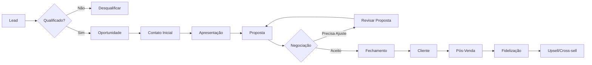

# 📄 MÓDULOS GESTÃO DE CONTRATOS E VENDAS & CRM - PARTE 2

**Sistema**: ICARUS v5.0  
**Continuação**: Documentação Completa  
**Versão**: 5.0.0  
**Última Atualização**: Outubro 2025  
**Idioma**: Português Brasileiro (pt-BR)

---

## CONTINUAÇÃO - PARTE I: GESTÃO DE CONTRATOS

## 6. WORKFLOW DE APROVAÇÃO (CONTINUAÇÃO)

### 6.1. Sistema de Aprovação Hierárquico (CONTINUAÇÃO)

```typescript
              <div className="flex-1">
                <h4 className="font-semibold">{aprovacao.nivel}</h4>
                <p className="text-sm text-gray-600">
                  {aprovacao.aprovadoPor?.nome || 'Aguardando'}
                </p>
                <p className="text-xs text-gray-500">
                  {aprovacao.dataAprovacao ? formatDate(aprovacao.dataAprovacao) : 'Pendente'}
                </p>
                
                {aprovacao.comentario && (
                  <p className="text-sm mt-2 p-2 bg-gray-100 dark:bg-gray-800 rounded">
                    {aprovacao.comentario}
                  </p>
                )}

                {aprovacao.motivo_rejeicao && (
                  <Alert variant="destructive" className="mt-2">
                    <AlertDescription>
                      <strong>Motivo da Rejeição:</strong> {aprovacao.motivo_rejeicao}
                    </AlertDescription>
                  </Alert>
                )}
              </div>

              {/* Ações (se pendente e usuário tem permissão) */}
              {aprovacao.status === 'pendente' && temPermissao(aprovacao.nivel) && (
                <div className="flex flex-col gap-2">
                  <Button
                    variant="primary"
                    size="sm"
                    onClick={() => handleAprovar(aprovacao.nivel)}
                  >
                    Aprovar
                  </Button>
                  <Button
                    variant="secondary"
                    size="sm"
                    onClick={() => handleRejeitar(aprovacao.nivel)}
                  >
                    Rejeitar
                  </Button>
                </div>
              )}
            </div>
          ))}
        </div>

        {/* Resumo */}
        <div className="mt-6 p-4 bg-gray-50 dark:bg-gray-800 rounded-lg">
          <h4 className="font-semibold mb-2">Status do Workflow</h4>
          <div className="grid grid-cols-3 gap-4">
            <div>
              <p className="text-sm text-gray-600">Aprovações</p>
              <p className="text-lg font-bold text-green-600">
                {aprovacoes.filter(a => a.status === 'aprovado').length}
              </p>
            </div>
            <div>
              <p className="text-sm text-gray-600">Pendentes</p>
              <p className="text-lg font-bold text-gray-600">
                {aprovacoes.filter(a => a.status === 'pendente').length}
              </p>
            </div>
            <div>
              <p className="text-sm text-gray-600">Rejeições</p>
              <p className="text-lg font-bold text-red-600">
                {aprovacoes.filter(a => a.status === 'rejeitado').length}
              </p>
            </div>
          </div>
        </div>
      </div>
    </Card>
  );
};
```

### 6.2. Regras de Negócio do Workflow

```typescript
/**
 * Regras de Aprovação de Contratos
 * 
 * AUTOMATIZAÇÕES:
 * 1. Valor > R$ 100.000 → Obrigatório aprovação diretoria
 * 2. Prazo > 24 meses → Obrigatório aprovação jurídica
 * 3. Contratos internacionais → Jurídico + Fiscal
 * 4. SLA crítico (< 24h) → Aprovação operacional
 * 5. Reajuste > IPCA + 2% → Aprovação financeira dupla
 * 
 * PERMISSÕES:
 * - Gerente Comercial: Pode criar/editar contratos
 * - Jurídico: Aprovação jurídica
 * - Controller: Aprovação financeira
 * - Diretor: Aprovação final
 * 
 * NOTIFICAÇÕES:
 * - Email ao criar contrato
 * - Email ao aprovar/rejeitar
 * - Push notification para aprovadores
 * - Alerta se parado > 3 dias
 */

export class WorkflowContratosService {
  async iniciarWorkflow(contratoId: string): Promise<void> {
    const contrato = await this.getContrato(contratoId);
    const niveis = this.determinarNiveisAprovacao(contrato);

    // Criar registros de aprovação
    for (const nivel of niveis) {
      await supabase.from('contratos_aprovacoes').insert({
        contrato_id: contratoId,
        nivel: nivel,
        status: 'pendente',
        ordem: this.getOrdem(nivel)
      });
    }

    // Notificar primeiro aprovador
    await this.notificarProximoAprovador(contratoId);
  }

  private determinarNiveisAprovacao(contrato: Contrato): string[] {
    const niveis: string[] = [];

    // Jurídico
    if (contrato.exige_aprovacao_juridico || 
        contrato.prazo_meses > 24 || 
        contrato.tipo === 'internacional') {
      niveis.push('juridico');
    }

    // Financeiro
    if (contrato.exige_aprovacao_financeiro || 
        contrato.valor_total > 50000) {
      niveis.push('financeiro');
    }

    // Diretoria
    if (contrato.exige_aprovacao_diretoria || 
        contrato.valor_total > 100000) {
      niveis.push('diretoria');
    }

    return niveis;
  }

  async aprovar(
    contratoId: string, 
    nivel: string, 
    dados: { aprovadoPor: string; comentario?: string }
  ): Promise<void> {
    // Atualizar aprovação
    await supabase
      .from('contratos_aprovacoes')
      .update({
        status: 'aprovado',
        aprovado_por: dados.aprovadoPor,
        data_aprovacao: new Date().toISOString(),
        comentario: dados.comentario
      })
      .eq('contrato_id', contratoId)
      .eq('nivel', nivel);

    // Verificar se todas as aprovações foram concluídas
    const { data: aprovacoes } = await supabase
      .from('contratos_aprovacoes')
      .select('*')
      .eq('contrato_id', contratoId);

    const todasAprovadas = aprovacoes?.every(a => a.status === 'aprovado');

    if (todasAprovadas) {
      // Ativar contrato
      await supabase
        .from('contratos')
        .update({ status: 'ativo' })
        .eq('id', contratoId);

      // Notificar criador
      await this.notificarContratoAprovado(contratoId);
    } else {
      // Notificar próximo aprovador
      await this.notificarProximoAprovador(contratoId);
    }
  }

  async rejeitar(
    contratoId: string, 
    nivel: string, 
    dados: { rejeitadoPor: string; motivo: string }
  ): Promise<void> {
    // Atualizar aprovação
    await supabase
      .from('contratos_aprovacoes')
      .update({
        status: 'rejeitado',
        aprovado_por: dados.rejeitadoPor,
        data_aprovacao: new Date().toISOString(),
        motivo_rejeicao: dados.motivo
      })
      .eq('contrato_id', contratoId)
      .eq('nivel', nivel);

    // Atualizar contrato
    await supabase
      .from('contratos')
      .update({ status: 'rejeitado' })
      .eq('id', contratoId);

    // Notificar criador
    await this.notificarContratoRejeitado(contratoId, dados.motivo);
  }
}
```

---

## 7. GESTÃO DE VENCIMENTOS

### 7.1. Sistema de Alertas de Vencimento

```typescript
/**
 * Gestão de Vencimentos e Renovações
 * 
 * ALERTAS AUTOMÁTICOS:
 * - 90 dias antes: Alerta para Gerente Comercial
 * - 60 dias antes: Alerta para Diretoria
 * - 30 dias antes: Alerta CRÍTICO (email diário)
 * - 15 dias antes: Alerta URGENTE (email + WhatsApp)
 * - No vencimento: Bloqueio automático (se não renovado)
 * 
 * RENOVAÇÃO AUTOMÁTICA:
 * - Se habilitado no contrato
 * - Gerar novo contrato automaticamente
 * - Aplicar reajuste (se configurado)
 * - Workflow de aprovação simplificado
 */

export const GestaoVencimentos: React.FC = () => {
  const { contratosVencendo, loading } = useContratosVencendo();
  const [filtro, setFiltro] = useState<'30' | '60' | '90'>('30');

  return (
    <div className="space-y-6">
      <div className="flex items-center justify-between">
        <h2 className="text-2xl font-bold">Contratos a Vencer</h2>
        
        {/* Filtro */}
        <div className="flex items-center gap-3">
          <Button
            variant={filtro === '30' ? 'primary' : 'secondary'}
            onClick={() => setFiltro('30')}
          >
            30 dias
          </Button>
          <Button
            variant={filtro === '60' ? 'primary' : 'secondary'}
            onClick={() => setFiltro('60')}
          >
            60 dias
          </Button>
          <Button
            variant={filtro === '90' ? 'primary' : 'secondary'}
            onClick={() => setFiltro('90')}
          >
            90 dias
          </Button>
        </div>
      </div>

      {/* Estatísticas */}
      <div className="grid grid-cols-1 md:grid-cols-4 gap-6">
        <KPICard
          label="Vencendo em 30 dias"
          value={contratosVencendo.vencendo30}
          icon={<AlertTriangle />}
          variant="warning"
        />
        <KPICard
          label="Vencendo em 60 dias"
          value={contratosVencendo.vencendo60}
          icon={<Clock />}
        />
        <KPICard
          label="Vencendo em 90 dias"
          value={contratosVencendo.vencendo90}
          icon={<Calendar />}
        />
        <KPICard
          label="Renovação Automática"
          value={contratosVencendo.renovacaoAuto}
          icon={<RefreshCw />}
          variant="success"
        />
      </div>

      {/* Lista de Contratos */}
      <Card title={`Contratos a Vencer em ${filtro} dias`} padding="none">
        <Table>
          <TableHeader>
            <TableRow>
              <TableHead>Número</TableHead>
              <TableHead>Contratado</TableHead>
              <TableHead>Tipo</TableHead>
              <TableHead>Valor</TableHead>
              <TableHead>Vencimento</TableHead>
              <TableHead>Dias Restantes</TableHead>
              <TableHead>Renovação Auto</TableHead>
              <TableHead>Ações</TableHead>
            </TableRow>
          </TableHeader>
          <TableBody>
            {contratosVencendo.contratos
              .filter(c => c.diasRestantes <= parseInt(filtro))
              .map((contrato) => (
                <TableRow key={contrato.id}>
                  <TableCell>
                    <Button
                      variant="link"
                      onClick={() => navigate(`/contratos/${contrato.id}`)}
                    >
                      {contrato.numero_contrato}
                    </Button>
                  </TableCell>
                  <TableCell>{contrato.contratado.nome}</TableCell>
                  <TableCell>
                    <Badge variant="outline">{contrato.tipo}</Badge>
                  </TableCell>
                  <TableCell>{formatCurrency(contrato.valor_total)}</TableCell>
                  <TableCell>{formatDate(contrato.data_fim)}</TableCell>
                  <TableCell>
                    <Badge 
                      variant={
                        contrato.diasRestantes <= 15 ? 'destructive' :
                        contrato.diasRestantes <= 30 ? 'warning' :
                        'default'
                      }
                    >
                      {contrato.diasRestantes} dias
                    </Badge>
                  </TableCell>
                  <TableCell>
                    {contrato.renovacao_automatica ? (
                      <Badge variant="success">Sim</Badge>
                    ) : (
                      <Badge variant="secondary">Não</Badge>
                    )}
                  </TableCell>
                  <TableCell>
                    <DropdownMenu>
                      <DropdownMenuTrigger asChild>
                        <Button variant="secondary" size="sm">
                          <MoreVertical size={16} />
                        </Button>
                      </DropdownMenuTrigger>
                      <DropdownMenuContent>
                        <DropdownMenuItem onClick={() => handleRenovar(contrato.id)}>
                          <RefreshCw className="mr-2 h-4 w-4" />
                          Renovar Contrato
                        </DropdownMenuItem>
                        <DropdownMenuItem onClick={() => handleRenegociar(contrato.id)}>
                          <Edit className="mr-2 h-4 w-4" />
                          Renegociar Termos
                        </DropdownMenuItem>
                        <DropdownMenuItem onClick={() => handleEncerrar(contrato.id)}>
                          <XCircle className="mr-2 h-4 w-4" />
                          Encerrar Contrato
                        </DropdownMenuItem>
                      </DropdownMenuContent>
                    </DropdownMenu>
                  </TableCell>
                </TableRow>
              ))}
          </TableBody>
        </Table>
      </Card>

      {/* Ações Rápidas */}
      <Card title="Ações em Lote" padding="md">
        <div className="flex items-center gap-3">
          <Button variant="primary" icon={<RefreshCw />}>
            Renovar Selecionados
          </Button>
          <Button variant="secondary" icon={<Mail />}>
            Enviar Notificação em Lote
          </Button>
          <Button variant="secondary" icon={<FileText />}>
            Exportar Relatório
          </Button>
        </div>
      </Card>
    </div>
  );
};

/**
 * Serviço de Alertas de Vencimento
 */
export class AlertasVencimentoService {
  async verificarVencimentos(): Promise<void> {
    const hoje = new Date();

    // Buscar contratos próximos ao vencimento
    const { data: contratos } = await supabase
      .from('contratos')
      .select('*')
      .eq('status', 'ativo')
      .gte('data_fim', hoje.toISOString())
      .lte('data_fim', addDays(hoje, 90).toISOString());

    if (!contratos) return;

    for (const contrato of contratos) {
      const diasRestantes = differenceInDays(new Date(contrato.data_fim), hoje);

      // Alerta 90 dias
      if (diasRestantes === 90) {
        await this.enviarAlerta(contrato, 'info', '90 dias para vencimento');
      }

      // Alerta 60 dias
      if (diasRestantes === 60) {
        await this.enviarAlerta(contrato, 'warning', '60 dias para vencimento');
      }

      // Alerta 30 dias
      if (diasRestantes === 30) {
        await this.enviarAlerta(contrato, 'critical', '30 dias para vencimento - AÇÃO NECESSÁRIA');
      }

      // Alerta 15 dias
      if (diasRestantes === 15) {
        await this.enviarAlerta(contrato, 'urgent', '15 dias para vencimento - URGENTE');
        await this.enviarWhatsApp(contrato);
      }

      // Renovação automática
      if (diasRestantes === 7 && contrato.renovacao_automatica) {
        await this.processarRenovacaoAutomatica(contrato);
      }
    }
  }

  private async enviarAlerta(
    contrato: Contrato, 
    severidade: string, 
    mensagem: string
  ): Promise<void> {
    // Registrar alerta
    await supabase.from('contratos_alertas').insert({
      contrato_id: contrato.id,
      severidade,
      mensagem,
      data_alerta: new Date().toISOString()
    });

    // Enviar email
    await this.enviarEmailAlerta(contrato, mensagem);

    // Notificação push
    await this.enviarPushNotification(contrato, mensagem);
  }

  private async processarRenovacaoAutomatica(contrato: Contrato): Promise<void> {
    // Criar novo contrato com dados atualizados
    const novoContrato = {
      ...contrato,
      numero_contrato: gerarNumeroContrato(),
      data_inicio: addDays(new Date(contrato.data_fim), 1),
      data_fim: addMonths(new Date(contrato.data_fim), contrato.prazo_meses),
      valor_total: this.calcularReajuste(contrato),
      contrato_origem_id: contrato.id,
      status: 'aguardando_aprovacao'
    };

    const { data: novo } = await supabase
      .from('contratos')
      .insert(novoContrato)
      .select()
      .single();

    // Iniciar workflow simplificado
    await workflowService.iniciarWorkflow(novo.id);

    // Notificar
    await this.notificarRenovacaoAutomatica(contrato, novo);
  }

  private calcularReajuste(contrato: Contrato): number {
    if (contrato.indice_reajuste === 'nenhum') {
      return contrato.valor_total;
    }

    let percentual = 0;

    switch (contrato.indice_reajuste) {
      case 'ipca':
        percentual = await this.buscarIPCA();
        break;
      case 'igpm':
        percentual = await this.buscarIGPM();
        break;
      case 'percentual_fixo':
        percentual = contrato.percentual_reajuste;
        break;
    }

    return contrato.valor_total * (1 + percentual / 100);
  }
}
```

---

## 8. CLÁUSULAS E ADITIVOS

### 8.1. Gestão de Aditivos Contratuais

```typescript
/**
 * Aditivos Contratuais
 * 
 * TIPOS DE ADITIVOS:
 * 1. Aditivo de Prazo (prorrogação)
 * 2. Aditivo de Valor (aumento/redução)
 * 3. Aditivo de Escopo (inclusão/exclusão de itens)
 * 4. Aditivo de Cláusulas (alteração de termos)
 * 5. Aditivo de Rescisão (encerramento antecipado)
 * 
 * WORKFLOW:
 * - Mesmo workflow do contrato principal
 * - Aprovação simplificada (se valor < 10%)
 * - Aprovação completa (se alteração significativa)
 */

export const FormularioAditivo: React.FC<{ contratoId: string }> = ({ contratoId }) => {
  const { contrato } = useContrato(contratoId);
  const [formData, setFormData] = useState<AditivoFormData>({});

  return (
    <FormularioContainer title="Novo Aditivo Contratual">
      {/* Dados do Contrato Original */}
      <Card title="Contrato Original" padding="md">
        <div className="grid grid-cols-2 gap-4">
          <div>
            <p className="text-sm text-gray-600">Número</p>
            <p className="font-semibold">{contrato?.numero_contrato}</p>
          </div>
          <div>
            <p className="text-sm text-gray-600">Contratado</p>
            <p className="font-semibold">{contrato?.contratado.nome}</p>
          </div>
          <div>
            <p className="text-sm text-gray-600">Valor Atual</p>
            <p className="font-semibold">{formatCurrency(contrato?.valor_total)}</p>
          </div>
          <div>
            <p className="text-sm text-gray-600">Vigência Atual</p>
            <p className="font-semibold">
              {formatDate(contrato?.data_inicio)} a {formatDate(contrato?.data_fim)}
            </p>
          </div>
        </div>
      </Card>

      {/* Tipo de Aditivo */}
      <Card title="Tipo de Aditivo" padding="lg">
        <Select
          label="Selecione o Tipo"
          value={formData.tipo}
          onChange={(value) => setFormData({ ...formData, tipo: value })}
          options={[
            { value: 'prazo', label: 'Aditivo de Prazo' },
            { value: 'valor', label: 'Aditivo de Valor' },
            { value: 'escopo', label: 'Aditivo de Escopo' },
            { value: 'clausulas', label: 'Aditivo de Cláusulas' },
            { value: 'rescisao', label: 'Aditivo de Rescisão' }
          ]}
          required
        />
      </Card>

      {/* Formulários Condicionais */}
      {formData.tipo === 'prazo' && (
        <Card title="Prorrogação de Prazo" padding="lg">
          <div className="grid grid-cols-2 gap-4">
            <Input
              label="Nova Data de Término"
              type="date"
              value={formData.nova_data_fim}
              onChange={(e) => setFormData({ ...formData, nova_data_fim: e.target.value })}
              min={contrato?.data_fim}
              required
            />
            <Input
              label="Meses Adicionais"
              type="number"
              value={formData.meses_adicionais}
              onChange={(e) => setFormData({ ...formData, meses_adicionais: parseInt(e.target.value) })}
              min="1"
              disabled
            />
          </div>
          <Textarea
            label="Justificativa"
            value={formData.justificativa}
            onChange={(e) => setFormData({ ...formData, justificativa: e.target.value })}
            rows={4}
            required
            placeholder="Explique o motivo da prorrogação..."
          />
        </Card>
      )}

      {formData.tipo === 'valor' && (
        <Card title="Alteração de Valor" padding="lg">
          <div className="grid grid-cols-2 gap-4">
            <Input
              label="Valor Atual"
              type="number"
              value={contrato?.valor_total}
              disabled
            />
            <Input
              label="Novo Valor (R$)"
              type="number"
              value={formData.novo_valor}
              onChange={(e) => setFormData({ ...formData, novo_valor: parseFloat(e.target.value) })}
              min="0"
              step="0.01"
              required
            />
            <div className="col-span-2">
              <Alert variant={formData.novo_valor > contrato?.valor_total ? 'warning' : 'info'}>
                <AlertDescription>
                  Variação: {formatCurrency(formData.novo_valor - contrato?.valor_total)} 
                  ({((formData.novo_valor / contrato?.valor_total - 1) * 100).toFixed(2)}%)
                </AlertDescription>
              </Alert>
            </div>
          </div>
          <Textarea
            label="Justificativa"
            value={formData.justificativa}
            onChange={(e) => setFormData({ ...formData, justificativa: e.target.value })}
            rows={4}
            required
          />
        </Card>
      )}

      {formData.tipo === 'escopo' && (
        <Card title="Alteração de Escopo" padding="lg">
          <Textarea
            label="Descrição da Alteração"
            value={formData.descricao_alteracao}
            onChange={(e) => setFormData({ ...formData, descricao_alteracao: e.target.value })}
            rows={6}
            required
            placeholder="Descreva as inclusões/exclusões de escopo..."
          />
        </Card>
      )}

      {/* Anexos */}
      <Card title="Documentos" padding="lg">
        <FileUploadZone
          label="Anexar Aditivo Assinado (PDF)"
          accept=".pdf"
          onFileSelect={(file) => setFormData({ ...formData, documento: file })}
        />
      </Card>

      {/* Botões */}
      <div className="flex items-center justify-end gap-3">
        <Button variant="secondary" onClick={onCancel}>
          Cancelar
        </Button>
        <Button variant="primary" type="submit" icon={<Check />}>
          Criar Aditivo
        </Button>
      </div>
    </FormularioContainer>
  );
};
```

---

## 9. SLA E INDICADORES

### 9.1. Monitoramento de SLA

```typescript
/**
 * Monitoramento de Service Level Agreement
 * 
 * INDICADORES COMUNS:
 * - Tempo de Entrega (horas)
 * - Taxa de Disponibilidade (%)
 * - Tempo de Resposta (minutos)
 * - Taxa de Defeitos (%)
 * - Uptime de Sistemas (%)
 * 
 * PENALIDADES:
 * - Desconto no valor
 * - Créditos futuros
 * - Rescisão (se recorrente)
 */

export const MonitoramentoSLA: React.FC<{ contratoId: string }> = ({ contratoId }) => {
  const { slas, performance } = useSLAMonitoring(contratoId);

  return (
    <div className="space-y-6">
      <h2 className="text-2xl font-bold">Monitoramento de SLA</h2>

      {/* Resumo Geral */}
      <div className="grid grid-cols-1 md:grid-cols-4 gap-6">
        <KPICard
          label="SLA Geral"
          value={`${performance.geral}%`}
          icon={<Target />}
          trend={{ direction: performance.geral >= performance.mesAnterior ? 'up' : 'down' }}
        />
        <KPICard
          label="No Prazo"
          value={performance.noPrazo}
          icon={<CheckCircle />}
          variant="success"
        />
        <KPICard
          label="Fora do Prazo"
          value={performance.foraPrazo}
          icon={<XCircle />}
          variant="destructive"
        />
        <KPICard
          label="Penalidades (R$)"
          value={formatCurrency(performance.penalidades)}
          icon={<DollarSign />}
        />
      </div>

      {/* Indicadores Detalhados */}
      <Card title="Indicadores de Performance" padding="none">
        <Table>
          <TableHeader>
            <TableRow>
              <TableHead>Indicador</TableHead>
              <TableHead>Meta</TableHead>
              <TableHead>Realizado</TableHead>
              <TableHead>Status</TableHead>
              <TableHead>Penalidade</TableHead>
              <TableHead>Ações</TableHead>
            </TableRow>
          </TableHeader>
          <TableBody>
            {slas.map((sla) => (
              <TableRow key={sla.id}>
                <TableCell className="font-medium">{sla.indicador}</TableCell>
                <TableCell>{sla.meta}</TableCell>
                <TableCell>{sla.realizado}</TableCell>
                <TableCell>
                  <Badge 
                    variant={
                      sla.percentual_cumprimento >= 95 ? 'success' :
                      sla.percentual_cumprimento >= 80 ? 'warning' :
                      'destructive'
                    }
                  >
                    {sla.percentual_cumprimento}%
                  </Badge>
                </TableCell>
                <TableCell>
                  {sla.penalidade_aplicada ? (
                    <span className="text-red-600">{sla.penalidade}</span>
                  ) : (
                    <span className="text-gray-400">-</span>
                  )}
                </TableCell>
                <TableCell>
                  <Button
                    variant="secondary"
                    size="sm"
                    onClick={() => handleVerDetalhes(sla.id)}
                  >
                    Ver Detalhes
                  </Button>
                </TableCell>
              </TableRow>
            ))}
          </TableBody>
        </Table>
      </Card>

      {/* Gráfico de Evolução */}
      <Card title="Evolução do SLA - Últimos 12 Meses" padding="md">
        <LineChart
          data={performance.historicoMensal}
          xAxis="mes"
          yAxis="percentual"
          targetLine={95}
        />
      </Card>
    </div>
  );
};

/**
 * Serviço de Monitoramento de SLA
 */
export class SLAMonitoringService {
  async calcularCumprimento(contratoId: string, periodo: string): Promise<SLAPerformance> {
    const { data: slas } = await supabase
      .from('contratos_sla')
      .select('*')
      .eq('contrato_id', contratoId);

    if (!slas) return null;

    const performance: SLAPerformance = {
      geral: 0,
      noPrazo: 0,
      foraPrazo: 0,
      penalidades: 0,
      detalhes: []
    };

    for (const sla of slas) {
      const medicoes = await this.buscarMedicoes(sla.id, periodo);
      const cumprimento = this.calcularPercentual(medicoes, sla.meta);

      performance.detalhes.push({
        indicador: sla.indicador,
        meta: sla.meta,
        realizado: this.calcularMedia(medicoes),
        percentual: cumprimento
      });

      // Aplicar penalidade se descumpriu
      if (cumprimento < 95) {
        const penalidade = await this.calcularPenalidade(sla, cumprimento);
        performance.penalidades += penalidade;
      }
    }

    // Calcular média geral
    performance.geral = performance.detalhes.reduce((acc, d) => acc + d.percentual, 0) / performance.detalhes.length;

    return performance;
  }

  private async calcularPenalidade(sla: SLA, cumprimento: number): Promise<number> {
    // Exemplo: 1% de desconto para cada 1% abaixo da meta
    const percentualAbaixoMeta = 95 - cumprimento;
    const valorContrato = sla.contrato.valor_mensal;
    
    return (valorContrato * percentualAbaixoMeta) / 100;
  }

  async gerarRelatorioMensal(contratoId: string): Promise<void> {
    const performance = await this.calcularCumprimento(contratoId, 'mensal');

    // Gerar PDF
    const pdf = await this.gerarPDFRelatorio(performance);

    // Enviar para contratado e contratante
    await this.enviarRelatorio(contratoId, pdf);
  }
}
```

---

## 10. IA PARA CONTRATOS

### 10.1. Análise de Contratos com GPT-4

```typescript
/**
 * IA para Análise de Contratos
 * 
 * FUNCIONALIDADES:
 * 1. Extração de Cláusulas Importantes
 * 2. Detecção de Riscos
 * 3. Comparação com Contratos Similares
 * 4. Sugestão de Melhorias
 * 5. Análise de Linguagem Jurídica
 * 6. Previsão de Renovação (ML)
 */

export class ContratosAI {
  private openai: OpenAI;

  constructor() {
    this.openai = new OpenAI({
      apiKey: process.env.VITE_OPENAI_API_KEY
    });
  }

  async analisarContrato(contratoTexto: string): Promise<AnaliseContrato> {
    const prompt = `
      Você é um especialista em análise de contratos comerciais no setor de saúde (OPME).
      
      Analise o contrato abaixo e forneça:
      
      1. CLÁUSULAS IMPORTANTES: Liste as 5 cláusulas mais importantes
      2. RISCOS IDENTIFICADOS: Liste potenciais riscos para nossa empresa
      3. PONTOS FAVORÁVEIS: Liste cláusulas favoráveis
      4. PONTOS DESFAVORÁVEIS: Liste cláusulas desfavoráveis
      5. SUGESTÕES: Sugestões de melhoria
      6. SCORE DE RISCO: De 0-100 (0 = sem risco, 100 = risco alto)
      
      Contrato:
      ${contratoTexto}
      
      Responda em formato JSON estruturado.
    `;

    const completion = await this.openai.chat.completions.create({
      model: 'gpt-4-turbo-preview',
      messages: [{ role: 'user', content: prompt }],
      response_format: { type: 'json_object' },
      temperature: 0.3
    });

    const analise = JSON.parse(completion.choices[0].message.content);

    return analise;
  }

  async compararContratos(contratoId: string): Promise<ComparacaoContratos> {
    // Buscar contrato atual
    const { data: contratoAtual } = await supabase
      .from('contratos')
      .select('*')
      .eq('id', contratoId)
      .single();

    // Buscar contratos similares
    const { data: contratosSimilares } = await supabase
      .from('contratos')
      .select('*')
      .eq('tipo', contratoAtual.tipo)
      .neq('id', contratoId)
      .limit(10);

    const comparacao: ComparacaoContratos = {
      valorMedio: this.calcularMedia(contratosSimilares.map(c => c.valor_total)),
      prazoMedio: this.calcularMedia(contratosSimilares.map(c => c.prazo_meses)),
      reajusteMaisComum: this.calcularModa(contratosSimilares.map(c => c.indice_reajuste)),
      clausulasComuns: await this.extrairClausulasComuns(contratosSimilares),
      recomendacao: ''
    };

    // Gerar recomendação
    if (contratoAtual.valor_total > comparacao.valorMedio * 1.2) {
      comparacao.recomendacao = 'Valor 20% acima da média. Considere renegociar.';
    } else if (contratoAtual.valor_total < comparacao.valorMedio * 0.8) {
      comparacao.recomendacao = 'Valor abaixo da média. Bom negócio!';
    }

    return comparacao;
  }

  async preverRenovacao(contratoId: string): Promise<PrevisaoRenovacao> {
    // Buscar histórico do fornecedor
    const { data: historicoFornecedor } = await supabase
      .from('contratos')
      .select('*')
      .eq('contratado_id', contratoId);

    // Features para o modelo
    const features = {
      valorContrato: contrato.valor_total,
      prazoMeses: contrato.prazo_meses,
      slaCumprimento: await this.calcularSLAMedio(contratoId),
      tempoRelacionamento: historicoFornecedor.length,
      taxaRenovacaoFornecedor: this.calcularTaxaRenovacao(historicoFornecedor),
      qualidadeServico: await this.calcularQualidadeServico(contratoId)
    };

    // Usar ML para prever
    const probabilidade = await this.modeloML.predict(features);

    return {
      probabilidade: probabilidade * 100,
      fatoresPositivos: this.identificarFatoresPositivos(features),
      fatoresNegativos: this.identificarFatoresNegativos(features),
      recomendacao: this.gerarRecomendacaoRenovacao(probabilidade)
    };
  }

  async extrairClausulas(contratoTexto: string): Promise<string[]> {
    const prompt = `
      Extraia todas as cláusulas do contrato abaixo, numerando-as.
      Retorne apenas a lista de cláusulas em formato JSON array.
      
      Contrato:
      ${contratoTexto}
    `;

    const completion = await this.openai.chat.completions.create({
      model: 'gpt-4-turbo-preview',
      messages: [{ role: 'user', content: prompt }],
      response_format: { type: 'json_object' }
    });

    const resultado = JSON.parse(completion.choices[0].message.content);
    return resultado.clausulas;
  }
}
```

---

# PARTE II - MÓDULO VENDAS & CRM

## 11. VISÃO GERAL CRM

### 11.1. Descrição

**Arquivo Principal**: `/components/modules/CRMVendas.tsx`

O módulo **Vendas & CRM** (Customer Relationship Management) é o coração comercial do sistema ICARUS v5.0, responsável por gerenciar todo o ciclo de vendas, desde a captação de leads até o pós-venda e fidelização. Focado em vendas B2B para hospitais, clínicas e médicos.

### 11.2. Objetivos

```yaml
Objetivos Principais:
  - Aumentar taxa de conversão de leads
  - Reduzir ciclo de vendas
  - Melhorar relacionamento com clientes
  - Automatizar follow-ups
  - Prever vendas (forecasting)
  - Gestão de pipeline visual
  - Integração com WhatsApp Business
  - IA para recomendação de produtos

Métricas de Sucesso:
  - Taxa de conversão > 30%
  - Ciclo de vendas < 15 dias
  - NPS (Net Promoter Score) > 70
  - Lifetime Value (LTV) crescente
  - CAC (Custo de Aquisição) < 20% do LTV
  - Retenção de clientes > 85%
```

### 11.3. Importância para Negócio OPME

```yaml
Por que é crítico:

  Vendas B2B Complexas:
    - Ciclo longo (30-90 dias)
    - Múltiplos tomadores de decisão
    - Volumes altos (cirurgias mensais)
    - Relacionamento é fundamental
    
  Relacionamento Hospitalar:
    - Compliance exigido por ANS
    - Contratos de longo prazo
    - Necessidade de follow-up constante
    - Fidelização = recorrência

  Competitividade:
    - Mercado OPME é concorrido
    - Preço não é único fator
    - Atendimento diferenciado vence
    - CRM organizado = vantagem competitiva
```

---

## 12. ARQUITETURA CRM

### 12.1. Diagrama de Componentes

```
┌─────────────────────────────────────────────────────────────────┐
│                  VENDAS & CRM - ARQUITETURA                      │
├─────────────────────────────────────────────────────────────────┤
│                                                                  │
│  ┌────────────────────────────────────────────────────────┐    │
│  │              PRESENTATION LAYER                         │    │
│  │  ┌──────────┐  ┌──────────┐  ┌──────────┐  ┌────────┐ │    │
│  │  │Dashboard │  │  Leads   │  │ Pipeline │  │  Opor  │ │    │
│  │  │  Vendas  │  │  Gestão  │  │  Visual  │  │tunidad │ │    │
│  │  └──────────┘  └──────────┘  └──────────┘  └────────┘ │    │
│  │                                                         │    │
│  │  ┌──────────┐  ┌──────────┐  ┌──────────┐  ┌────────┐ │    │
│  │  │ Clientes │  │Campanhas │  │ Relatóri │  │ Tarefas│ │    │
│  │  │  360º    │  │Marketing │  │   os     │  │ Follow │ │    │
│  │  └──────────┘  └──────────┘  └──────────┘  └────────┘ │    │
│  └────────────────────────────────────────────────────────┘    │
│                           ▼                                      │
│  ┌────────────────────────────────────────────────────────┐    │
│  │              BUSINESS LOGIC LAYER                       │    │
│  │  ┌──────────────────────────────────────────────────┐  │    │
│  │  │         CRMService.ts                             │  │    │
│  │  │  - CRUD de leads/oportunidades                    │  │    │
│  │  │  - Pipeline management                            │  │    │
│  │  │  - Forecasting                                    │  │    │
│  │  │  - Follow-ups automáticos                         │  │    │
│  │  └──────────────────────────────────────────────────┘  │    │
│  │                                                         │    │
│  │  ┌──────────────────────────────────────────────────┐  │    │
│  │  │         VendasAI.ts (IA)                         │  │    │
│  │  │  - Lead scoring (probabilidade conversão)        │  │    │
│  │  │  - Recomendação de produtos (GPT-4)             │  │    │
│  │  │  - Previsão de vendas (ML)                      │  │    │
│  │  │  - Análise de sentimento (NLP)                  │  │    │
│  │  │  - Next best action                             │  │    │
│  │  └──────────────────────────────────────────────────┘  │    │
│  │                                                         │    │
│  │  ┌──────────────────────────────────────────────────┐  │    │
│  │  │         CampanhasService.ts                      │  │    │
│  │  │  - Segmentação de clientes                       │  │    │
│  │  │  - Disparo de emails em massa                    │  │    │
│  │  │  - WhatsApp Business API                         │  │    │
│  │  │  - Tracking de abertura/clique                   │  │    │
│  │  └──────────────────────────────────────────────────┘  │    │
│  └────────────────────────────────────────────────────────┘    │
│                           ▼                                      │
│  ┌────────────────────────────────────────────────────────┐    │
│  │            INTEGRATION LAYER (APIs)                     │    │
│  │                                                         │    │
│  │  ┌──────────┐  ┌──────────┐  ┌──────────┐  ┌────────┐ │    │
│  │  │WhatsApp  │  │   RD     │  │ HubSpot  │  │Mailgun │ │    │
│  │  │Business  │  │ Station  │  │   API    │  │  API   │ │    │
│  │  └──────────┘  └──────────┘  └──────────┘  └────────┘ │    │
│  │                                                         │    │
│  │  ┌──────────┐  ┌──────────┐  ┌──────────┐  ┌────────┐ │    │
│  │  │ Twillio  │  │   GPT-4  │  │  Zapier  │  │LinkedIn│ │    │
│  │  │   API    │  │   API    │  │   API    │  │  API   │ │    │
│  │  └──────────┘  └──────────┘  └──────────┘  └────────┘ │    │
│  └────────────────────────────────────────────────────────┘    │
│                           ▼                                      │
│  ┌────────────────────────────────────────────────────────┐    │
│  │                  DATA LAYER                             │    │
│  │  ┌──────────────────────────────────────────────────┐  │    │
│  │  │          Supabase PostgreSQL                      │  │    │
│  │  │  - leads                                          │  │    │
│  │  │  - oportunidades                                  │  │    │
│  │  │  - clientes                                       │  │    │
│  │  │  - interacoes                                     │  │    │
│  │  │  - campanhas                                      │  │    │
│  │  │  - tarefas_follow_up                              │  │    │
│  │  │  - propostas_comerciais                           │  │    │
│  │  └──────────────────────────────────────────────────┘  │    │
│  └────────────────────────────────────────────────────────┘    │
└─────────────────────────────────────────────────────────────────┘
```

### 12.2. Fluxo do Pipeline de Vendas



---

## 13. SUB-MÓDULOS CRM

```typescript
interface SubModulosCRM {
  '13.1': 'Dashboard de Vendas',
  '13.2': 'Gestão de Leads',
  '13.3': 'Pipeline de Vendas',
  '13.4': 'Gestão de Oportunidades',
  '13.5': 'Relacionamento com Cliente (360º)',
  '13.6': 'Campanhas de Marketing',
  '13.7': 'Propostas Comerciais',
  '13.8': 'Tarefas e Follow-ups',
  '13.9': 'IA para Vendas',
  '13.10': 'Relatórios e Forecasting'
}
```

---

## 14. DASHBOARD DE VENDAS

### 14.1. KPIs Principais

```typescript
/**
 * Dashboard de Vendas - KPIs
 * 
 * MÉTRICAS PRINCIPAIS:
 * 1. Vendas do Mês (R$)
 * 2. Meta do Mês vs Realizado
 * 3. Taxa de Conversão (%)
 * 4. Ticket Médio
 * 5. Ciclo de Vendas Médio (dias)
 * 6. Pipeline Value (R$)
 * 7. Leads Gerados
 * 8. NPS (Net Promoter Score)
 * 
 * WIDGETS:
 * - Funil de Vendas
 * - Top Vendedores
 * - Produtos Mais Vendidos
 * - Previsão de Vendas (IA)
 * - Atividades Pendentes
 */

export const DashboardVendas: React.FC = () => {
  const { kpis, loading } = useVendasKPIs();
  const { previsao } = usePrevisaoVendas();

  return (
    <div className="space-y-6">
      {/* KPIs Linha 1 */}
      <div className="grid grid-cols-1 md:grid-cols-4 gap-6">
        <KPICard
          label="Vendas do Mês"
          value={formatCurrency(kpis.vendasMes)}
          icon={<TrendingUp />}
          trend={{ 
            direction: kpis.vendasMes > kpis.vendasMesAnterior ? 'up' : 'down',
            percentage: ((kpis.vendasMes / kpis.vendasMesAnterior - 1) * 100).toFixed(1)
          }}
        />
        
        <KPICard
          label="Meta do Mês"
          value={`${kpis.metaAtingida}%`}
          icon={<Target />}
          subtitle={`R$ ${formatNumber(kpis.meta)} meta`}
        />
        
        <KPICard
          label="Taxa de Conversão"
          value={`${kpis.taxaConversao}%`}
          icon={<Percent />}
          trend={{ direction: 'up', percentage: 2.5 }}
        />
        
        <KPICard
          label="Ticket Médio"
          value={formatCurrency(kpis.ticketMedio)}
          icon={<DollarSign />}
        />
      </div>

      {/* KPIs Linha 2 */}
      <div className="grid grid-cols-1 md:grid-cols-4 gap-6">
        <KPICard
          label="Leads Gerados"
          value={kpis.leadsGerados}
          icon={<Users />}
        />
        
        <KPICard
          label="Oportunidades Abertas"
          value={kpis.oportunidadesAbertas}
          icon={<Briefcase />}
        />
        
        <KPICard
          label="Ciclo de Vendas"
          value={`${kpis.cicloVendas} dias`}
          icon={<Clock />}
        />
        
        <KPICard
          label="Pipeline Value"
          value={formatCurrency(kpis.pipelineValue)}
          icon={<BarChart3 />}
        />
      </div>

      {/* Previsão IA */}
      <Card 
        title="Previsão de Vendas (IA)" 
        padding="md"
        icon={<Sparkles />}
      >
        <div className="grid grid-cols-3 gap-6">
          <div>
            <p className="text-sm text-gray-600">Previsão para este Mês</p>
            <p className="text-2xl font-bold text-indigo-600">
              {formatCurrency(previsao.mesAtual)}
            </p>
            <p className="text-xs text-gray-500 mt-1">
              Confiança: {previsao.confianca}%
            </p>
          </div>
          <div>
            <p className="text-sm text-gray-600">Previsão Próximo Mês</p>
            <p className="text-2xl font-bold">
              {formatCurrency(previsao.proximoMes)}
            </p>
          </div>
          <div>
            <p className="text-sm text-gray-600">Previsão Trimestre</p>
            <p className="text-2xl font-bold">
              {formatCurrency(previsao.trimestre)}
            </p>
          </div>
        </div>
      </Card>

      {/* Gráficos */}
      <div className="grid grid-cols-1 lg:grid-cols-2 gap-6">
        {/* Funil de Vendas */}
        <Card title="Funil de Vendas" padding="md">
          <FunnelChart data={kpis.funil} />
        </Card>

        {/* Vendas por Mês */}
        <Card title="Vendas - Últimos 12 Meses" padding="md">
          <BarChart
            data={kpis.vendasMensais}
            xAxis="mes"
            yAxis="valor"
            targetLine={kpis.meta}
          />
        </Card>

        {/* Top Vendedores */}
        <Card title="Top 10 Vendedores" padding="md">
          <BarChart
            data={kpis.topVendedores}
            xAxis="vendedor"
            yAxis="valor"
            horizontal
          />
        </Card>

        {/* Produtos Mais Vendidos */}
        <Card title="Produtos Mais Vendidos" padding="md">
          <Table>
            <TableHeader>
              <TableRow>
                <TableHead>Produto</TableHead>
                <TableHead>Qtd</TableHead>
                <TableHead>Valor</TableHead>
              </TableRow>
            </TableHeader>
            <TableBody>
              {kpis.produtosMaisVendidos.map((produto) => (
                <TableRow key={produto.id}>
                  <TableCell>{produto.descricao}</TableCell>
                  <TableCell>{produto.quantidade}</TableCell>
                  <TableCell>{formatCurrency(produto.valor)}</TableCell>
                </TableRow>
              ))}
            </TableBody>
          </Table>
        </Card>
      </div>

      {/* Tarefas Pendentes */}
      <Card title="Minhas Tarefas Hoje" padding="none">
        <Table>
          <TableHeader>
            <TableRow>
              <TableHead>Tarefa</TableHead>
              <TableHead>Cliente</TableHead>
              <TableHead>Horário</TableHead>
              <TableHead>Prioridade</TableHead>
              <TableHead>Ações</TableHead>
            </TableRow>
          </TableHeader>
          <TableBody>
            {kpis.tarefasPendentes.map((tarefa) => (
              <TableRow key={tarefa.id}>
                <TableCell>{tarefa.descricao}</TableCell>
                <TableCell>{tarefa.cliente}</TableCell>
                <TableCell>{formatTime(tarefa.horario)}</TableCell>
                <TableCell>
                  <Badge variant={tarefa.prioridade === 'alta' ? 'destructive' : 'default'}>
                    {tarefa.prioridade}
                  </Badge>
                </TableCell>
                <TableCell>
                  <Button size="sm" variant="primary">
                    Concluir
                  </Button>
                </TableCell>
              </TableRow>
            ))}
          </TableBody>
        </Table>
      </Card>
    </div>
  );
};
```

---

Vou continuar no próximo arquivo com as seções 15-24 (Gestão de Leads, Pipeline, Oportunidades, Relacionamento, Campanhas, IA para Vendas, Integrações e Analytics).

