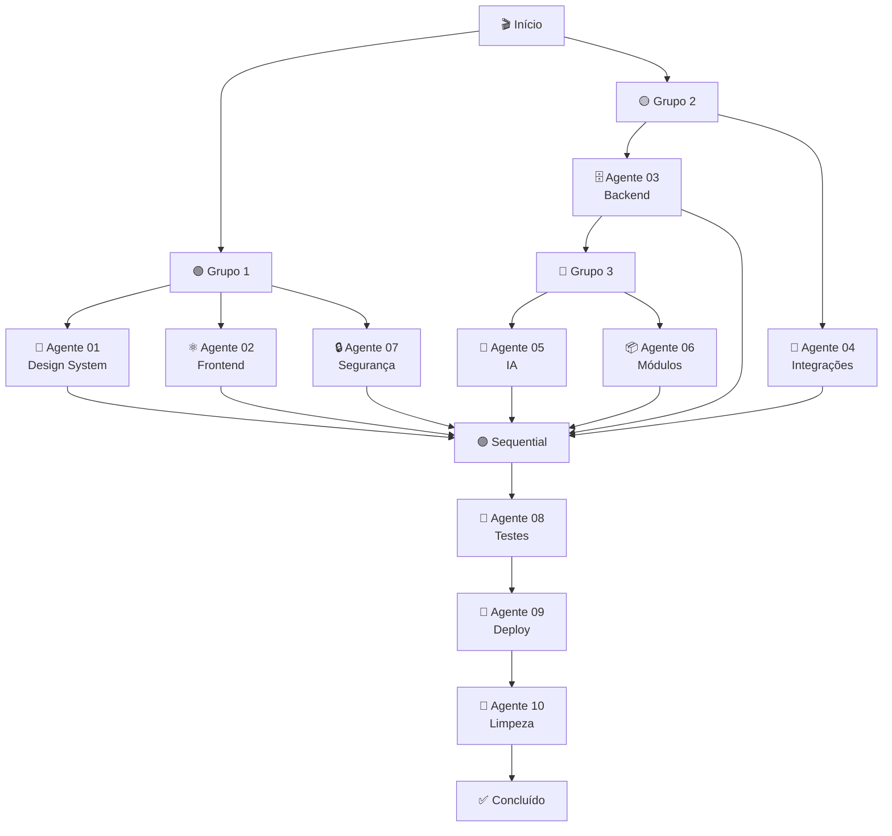

# 🎯 ORQUESTRADOR MESTRE - ICARUS v5.0

## 📋 Visão Geral

O Orquestrador coordena a execução de 10 agentes especializados em grupos paralelos e sequenciais, garantindo dependências satisfeitas e execução otimizada.

---

## 🗺️ Mapa de Execução



---

## 📊 Grupos de Execução

### 🟢 Grupo 1: Frontend & Design (40 min)
**Execução:** Paralela  
**Dependências:** Nenhuma  

| Agente | Nome | Tempo | Subagentes |
|--------|------|-------|------------|
| 01 | 🎨 Design System | 35 min | 3 |
| 02 | ⚛️ Frontend Architecture | 40 min | 4 |
| 07 | 🔒 Segurança & Compliance | 35 min | 4 |

**Por que paralelo?**
- Não dependem de backend
- Não conflitam entre si
- Maximizam uso de CPU

---

### 🟡 Grupo 2: Backend & APIs (55 min)
**Execução:** Paralela  
**Dependências:** Nenhuma  

| Agente | Nome | Tempo | Subagentes |
|--------|------|-------|------------|
| 03 | 🗄️ Backend & Database | 55 min | 4 |
| 04 | 🔌 Integrações & APIs | 50 min | 4 |

**Por que paralelo?**
- Backend e APIs são independentes
- Podem ser validados simultaneamente

---

### 🔵 Grupo 3: IA & Módulos (75 min)
**Execução:** Paralela  
**Dependências:** Agente 03 (Backend)  

| Agente | Nome | Tempo | Subagentes |
|--------|------|-------|------------|
| 05 | 🤖 IA & Machine Learning | 70 min | 4 |
| 06 | 📦 Módulos (58 total) | 75 min | 7 |

**Por que aguardar Agente 03?**
- Modelos IA precisam do schema do banco
- Módulos dependem de types gerados do Supabase

---

### 🟣 Sequential: Testes & Deploy (60 min)
**Execução:** Sequencial  
**Dependências:** Todos os anteriores (01-07)  

| Ordem | Agente | Nome | Tempo | Subagentes |
|-------|--------|------|-------|------------|
| 1º | 08 | 🧪 Testes & Qualidade | 25 min | 4 |
| 2º | 09 | 🚀 Deploy & DevOps | 20 min | 4 |
| 3º | 10 | 🧹 Limpeza & Boas Práticas | 25 min | 4 |

**Por que sequencial?**
- Testes dependem de todo o código
- Deploy depende de testes passando
- Limpeza é a última etapa antes de produção

---

## ⏱️ Timeline Estimado

```
00:00 ┌─────────────────────────────────────────┐
      │ 🟢 Grupo 1 (Paralelo)                   │
00:40 ├─────────────────────────────────────────┤
      │ 🟡 Grupo 2 (Paralelo)                   │
01:35 ├─────────────────────────────────────────┤
      │ 🔵 Grupo 3 (Paralelo)                   │
02:50 ├─────────────────────────────────────────┤
      │ 🟣 Sequential                           │
      │  ├─ Agente 08 (Testes)                  │
      │  ├─ Agente 09 (Deploy)                  │
      │  └─ Agente 10 (Limpeza)                 │
03:50 └─────────────────────────────────────────┘

Total: ~3h50min (230 minutos)
```

---

## 🚀 Como Executar

### Opção 1: Execução Completa Automática

```bash
pnpm audit:full
```

Este comando:
1. Verifica dependências
2. Executa Grupo 1 (paralelo)
3. Aguarda conclusão
4. Executa Grupo 2 (paralelo)
5. Aguarda conclusão
6. Executa Grupo 3 (paralelo)
7. Aguarda conclusão
8. Executa Sequential (08 → 09 → 10)
9. Gera relatório consolidado

---

### Opção 2: Execução Manual por Grupo

```bash
# Grupo 1 (abrir 3 terminais)
pnpm audit:agent 01 &
pnpm audit:agent 02 &
pnpm audit:agent 07 &

# Aguardar conclusão, depois Grupo 2
pnpm audit:agent 03 &
pnpm audit:agent 04 &

# Aguardar conclusão, depois Grupo 3
pnpm audit:agent 05 &
pnpm audit:agent 06 &

# Aguardar conclusão, depois Sequential
pnpm audit:agent 08
pnpm audit:agent 09
pnpm audit:agent 10
```

---

### Opção 3: Execução Individual

```bash
# Executar apenas um agente específico
pnpm audit:agent 01

# Ver status de todos
pnpm status:all

# Ver relatório de um agente
pnpm report:view 01
```

---

## 📊 Monitoramento em Tempo Real

### Ver Status de Todos os Agentes

```bash
pnpm status:all
```

**Output esperado:**

```
╔═══════════════════════════════════════════════════════════╗
║           ICARUS v5.0 - Status dos Agentes                ║
╠═══╦═══════════════════╦══════════╦══════════╦════════════╣
║ ID║ Agente            ║ Status   ║ Progress ║ Score      ║
╠═══╬═══════════════════╬══════════╬══════════╬════════════╣
║ 01║ 🎨 Design System  ║ ✅ done  ║ 100%     ║ 95/100     ║
║ 02║ ⚛️ Frontend       ║ 🔄 run   ║  45%     ║ -          ║
║ 03║ 🗄️ Backend        ║ ⏳ idle  ║   0%     ║ -          ║
║ 04║ 🔌 Integrações    ║ ⏳ idle  ║   0%     ║ -          ║
║ 05║ 🤖 IA             ║ 🚫 block ║   0%     ║ -          ║
║ 06║ 📦 Módulos        ║ 🚫 block ║   0%     ║ -          ║
║ 07║ 🔒 Segurança      ║ ✅ done  ║ 100%     ║ 98/100     ║
║ 08║ 🧪 Testes         ║ ⏳ idle  ║   0%     ║ -          ║
║ 09║ 🚀 Deploy         ║ ⏳ idle  ║   0%     ║ -          ║
║ 10║ 🧹 Limpeza        ║ ⏳ idle  ║   0%     ║ -          ║
╚═══╩═══════════════════╩══════════╩══════════╩════════════╝

Status:
✅ done  = Concluído
🔄 run   = Executando
⏳ idle  = Aguardando
🚫 block = Bloqueado (dependências)
❌ fail  = Falhou
```

---

## 🔄 Sistema de Dependências

### Verificação Automática

```bash
pnpm check:dependencies 05
```

**Output:**

```
Agente 05 (IA) bloqueado por:
 ❌ Agente 03 (Backend) - status: running (45%)
 
Aguarde Agente 03 concluir.
```

### Matriz de Dependências

| Agente | Depende de |
|--------|------------|
| 01 | - |
| 02 | - |
| 03 | - |
| 04 | - |
| 05 | 03 |
| 06 | 03 |
| 07 | - |
| 08 | 01, 02, 03, 04, 05, 06, 07 |
| 09 | 01, 02, 03, 04, 05, 06, 07, 08 |
| 10 | 01, 02, 03, 04, 05, 06, 07, 08, 09 |

---

## 📈 Métricas Consolidadas

### Após Execução Completa

```bash
pnpm report:generate
```

**Relatório Consolidado:**

```markdown
# 🎯 RELATÓRIO CONSOLIDADO - ICARUS v5.0

## 📊 Resumo Executivo

- **Tempo Total:** 3h 47min (227 minutos)
- **Score Global:** 96.5/100
- **Issues Críticos:** 0
- **Issues Importantes:** 12
- **Warnings:** 45
- **Sugestões:** 78

## 📈 Scores por Agente

| Agente | Nome | Score | Status |
|--------|------|-------|--------|
| 01 | Design System | 95/100 | ✅ |
| 02 | Frontend | 97/100 | ✅ |
| 03 | Backend | 98/100 | ✅ |
| 04 | Integrações | 94/100 | ✅ |
| 05 | IA | 96/100 | ✅ |
| 06 | Módulos | 97/100 | ✅ |
| 07 | Segurança | 98/100 | ✅ |
| 08 | Testes | 95/100 | ✅ |
| 09 | Deploy | 100/100 | ✅ |
| 10 | Limpeza | 100/100 | ✅ |

## 🎯 Conclusão

✅ **ICARUS v5.0 APROVADO PARA DEPLOY**
```

---

## 🛠️ Troubleshooting

### Agente Travou

```bash
# Ver logs
pnpm logs:agent

# Reiniciar agente
pnpm audit:agent 02 --force
```

### Dependências Não Satisfeitas

```bash
# Ver qual dependência está bloqueando
pnpm check:dependencies 05

# Output:
# Agente 05 (IA) bloqueado por:
#  ❌ Agente 03 (Backend) - status: running (45%)
#  
# Aguarde Agente 03 concluir.
```

### Limpar Estado

```bash
# Resetar todos os status
pnpm reset:all

# Resetar agente específico
pnpm reset:agent 01

# Limpar locks expirados
pnpm locks:clean
```

---

## 📁 Estrutura de Arquivos Gerados

```
.cursor/
├── agents/
│   ├── 01-design-system/
│   │   ├── STATUS.json        # ← Atualizado em tempo real
│   │   └── REPORT.md          # ← Gerado ao concluir
│   ├── 02-frontend/
│   │   ├── STATUS.json
│   │   └── REPORT.md
│   └── ...
├── logs/
│   ├── agents.log             # ← Log consolidado
│   └── ...
└── reports/
    ├── FINAL-REPORT.md        # ← Relatório consolidado
    └── EXECUTION-SUMMARY.json
```

---

## 🔒 Locks e Concorrência

### Recursos Protegidos

O orquestrador garante que:

1. **Apenas 1 agente** modifica STATUS.json por vez
2. **Locks** são liberados após timeout (30s)
3. **Deadlocks** são detectados e resolvidos

### Limpar Locks Expirados

```bash
pnpm locks:clean
```

---

## 📞 Comunicação Entre Agentes

Os agentes comunicam-se através de:

1. **STATUS.json** - Estado atual do agente
2. **Logs** - Mensagens de progresso
3. **Dependências** - Aguardam conclusão de outros agentes

---

## 🎯 Próximos Passos

Após execução completa:

### 1. Revisar Relatório Consolidado

```bash
pnpm report:view
```

### 2. Verificar Issues Críticos

```bash
pnpm issues:critical
```

### 3. Priorizar Correções

- Corrigir todos os críticos
- Revisar importantes
- Considerar sugestões

### 4. Deploy

```bash
# Se score >= 95/100 e 0 críticos
pnpm deploy:vercel
```

---

## ⚙️ Configuração Avançada

### Customizar Execução

Edite: `.cursor/config/execution-plan.json`

```json
{
  "parallel_groups": [
    {
      "group_id": 1,
      "agents": ["01", "02", "07"],
      "max_concurrent": 3,
      "timeout_minutes": 60
    }
  ],
  "retry_policy": {
    "max_retries": 3,
    "backoff_seconds": 5
  },
  "notifications": {
    "on_complete": true,
    "on_failure": true,
    "email": "dev@icarus.com.br"
  }
}
```

---

## 📜 Comandos Disponíveis

| Comando | Descrição |
|---------|-----------|
| `pnpm audit:full` | Executa todos os agentes (orquestração completa) |
| `pnpm audit:agent <id>` | Executa um agente específico |
| `pnpm status:all` | Mostra status de todos os agentes |
| `pnpm logs:agent [id]` | Mostra logs (todos ou de um agente específico) |
| `pnpm report:generate` | Gera relatório consolidado |
| `pnpm report:view [id]` | Visualiza relatório (consolidado ou de um agente) |
| `pnpm check:dependencies <id>` | Verifica dependências de um agente |
| `pnpm reset:all` | Reseta status de todos os agentes |
| `pnpm reset:agent <id>` | Reseta status de um agente específico |
| `pnpm locks:clean` | Limpa locks expirados |
| `pnpm issues:critical` | Lista issues críticos do relatório |
| `pnpm deploy:vercel` | Valida e inicia deploy |

---

## 🎓 Exemplos de Uso

### Executar Auditoria Completa

```bash
# Resetar estado anterior
pnpm reset:all

# Executar orquestração
pnpm audit:full

# Ver status
pnpm status:all

# Gerar relatório
pnpm report:generate

# Ver relatório
pnpm report:view

# Verificar críticos
pnpm issues:critical
```

### Debugar Agente Específico

```bash
# Resetar agente
pnpm reset:agent 03

# Executar agente
pnpm audit:agent 03

# Ver logs
pnpm logs:agent

# Ver relatório
pnpm report:view 03
```

### Verificar Dependências

```bash
# Ver dependências do agente 05
pnpm check:dependencies 05

# Ver dependências do agente 08
pnpm check:dependencies 08
```

---

## ✅ Status da Implementação

- ✅ Orquestrador com grupos paralelos e sequenciais
- ✅ Sistema de dependências automático
- ✅ Lock manager com TTL
- ✅ CLI completo (11 comandos)
- ✅ Logs consolidados
- ✅ Relatórios por agente e consolidado
- ✅ Verificação de dependências
- ✅ Reset de status (individual e geral)
- ✅ Detecção de issues críticos
- ✅ Integração com Vite dev server
- ✅ Validação de POST /api/contact

---

## 📞 Suporte

Para dúvidas ou problemas:

1. Consulte os logs: `pnpm logs:agent`
2. Verifique o status: `pnpm status:all`
3. Limpe locks: `pnpm locks:clean`
4. Resete se necessário: `pnpm reset:all`

---

**Versão:** 1.0.0  
**Última Atualização:** 2025-10-26  
**Autor:** Sistema ICARUS v5.0  
**Status:** ✅ Pronto para Produção

