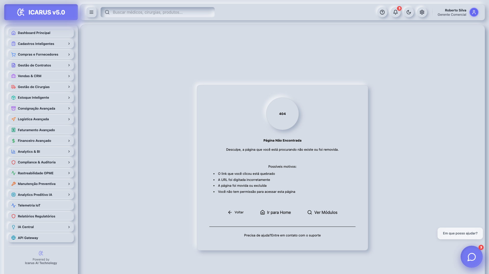

# Manual Completo – ICARUS v5.0 (58 Módulos)

## Sumário
- [Visão Geral](#visão-geral)
- [Guia Rápido](#guia-rápido)
- [Como Navegar neste Manual](#como-navegar-neste-manual)
- [Módulos (1–58)](#módulos-1–58)
- [Apêndices](#apêndices)

## Visão Geral
- Frontend: React 18 + TypeScript + Vite; Storybook para UI; Tailwind 3.
- Backend: Supabase (Postgres, Auth, Realtime, Storage); RLS aplicado na etapa final.
- Design: OraclusX DS (neumórfico) com dark/light; acessibilidade AA.
- Integrações: Meilisearch, BullMQ/Redis, Email (SMTP), Tesseract, Ollama, PostHog.

## Guia Rápido
1. Acesse `/login` (ICARUS v5.0 → “Gestão elevada pela IA”).
2. Use a Sidebar para navegar; Ctrl+K abre a busca global.
3. Em cada módulo, siga “Passo a passo” e veja “Exemplos”.
4. Ajuda/FAQ: botão “Ajuda” na Topbar do módulo.

## Como Navegar neste Manual
- Use o índice abaixo para ir direto ao módulo desejado.
- Cada módulo possui: Objetivo; Funcionalidades; Passo a passo; Exemplos; Configurações; Integrações/Permissões; Erros comuns.
- Recomenda-se começar pelos módulos Core (1–10) e depois avançar.

---

## Módulos (1–58)

### 01. Dashboard Principal
- Objetivo: visão 360° do negócio em tempo real.
- Funcionalidades (principais): KPIs; filtros de período; exportar PDF/CSV; atalhos para módulos.
- Funcionalidades (secundárias): fullscreen; ordenação de cards; metas por KPI.
- Passo a passo:
  1) Abra Dashboard → selecione o período.
  2) Clique em um KPI para detalhar (navegação contextual).
  3) Use “Exportar” para gerar relatório (PDF/CSV).
- Exemplos: filtrar “Últimos 90 dias”; exportar relatório mensal.
- Configurações: metas de KPI; disposição de cards; preferências de período.
- Integrações/Permissões: Supabase Realtime; role mínima “visualizador”.
- Erros comuns: “sem dados” → ajustar período/permissão.

### 02. Gestão de Cadastros
- Objetivo: centralizar entidades (médicos, hospitais, pacientes, fornecedores, convênios, OPME).
- Funcionalidades (principais): CRUD; validações (CPF/CRM/CEP); importação CSV/XLSX; busca avançada.
- Funcionalidades (secundárias): deduplicação; auditoria de alterações.
- Passo a passo: escolher entidade → “Novo Cadastro” → preencher → salvar.
- Exemplos: importar médicos; validar CRM via CFM; endereço via ViaCEP.
- Configurações: campos obrigatórios por entidade; regras de deduplicação.
- Integrações/Permissões: Receita/ViaCEP/CFM/ANS; role “escrita”.
- Erros comuns: CPF/Email inválido/duplicado.

### 03. Cirurgias e Procedimentos
- Objetivo: planejar/registrar cirurgias OPME.
- Funcionalidades (principais): agendamento; kits; rastreabilidade ANVISA; pós-cirúrgico.
- Funcionalidades (secundárias): predição de duração; recomendações de kits.
- Passo a passo: “Nova Cirurgia” → hospital/médico/paciente → materiais → salvar.
- Exemplos: check-in pré-operatório; registro intra; pós-cirúrgico e faturamento.
- Configurações: tipos de procedimento; tempos padrão; alertas críticos.
- Integrações/Permissões: ANVISA/TISS; role “escrita”.
- Erros comuns: data passada; materiais sem lote.

### 04. Estoque com IA
- Objetivo: otimizar estoque e validade.
- Funcionalidades (principais): previsão demanda; ABC/XYZ; ponto de reposição; validade/lotes.
- Funcionalidades (secundárias): anomalias; integração com compras.
- Passo a passo: revisar KPIs → ajustar reposição → lançar movimentações.
- Exemplos: previsão 90 dias; alerta validade.
- Configurações: estoque mín/máx; regras por família.
- Integrações/Permissões: Supabase; role “estoque”.
- Erros comuns: saldos negativos; unidade incorreta.

### 05. Financeiro Avançado
- Objetivo: contas, fluxo, projeções.
- Funcionalidades (principais): inadimplência (score); ARIMA; conciliação.
- Funcionalidades (secundárias): centros de custo; DRE gerencial.
- Passo a passo: importar extratos → conciliar → relatórios.
- Exemplos: projetar fluxo 90 dias; aging por cliente.
- Configurações: plano de contas; conciliação automática.
- Integrações/Permissões: Pluggy/Bank APIs; role “financeiro”.
- Erros comuns: divergência de extratos.

#### Fluxos detalhados
1) Conciliação bancária
   - Importar extrato (.OFX/.CSV) → Classificar por regra → Conciliar por valor+data+histórico → Resolver pendências → Fechar período.
2) Projeção de fluxo de caixa (90 dias)
   - Selecionar contas e categorias → Rodar previsão (ARIMA) → Ajustar outliers → Gerar relatório de previsão → Exportar (PDF/CSV).
3) Inadimplência (score)
   - Carregar títulos → Calcular score por cliente → Priorizar régua de cobrança → Monitorar conversão.

#### Screenshots (referência)

#### Troubleshooting
- Diferença de saldo: reimporte extrato e verifique contas inativas/duplicadas.
- Previsão inconsistente: revise período base e remova outliers antes do cálculo.

### 06. Faturamento Avançado
- Objetivo: gestão de lotes e glosas.
- Funcionalidades (principais): lotes; detecção glosas; convênios.
- Funcionalidades (secundárias): auditoria; exportações regulatórias.
- Passo a passo: criar lote → validar → faturar.
- Exemplos: auditoria de glosa; reprocesso.
- Configurações: convênios; TISS; regras de glosa.
- Erros comuns: rejeições de convênio; campos obrigatórios.

### 07. Faturamento NF-e Completo
- Objetivo: emissão NF-e e eventos.
- Funcionalidades (principais): status SEFAZ; cancelamento; carta correção.
- Passo a passo: gerar NF → transmitir → acompanhar eventos.
- Exemplos: emissão série única; contingência.
- Configurações: certificado, série, CFOP/CSOSN.
- Erros comuns: rejeição SEFAZ; certificado inválido.

#### Guia Fiscal (CFOP/CSOSN – Saída)
- Tabela por cenário (resumo):

| Cenário | UF | CFOP sugerido | Regime | CSOSN/CST |
|---|---|---|---|---|
| Venda dentro do estado | Intra | 5.101 / 5.102 | Simples | 102/103 (ou 201/202 c/ ST) |
| Venda para outro estado | Inter | 6.101 / 6.102 | Simples | 102/103 (ou 201/202 c/ ST) |
| Remessa consignação | Intra/Inter | 5.551 / 6.551 | Todos | 900 (ou CST 41/49) |
| Devolução de compra (saída) | Intra/Inter | 5.202 / 6.202 | Todos | CST conforme origem |
| Outras saídas | Intra/Inter | 5.949 / 6.949 | Todos | Conforme operação |

- CFOP (exemplos mais comuns):
  - 5.101 (Venda de produção do estabelecimento – dentro do estado)
  - 6.101 (Venda de produção do estabelecimento – fora do estado)
  - 5.102/6.102 (Venda de mercadoria adquirida de terceiros – intra/interestadual)
  - 5.405/6.405 (Venda de mercadoria adquirida de terceiros, sujeita a ST)
  - 5.551/6.551 (Remessa em consignação)
  - 5.949/6.949 (Outras saídas de mercadorias ou prestações de serviços)
- CSOSN (Simples Nacional – exemplos):
  - 102/103 (Tributado pelo Simples sem permissão de crédito)
  - 201/202 (Com ST)
  - 900 (Outros)
- CST/ICMS (Regime Normal):
  - 00 (Tributada integralmente), 10 (Trib. c/ cobrança de ST), 20 (Base reduzida), 40/41/50 (Isenta/Não Trib./Suspensa)
- Outros parâmetros: NCM; CEST (quando aplicável); origem da mercadoria; PIS/COFINS/IPI conforme operação.

#### Checklist Pré-emissão (Saída)
1) Emitente/Certificado: CNPJ, IE, certificado válido, horário correto.
2) Destinatário: CNPJ/CPF, IE (se aplicável), UF, endereço.
3) Operação: CFOP coerente (UF/oper.); CSOSN/CST compatível com regime.
4) Itens: NCM/CEST, unidade, quantidade, valor unitário, descontos.
5) Impostos: ICMS/BC/ALIQ; ST (se aplicável); PIS/COFINS; IPI.
6) Transporte: modalidade, volumes, frete.
7) Cobrança: fatura/duplicatas (se houver).

#### Checklist Pós-emissão (Saída)
1) Retorno SEFAZ Autorizado (prot. autorização).  
2) Envio do XML/DANFE ao cliente.  
3) Armazenamento do XML (compliance).  
4) Eventos: CC-e (correções), Cancelamento (prazo), Inutilização (se necessário).  
5) Integrações: baixa no estoque; geração de contas a receber.

#### Troubleshooting Fiscal (Saída)
- Rejeição por CFOP/UF incompatível: ajuste CFOP (5.xxx intra; 6.xxx inter).  
- CSOSN/CST incompatível com regime tributário: verifique regime do emitente.  
- NCM inválido/CEST ausente: atualizar cadastro do item.  
- Certificado inválido/horário do sistema: renove certificado/ajuste hora.  
- Timeout/ambiente: conferir se está em Produção/Homologação correto.

### 08. Contas a Receber IA
- Objetivo: cobrança preditiva.
- Funcionalidades: score inadimplência; alertas; régua de cobrança.
- Passo a passo: importar títulos → disparar régua → acompanhar.
- Exemplos: segmentar por risco; priorizar cobrança.
- Configurações: régua por faixa de risco.

### 09. Relatórios Financeiros
- Objetivo: relatórios de gestão.
- Funcionalidades: DRE; fluxo; margem; dashboards.
- Passo a passo: escolher relatório → filtros → exportar.
- Exemplos: DRE mensal por centro de custo.

### 10. Relatórios Executivos
- Objetivo: visão consolidada p/ diretoria.
- Funcionalidades: metas; YoY; export.
- Passo a passo: selecionar painel → ajustar metas → gerar PDF.

### 11. CRM Vendas
- Objetivo: funil de vendas e forecast.
- Funcionalidades: pipeline Kanban; atividades; propostas.
- Passo a passo: cadastrar lead → mover etapas → fechar.
- Exemplos: pipeline por região.

### 12. Gestão de Leads
- Objetivo: captação e qualificação.
- Funcionalidades: fontes; scoring; campanhas.
- Passo a passo: importar leads → qualificar → atribuir.

### 13. Relacionamento com Cliente
- Objetivo: histórico 360°.
- Funcionalidades: contatos; tickets; NPS.
- Passo a passo: registrar contato → acompanhar ticket.

### 14. Gestão de Compras
- Objetivo: cotações e pedidos.
- Funcionalidades: cotações multi-fornecedor; pedidos; recebimento.
- Passo a passo: nova cotação → comparar → pedido.

#### Fluxos detalhados
1) Cotação multi-fornecedor
   - Criar solicitação → Adicionar itens (OPME) → Convidar fornecedores → Receber propostas → Comparar preço/prazo → Selecionar vencedor.
2) Pedido de compra
   - Converter cotação vencedora → Gerar pedido → Enviar ao fornecedor → Acompanhar confirmação.
3) Recebimento e conferência
   - Registrar recebimento parcial/total → Conferir NF/itens → Enviar para estoque/fiscal.

#### Screenshots (referência)

#### Erros comuns
- Itens sem unidade/código: cadastre previamente em Produtos OPME.
- Divergência de recebimento: use conferência cega e validação por lote.

### 15. Compras Internacionais
- Objetivo: importação; câmbio.
- Funcionalidades: desembaraço; custos; simulações.
- Passo a passo: cadastro de pedido internacional → custos → desembaraço.

### 16. Notas de Compra
- Objetivo: lançar e validar XML.
- Funcionalidades: leitura XML; impostos; lançamentos.
- Passo a passo: importar XML → validar → lançar.

#### Fluxos detalhados
1) Importação XML/NFe
   - Upload XML → Parsing automático → Validação CFOP/CSOSN → Aplicar regras fiscais.
2) Integração com estoque e financeiro
   - Gerar movimentação de entrada → Atualizar custo → Provisionar pagamento.

#### Screenshots (referência)

#### Guia Fiscal (CFOP/CSOSN – Entrada)
- Tabela por cenário (resumo):

| Cenário | Origem | CFOP sugerido | Observação |
|---|---|---|---|
| Compra p/ revenda (intra) | Estadual | 1.101 / 1.102 | Comercialização |
| Compra p/ revenda (inter) | Interestadual | 2.101 / 2.102 | Comercialização |
| Devolução de venda (entrada) | Intra/Inter | 1.401/1.403 / 2.401/2.403 | Espelhar CFOP de saída |
| Importação | Exterior | 3.101 / 3.102 | Conferir impostos de importação |

- CFOP (entrada – exemplos):
  - 1.101/2.101 (Compra para comercialização – intra/interestadual)
  - 1.401/2.401 (Devolução de venda de produção do estabelecimento – intra/interestadual)
  - 1.403/2.403 (Devolução de venda de mercadoria adquirida de terceiros)
  - 3.101 (Compra para comercialização – importação)
- CST/CSOSN do fornecedor: respeitar CST/CSOSN do XML; para crédito PIS/COFINS/ICMS, seguir regime do adquirente e legislação vigente.
- Conferir: NCM; CEST (quando aplicável); origem; BC/ALIQ ICMS, ST, PIS, COFINS, IPI.

#### Checklist de Entrada (Compras)
1) Emitente/Destinatário: CNPJ/IE, UF; conferir se NF é para sua IE.  
2) CFOP: coerente com a destinação (1.xxx intra, 2.xxx inter, 3.xxx importação).  
3) Itens: NCM/CEST, unidade, quantidades, preços e descontos.  
4) Impostos: ICMS/BC/ALIQ; ST; FCP (se houver); PIS/COFINS; IPI.  
5) Vinculação: Pedido de compra (se houver); contrato; consignação (quando aplicável).  
6) Estoque: localização/armazém; lotes/validade (OPME); rastreabilidade.  
7) Financeiro: contas a pagar; vencimentos; centro de custo.

#### Checklist Fiscal (Entrada)
1) Divergências entre XML e pedido (quantidade/valor).  
2) CFOP de devolução x CFOP de origem (espelhar corretamente).  
3) Crédito de ICMS/PIS/COFINS conforme regime e natureza da operação.  
4) Documentos anexos: DANFE, XML, laudos (OPME), licença ANVISA (quando aplicável).  
5) Atualização de custo médio/PEPS após entrada.

#### Erros Fiscais Comuns (Entrada)
- CFOP incorreto para a UF/oper. → ajustar para 1.xxx/2.xxx/3.xxx conforme origem.  
- Cálculo de ST divergente → revisar MVA/BC; conferir UF destino.  
- NCM desatualizado → atualizar cadastro do item.  
- Lotes/validade ausentes em itens OPME → bloquear entrada até regularização.

### 17. Logística Avançada
- Objetivo: entregas e SLA.
- Funcionalidades: rotas; rastreio; manifesto; otimização.
- Passo a passo: programar entregas → rastrear → fechar.

### 18. Logística Transportadoras
- Objetivo: gestão de parceiros.
- Funcionalidades: 18 transportadoras; SLA; cotações; desempenho.
- Passo a passo: cadastrar transportadora → medir SLA.

### 19. Consignação Avançada
- Objetivo: materiais consignados por hospital.
- Funcionalidades: KPIs (13); contratos; conferências; ROI.
- Passo a passo: registrar envio → conferir semanal → faturar usos.

#### Fluxos detalhados
1) Envio para hospital
   - Criar remessa → Vincular contrato/hospital → Definir itens/lotes/validade → Emitir romaneio.
2) Conferência periódica (semanal)
   - Registrar contagem → Sinalizar diferenças → Gerar tarefas de ajuste → Atualizar KPIs (rotatividade, dias estoque).
3) Faturamento por uso
   - Registrar consumo em cirurgia → Vincular materiais → Emitir NF (quando aplicável) → Atualizar custo de carregamento.

#### KPIs (exemplos)
- Valor total consignado; Materiais utilizados; Dias médio em estoque; ROI da consignação.

#### Screenshots (referência)

#### Erros comuns
- Falta de conferência: configurar lembrete semanal obrigatório.
- Lotes vencidos: habilitar alerta de validade e ação corretiva.

### 20. Rastreabilidade OPME
- Objetivo: lote/serie; cadeia custódia.
- Funcionalidades: rastreio ANVISA; histórico completo.
- Passo a passo: registrar lote → rastrear uso/devolução.

### 21. Gestão de Inventário
- Objetivo: contagens; ajustes; inventário rotativo.
- Funcionalidades: contagem cega; divergências.
- Passo a passo: iniciar contagem → ajustar saldos.

### 22. Grupos de Produtos OPME
- Objetivo: hierarquia e famílias.
- Funcionalidades: famílias, grupos, subgrupos.
- Passo a passo: criar famílias → associar produtos.

### 23. Tabela de Preços Viewer
- Objetivo: consulta rápida.
- Funcionalidades: pesquisa, filtros, histórico.
- Passo a passo: pesquisar item → consultar preço vigente.

### 24. Tabelas de Preços Form
- Objetivo: manutenção de preços.
- Funcionalidades: edição em massa; vigência; validações.
- Passo a passo: carregar tabela → editar → publicar.

### 25. Tabelas de Preços Import
- Objetivo: importação de tabelas.
- Funcionalidades: import CSV/XLSX; validação; relatório de erros.
- Passo a passo: subir arquivo → corrigir erros → confirmar.

### 26. Viabilidade de Importação
- Objetivo: custos e ROI.
- Funcionalidades: simulação de custos; cenários.
- Passo a passo: selecionar itens → simular → comparar.

### 27. IA Central
- Objetivo: serviços de IA (recomendações/insights).
- Funcionalidades: motores de scoring; insights em painéis.
- Passo a passo: ativar modelos → consumir recomendações.

### 28. Automação IA
- Objetivo: jobs/rotinas.
- Funcionalidades: filas BullMQ; reintentos; DLQ.
- Passo a passo: criar job → monitorar → reprocessar falhas.

### 29. ChatBot Metrics Dashboard
- Objetivo: métricas do chatbot.
- Funcionalidades: intents; CSAT; tempo de resposta.
- Passo a passo: filtrar período → exportar insights.

### 30. Analytics BI
- Objetivo: painéis analíticos.
- Funcionalidades: dashboards; drill-down; export.
- Passo a passo: escolher painel → explorar → salvar visão.

### 31. Analytics Predição
- Objetivo: predições e séries temporais.
- Funcionalidades: ARIMA/LSTM; previsões; intervalos confiança.
- Passo a passo: selecionar métrica → gerar previsão.

### 32. BI Dashboard Interativo
- Objetivo: exploração visual interativa.
- Funcionalidades: filtros dinâmicos; bookmarks.

### 33. KPI Dashboard Consolidado
- Objetivo: KPIs unificados.
- Funcionalidades: metas; alertas; comparativos.

### 34. Integrações Avançadas
- Objetivo: integrações externas.
- Funcionalidades: conectores; logs; retries.

### 35. Integrations Manager
- Objetivo: credenciais e webhooks.
- Funcionalidades: secrets; health-check; logs.

### 36. API Gateway
- Objetivo: camada de APIs.
- Funcionalidades: rate limit; auth; cache.

### 37. Gestão Usuários e Permissões
- Objetivo: RBAC por módulo.
- Funcionalidades: papéis; permissões granulares.

### 38. Configurações do Sistema
- Objetivo: parâmetros globais.
- Funcionalidades: preferências; temas; metas.

### 39. Configurações Avançadas
- Objetivo: tunning/feature flags.
- Funcionalidades: flags; toggles; advanced.

### 40. RH Gestão de Pessoas
- Objetivo: pessoas/folha/performance.
- Funcionalidades: cadastro; avaliações; treinamentos.

### 41. Compliance e Auditoria
- Objetivo: requisitos/registros/score.
- Funcionalidades: auditorias; planos ação; evidências.

### 42. Qualidade e Certificação
- Objetivo: ISO; auditorias; evidências.
- Funcionalidades: checklists; relatórios.

### 43. Relatórios Regulatórios
- Objetivo: relatórios ANS/ANVISA.
- Funcionalidades: modelos padrão; submissões.

### 44. Gestão Contábil
- Objetivo: integração/lançamentos.
- Funcionalidades: export contábil; conciliações.

### 45. Gestão de Contratos
- Objetivo: ciclo de vida; workflow.
- Funcionalidades: SLA; aprovações; aditivos.

### 46. Licitações e Propostas
- Objetivo: editais; propostas; SLAs.
- Funcionalidades: gestão de prazos; anexos; envios.

### 47. Campanhas de Marketing
- Objetivo: campanhas; tracking.
- Funcionalidades: segmentação; e-mail; SMS.

### 48. Telemetria IoT
- Objetivo: sensores e alertas.
- Funcionalidades: devices; thresholds; eventos.

### 49. Manutenção Preventiva
- Objetivo: agendas e ordens.
- Funcionalidades: planos; execuções; custos.

### 50. Workflow Builder Visual
- Objetivo: fluxos drag-and-drop.
- Funcionalidades: nós; condições; ações.

### 51. Voice Analytics Dashboard
- Objetivo: análise de áudio.
- Funcionalidades: transcrição; intents; métricas.

### 52. Voice Biometrics Manager
- Objetivo: biometria de voz.
- Funcionalidades: cadastro; match; auditoria.

### 53. Voice Macros Manager
- Objetivo: automações por voz.
- Funcionalidades: gravação; acionamentos.

### 54. Video Calls Manager
- Objetivo: chamadas de vídeo.
- Funcionalidades: salas; gravação; compliance.

### 55. Notificações Inteligentes
- Objetivo: push/email/in-app.
- Funcionalidades: templates; filas; tracking.

### 56. System Health Dashboard
- Objetivo: saúde do sistema.
- Funcionalidades: uptime; erros; latência.

### 57. Tooltip Analytics Dashboard
- Objetivo: UX e tooltips.
- Funcionalidades: heatmap; cliques; retenção.

### 58. Voice Commands Manager
- Objetivo: comandos por voz.
- Funcionalidades: comandos; intents; logs.

---

## Apêndices
- Atalhos de teclado (Ctrl+K, etc.)
- Glossário OPME
- Contatos de suporte
