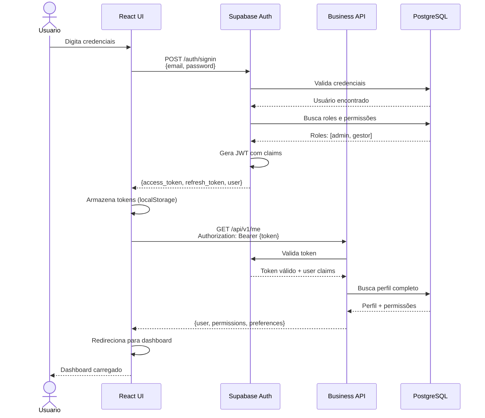
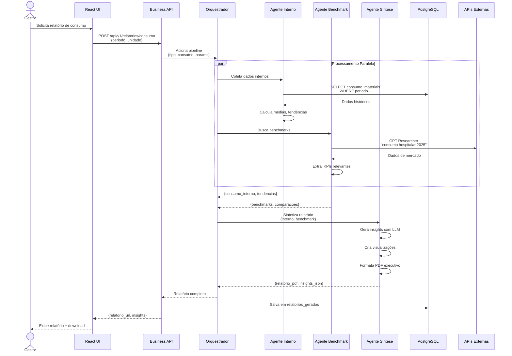
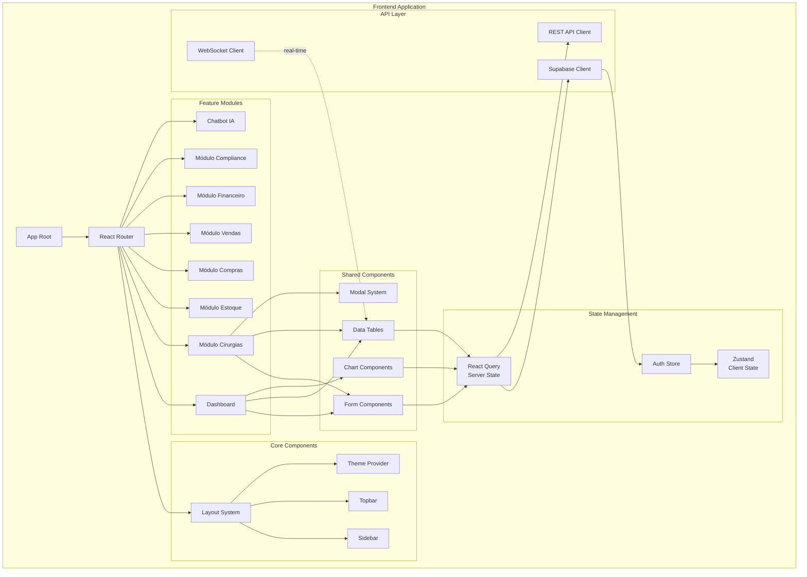
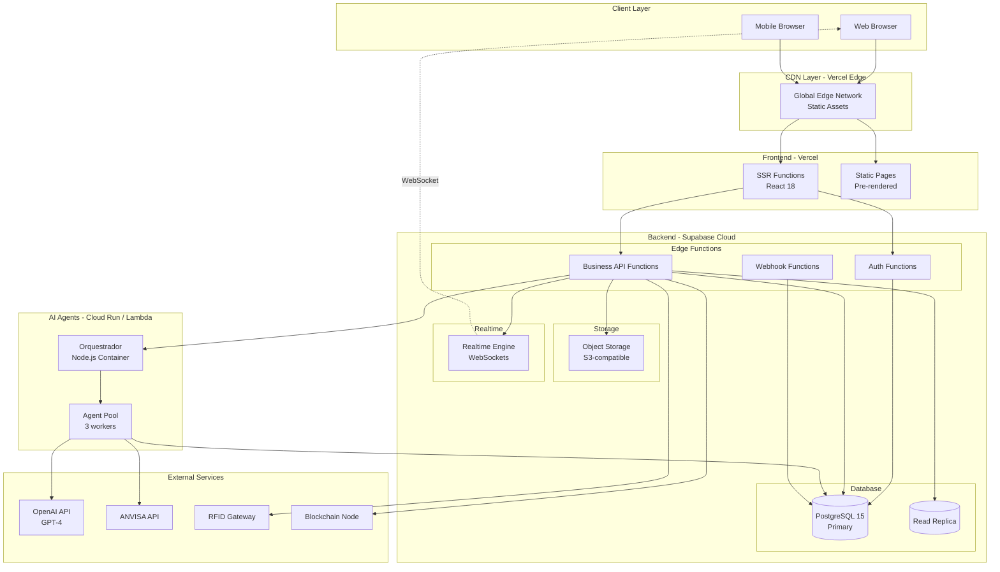
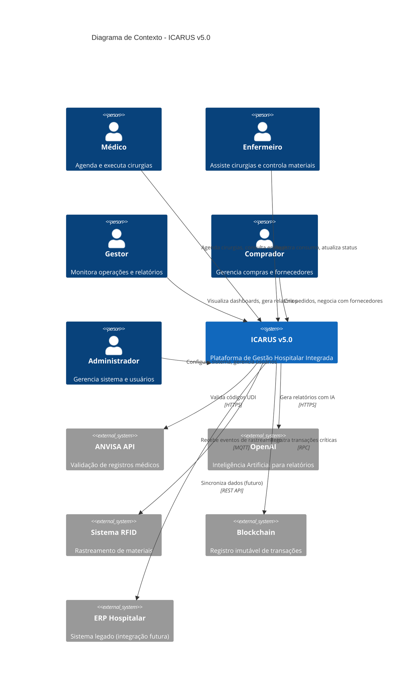
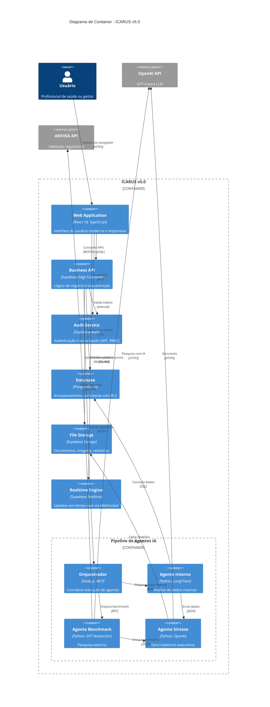
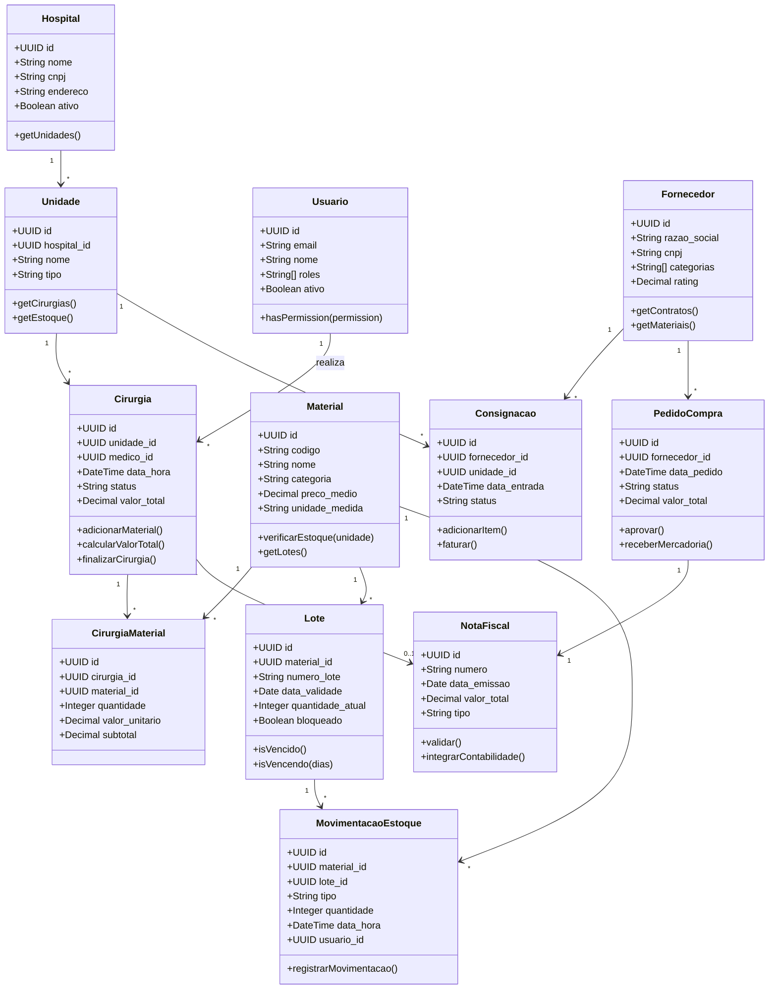
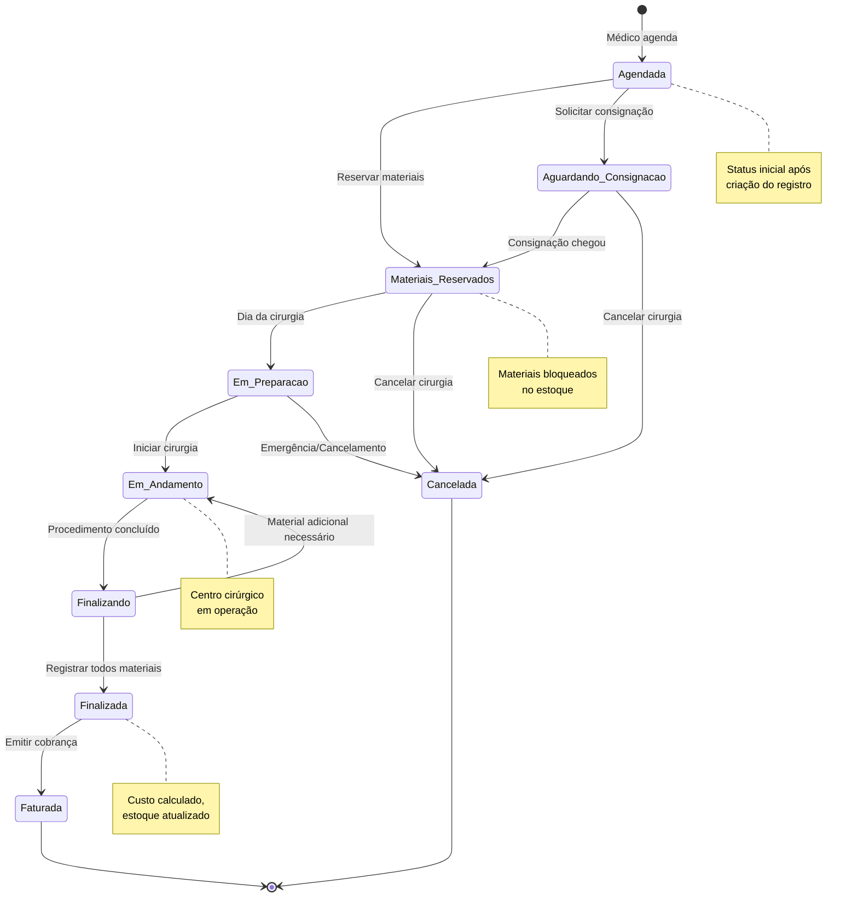
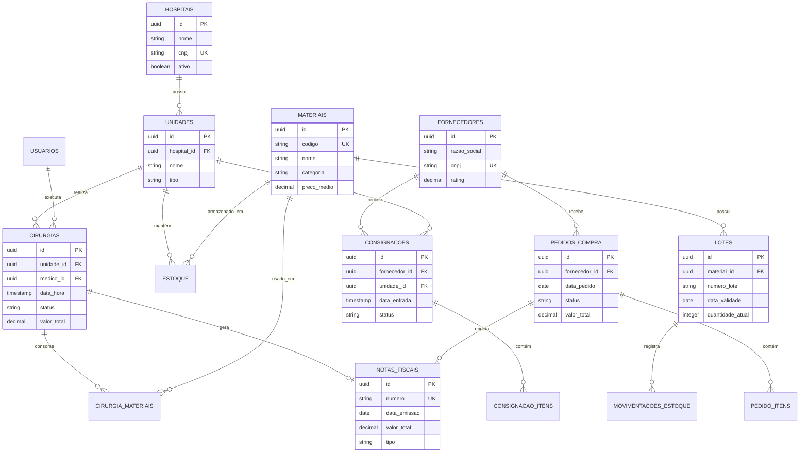

# ICARUS v5.0 — Diagramas de Arquitetura Detalhados

> **Diagramas Complementares de Arquitetura**  
> Versão: 5.0  
> Última Atualização: 17 de novembro de 2025

---

## 📋 Índice

1. [Diagrama de Sequência: Autenticação](#1-diagrama-de-sequência-autenticação)
2. [Diagrama de Sequência: Geração de Relatório IA](#2-diagrama-de-sequência-geração-de-relatório-ia)
3. [Diagrama de Componentes: Frontend](#3-diagrama-de-componentes-frontend)
4. [Diagrama de Deployment](#4-diagrama-de-deployment)
5. [Diagrama C4: Contexto do Sistema](#5-diagrama-c4-contexto-do-sistema)
6. [Diagrama C4: Container](#6-diagrama-c4-container)
7. [Diagrama de Classes: Domain Model](#7-diagrama-de-classes-domain-model)
8. [Fluxograma: Processo de Cirurgia](#8-fluxograma-processo-de-cirurgia)

---

## 1. Diagrama de Sequência: Autenticação

---

## 2. Diagrama de Sequência: Geração de Relatório IA

---

## 3. Diagrama de Componentes: Frontend

---

## 4. Diagrama de Deployment

---

## 5. Diagrama C4: Contexto do Sistema

---

## 6. Diagrama C4: Container

---

## 7. Diagrama de Classes: Domain Model

---

## 8. Fluxograma: Processo de Cirurgia

```mermaid
flowchart TD
    Start([Início]) --> AgendarCirurgia[Médico agenda cirurgia]
    AgendarCirurgia --> SelecionarMateriais[Selecionar materiais necessários]
    SelecionarMateriais --> VerificarEstoque{Estoque disponível?}
    
    VerificarEstoque -->|Sim| ReservarMateriais[Reservar materiais]
    VerificarEstoque -->|Não| SolicitarConsignacao[Solicitar consignação]
    
    SolicitarConsignacao --> AguardarEntrega[Aguardar entrega]
    AguardarEntrega --> ReservarMateriais
    
    ReservarMateriais --> AguardarDataCirurgia[Aguardar data da cirurgia]
    AguardarDataCirurgia --> SepararMateriais[Separar materiais no CC]
    SepararMateriais --> IniciarCirurgia[Iniciar cirurgia]
    
    IniciarCirurgia --> RegistrarConsumo[Enfermeiro registra consumo real]
    RegistrarConsumo --> TodosMaterialsRegistrados{Todos materiais<br/>registrados?}
    
    TodosMaterialsRegistrados -->|Não| RegistrarConsumo
    TodosMaterialsRegistrados -->|Sim| FinalizarCirurgia[Finalizar cirurgia]
    
    FinalizarCirurgia --> AtualizarEstoque[Atualizar estoque]
    AtualizarEstoque --> CalcularCusto[Calcular custo total]
    CalcularCusto --> GerarCobranca{Paciente particular?}
    
    GerarCobranca -->|Sim| EmitirNF[Emitir nota fiscal]
    GerarCobranca -->|Não| RegistrarRepasse[Registrar repasse SUS/Convênio]
    
    EmitirNF --> RegistrarFinanceiro[Registrar no financeiro]
    RegistrarRepasse --> RegistrarFinanceiro
    
    RegistrarFinanceiro --> AtualizarIndicadores[Atualizar indicadores]
    AtualizarIndicadores --> FoiConsignacao{Foi usada<br/>consignação?}
    
    FoiConsignacao -->|Sim| FaturarConsignacao[Faturar consignação]
    FoiConsignacao -->|Não| End
    
    FaturarConsignacao --> GerarPagamentoFornecedor[Gerar pagamento para fornecedor]
    GerarPagamentoFornecedor --> End([Fim])
    
    style Start fill:#90EE90
    style End fill:#FFB6C1
    style VerificarEstoque fill:#FFD700
    style TodosMaterialsRegistrados fill:#FFD700
    style GerarCobranca fill:#FFD700
    style FoiConsignacao fill:#FFD700
```

---

## 9. Diagrama de Estados: Ciclo de Vida da Cirurgia

---

## 10. Diagrama de Entidade-Relacionamento (Simplificado)

---

## Referências

- [Arquitetura Geral](./ARQUITETURA_ICARUS_V5_VISAO_GERAL.md)
- [Documentação Técnica](./DOCUMENTACAO_TECNICA_COMPLETA.md)
- [Inventário de Módulos](./INVENTARIO_58_MODULOS_COMPLETO.md)

---

**Mantido por**: Equipe de Arquitetura ICARUS  
**Data**: 17 de novembro de 2025

