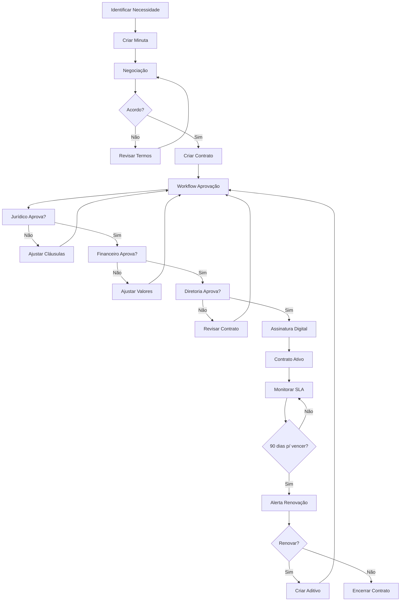

# 📄 MÓDULOS GESTÃO DE CONTRATOS E VENDAS & CRM - DOCUMENTAÇÃO COMPLETA

**Sistema**: ICARUS v5.0  
**Categoria**: Comercial / Gestão  
**Versão**: 5.0.0  
**Última Atualização**: Outubro 2025  
**Idioma**: Português Brasileiro (pt-BR)

---

## 📑 ÍNDICE GERAL

### PARTE I - MÓDULO GESTÃO DE CONTRATOS
1. [Visão Geral Contratos](#1-visão-geral-contratos)
2. [Arquitetura Contratos](#2-arquitetura-contratos)
3. [Sub-módulos Contratos](#3-sub-módulos-contratos)
4. [Dashboard Contratos](#4-dashboard-contratos)
5. [Tipos de Contratos](#5-tipos-de-contratos)
6. [Workflow de Aprovação](#6-workflow-de-aprovação)
7. [Gestão de Vencimentos](#7-gestão-de-vencimentos)
8. [Cláusulas e Aditivos](#8-cláusulas-e-aditivos)
9. [SLA e Indicadores](#9-sla-e-indicadores)
10. [IA para Contratos](#10-ia-para-contratos)

### PARTE II - MÓDULO VENDAS & CRM
11. [Visão Geral CRM](#11-visão-geral-crm)
12. [Arquitetura CRM](#12-arquitetura-crm)
13. [Sub-módulos CRM](#13-sub-módulos-crm)
14. [Dashboard de Vendas](#14-dashboard-de-vendas)
15. [Gestão de Leads](#15-gestão-de-leads)
16. [Pipeline de Vendas](#16-pipeline-de-vendas)
17. [Gestão de Oportunidades](#17-gestão-de-oportunidades)
18. [Relacionamento com Cliente](#18-relacionamento-com-cliente)
19. [Campanhas de Marketing](#19-campanhas-de-marketing)
20. [IA para Vendas](#20-ia-para-vendas)

### PARTE III - INTEGRAÇÕES E ANALYTICS
21. [Integrações Externas](#21-integrações-externas)
22. [Relatórios e Analytics](#22-relatórios-e-analytics)
23. [Contexto e Justificativas](#23-contexto-e-justificativas)
24. [Casos de Uso](#24-casos-de-uso)

---

# PARTE I - MÓDULO GESTÃO DE CONTRATOS

## 1. VISÃO GERAL CONTRATOS

### 1.1. Descrição

**Arquivo Principal**: `/components/modules/GestaoContratosNovo.tsx`

O módulo **Gestão de Contratos** centraliza todo o ciclo de vida dos contratos firmados pela distribuidora OPME, desde a criação e negociação até o vencimento e renovação. Gerencia contratos de fornecimento de produtos, prestação de serviços, contratos OPME com hospitais, SLA, acordos comerciais e muito mais.

### 1.2. Objetivos

```yaml
Objetivos Principais:
  - Centralizar gestão de todos os contratos
  - Automatizar alertas de vencimento
  - Controlar renovações e aditivos
  - Gestão de SLA (Service Level Agreement)
  - Análise de contratos com IA
  - Workflow de aprovação hierárquico
  - Integração com financeiro e jurídico
  - Compliance e auditoria

Métricas de Sucesso:
  - 100% dos contratos cadastrados
  - 0 contratos vencidos sem renovação
  - Tempo médio de aprovação < 5 dias
  - 95% de SLA cumpridos
  - Redução de 40% em custos contratuais
```

### 1.3. Importância para Negócio OPME

```yaml
Por que é crítico:

  Relacionamento de Longo Prazo:
    - Contratos OPME são de longo prazo (12-36 meses)
    - Renovação automática se não cancelado
    - Penalidades por quebra de contrato
    - Volume comprometido x desconto progressivo

  Compliance e Auditoria:
    - ANS exige contratos formais
    - Auditoria de convênios verifica contratos
    - LGPD exige DPO e termos de uso
    - ISO 9001 exige gestão documental

  Financeiro:
    - Cláusulas de reajuste (IPCA, IGP-M)
    - Multas por inadimplência
    - Garantias e fianças
    - Budget anual depende de contratos

  Operacional:
    - SLA define tempo de entrega
    - Cláusulas de exclusividade
    - Mínimo de compra mensal
    - Penalidades por atraso
```

---

## 2. ARQUITETURA CONTRATOS

### 2.1. Diagrama de Componentes

```
┌─────────────────────────────────────────────────────────────────┐
│              GESTÃO DE CONTRATOS - ARQUITETURA                   │
├─────────────────────────────────────────────────────────────────┤
│                                                                  │
│  ┌────────────────────────────────────────────────────────┐    │
│  │                  PRESENTATION LAYER                     │    │
│  │  ┌──────────────┐  ┌──────────────┐  ┌──────────────┐ │    │
│  │  │  Dashboard   │  │   Contratos  │  │  Vencimentos │ │    │
│  │  │   Contratos  │  │    Ativos    │  │   Alertas    │ │    │
│  │  └──────────────┘  └──────────────┘  └──────────────┘ │    │
│  │                                                         │    │
│  │  ┌──────────────┐  ┌──────────────┐  ┌──────────────┐ │    │
│  │  │  Workflow    │  │  Cláusulas   │  │     SLA      │ │    │
│  │  │   Aprovação  │  │   Aditivos   │  │  Indicadores │ │    │
│  │  └──────────────┘  └──────────────┘  └──────────────┘ │    │
│  └────────────────────────────────────────────────────────┘    │
│                           ▼                                      │
│  ┌────────────────────────────────────────────────────────┐    │
│  │                  BUSINESS LOGIC LAYER                   │    │
│  │  ┌──────────────────────────────────────────────────┐  │    │
│  │  │         ContratosService.ts                       │  │    │
│  │  │  - CRUD de contratos                              │  │    │
│  │  │  - Workflow de aprovação                          │  │    │
│  │  │  - Cálculo de reajustes                           │  │    │
│  │  │  - Alertas de vencimento                          │  │    │
│  │  └──────────────────────────────────────────────────┘  │    │
│  │                                                         │    │
│  │  ┌──────────────────────────────────────────────────┐  │    │
│  │  │         ContratosAI.ts (IA)                      │  │    │
│  │  │  - Análise de cláusulas (GPT-4)                  │  │    │
│  │  │  - Extração de termos importantes                │  │    │
│  │  │  - Comparação com contratos similares            │  │    │
│  │  │  - Sugestão de melhorias                         │  │    │
│  │  │  - Detecção de riscos                            │  │    │
│  │  └──────────────────────────────────────────────────┘  │    │
│  │                                                         │    │
│  │  ┌──────────────────────────────────────────────────┐  │    │
│  │  │         SLAMonitoringService.ts                  │  │    │
│  │  │  - Monitoramento de SLA                          │  │    │
│  │  │  - Cálculo de cumprimento                        │  │    │
│  │  │  - Alertas de descumprimento                     │  │    │
│  │  └──────────────────────────────────────────────────┘  │    │
│  └────────────────────────────────────────────────────────┘    │
│                           ▼                                      │
│  ┌────────────────────────────────────────────────────────┐    │
│  │              INTEGRATION LAYER (APIs)                   │    │
│  │                                                         │    │
│  │  ┌──────────────┐  ┌──────────────┐  ┌──────────────┐ │    │
│  │  │  DocuSign    │  │  ClickSign   │  │   Adobe     │ │    │
│  │  │ (Assinatura  │  │ (Assinatura  │  │    Sign     │ │    │
│  │  │  Digital)    │  │   Digital)   │  │  (Digital)  │ │    │
│  │  └──────────────┘  └──────────────┘  └──────────────┘ │    │
│  │                                                         │    │
│  │  ┌──────────────┐  ┌──────────────┐  ┌──────────────┐ │    │
│  │  │  GPT-4 API   │  │   IPCA/IGP-M │  │  Calendário  │ │    │
│  │  │ (Análise IA) │  │  (Reajustes) │  │  (Feriados)  │ │    │
│  │  └──────────────┘  └──────────────┘  └──────────────┘ │    │
│  └────────────────────────────────────────────────────────┘    │
│                           ▼                                      │
│  ┌────────────────────────────────────────────────────────┐    │
│  │                    DATA LAYER                           │    │
│  │  ┌──────────────────────────────────────────────────┐  │    │
│  │  │            Supabase PostgreSQL                    │  │    │
│  │  │  - contratos                                      │  │    │
│  │  │  - contratos_clausulas                            │  │    │
│  │  │  - contratos_aditivos                             │  │    │
│  │  │  - contratos_aprovacoes                           │  │    │
│  │  │  - contratos_sla                                  │  │    │
│  │  │  - contratos_renovacoes                           │  │    │
│  │  │  - contratos_alertas                              │  │    │
│  │  └──────────────────────────────────────────────────┘  │    │
│  └────────────────────────────────────────────────────────┘    │
└─────────────────────────────────────────────────────────────────┘
```

### 2.2. Fluxo de Ciclo de Vida



---

## 3. SUB-MÓDULOS CONTRATOS

### 3.1. Lista de Sub-módulos

```typescript
/**
 * Sub-módulos da Gestão de Contratos
 * 
 * Total: 10 sub-módulos
 */

interface SubModulosContratos {
  '3.1.1': 'Dashboard Contratos',
  '3.1.2': 'Contratos Ativos',
  '3.1.3': 'Contratos a Vencer',
  '3.1.4': 'Workflow de Aprovação',
  '3.1.5': 'Cláusulas e Aditivos',
  '3.1.6': 'SLA e Indicadores',
  '3.1.7': 'Renovações',
  '3.1.8': 'Contratos Encerrados',
  '3.1.9': 'Análise com IA',
  '3.1.10': 'Relatórios de Contratos'
}
```

---

## 4. DASHBOARD CONTRATOS

### 4.1. KPIs Principais

```typescript
/**
 * Dashboard de Gestão de Contratos
 * 
 * KPIS PRINCIPAIS:
 * 1. Total de Contratos Ativos
 * 2. Valor Total Comprometido (R$)
 * 3. Contratos a Vencer (30 dias)
 * 4. Contratos a Vencer (90 dias)
 * 5. SLA Cumpridos (%)
 * 6. Contratos Pendentes de Aprovação
 * 7. Aditivos Realizados (mês)
 * 8. Economia em Renegociações
 * 
 * WIDGETS:
 * - Timeline de vencimentos (próximos 12 meses)
 * - Gráfico de valor por tipo de contrato
 * - Top 10 fornecedores (valor)
 * - Mapa de SLA (verde/amarelo/vermelho)
 * - Alertas críticos
 */

export const DashboardContratos: React.FC = () => {
  const { kpis, loading } = useContratosKPIs();
  const { alertas } = useAlertasContratos();

  return (
    <div className="space-y-6">
      {/* KPIs Linha 1 */}
      <div className="grid grid-cols-1 md:grid-cols-4 gap-6">
        <KPICard
          label="Contratos Ativos"
          value={kpis.contratosAtivos}
          icon={<FileText />}
          onClick={() => navigate('/contratos/ativos')}
        />
        
        <KPICard
          label="Valor Comprometido"
          value={formatCurrency(kpis.valorTotal)}
          icon={<DollarSign />}
          subtitle="Vigência atual"
        />
        
        <KPICard
          label="A Vencer (30 dias)"
          value={kpis.vencer30}
          icon={<AlertTriangle />}
          trend={{ direction: 'down', percentage: 10 }}
        />
        
        <KPICard
          label="SLA Cumpridos"
          value={`${kpis.slaCumpridos}%`}
          icon={<CheckCircle />}
          trend={{ direction: 'up', percentage: 5 }}
        />
      </div>

      {/* KPIs Linha 2 */}
      <div className="grid grid-cols-1 md:grid-cols-4 gap-6">
        <KPICard
          label="Pendentes Aprovação"
          value={kpis.pendentesAprovacao}
          icon={<Clock />}
        />
        
        <KPICard
          label="Aditivos (mês)"
          value={kpis.aditivosMes}
          icon={<FileSignature />}
        />
        
        <KPICard
          label="Economia Renegociações"
          value={formatCurrency(kpis.economia)}
          icon={<TrendingDown />}
        />
        
        <KPICard
          label="A Vencer (90 dias)"
          value={kpis.vencer90}
          icon={<Calendar />}
        />
      </div>

      {/* Alertas Críticos */}
      {alertas.length > 0 && (
        <Card title="Alertas Críticos" padding="md">
          <div className="space-y-3">
            {alertas.map((alerta, idx) => (
              <Alert key={idx} variant={alerta.severidade}>
                <AlertTriangle className="h-4 w-4" />
                <AlertTitle>{alerta.titulo}</AlertTitle>
                <AlertDescription>
                  {alerta.descricao}
                  <Button 
                    variant="link" 
                    className="ml-2"
                    onClick={() => handleVerContrato(alerta.contratoId)}
                  >
                    Ver contrato →
                  </Button>
                </AlertDescription>
              </Alert>
            ))}
          </div>
        </Card>
      )}

      {/* Gráficos */}
      <div className="grid grid-cols-1 lg:grid-cols-2 gap-6">
        {/* Timeline de Vencimentos */}
        <Card title="Vencimentos - Próximos 12 Meses" padding="md">
          <LineChart
            data={kpis.timelineVencimentos}
            xAxis="mes"
            yAxis="quantidade"
          />
        </Card>

        {/* Valor por Tipo */}
        <Card title="Valor por Tipo de Contrato" padding="md">
          <PieChart
            data={kpis.valorPorTipo}
            label="tipo"
            value="valor"
          />
        </Card>

        {/* Top Fornecedores */}
        <Card title="Top 10 Fornecedores (Valor Contratual)" padding="md">
          <BarChart
            data={kpis.topFornecedores}
            xAxis="fornecedor"
            yAxis="valor"
            horizontal
            formatY={(value) => formatCurrency(value)}
          />
        </Card>

        {/* Mapa de SLA */}
        <Card title="Status de SLA" padding="md">
          <SLAHeatmap data={kpis.slaStatus} />
        </Card>
      </div>

      {/* Análise IA */}
      <Card 
        title="Análise de Contratos com IA" 
        padding="md"
        icon={<Sparkles />}
      >
        <AnaliseContratosIA contratos={kpis.contratosAtivos} />
      </Card>
    </div>
  );
};
```

---

## 5. TIPOS DE CONTRATOS

### 5.1. Categorização de Contratos

```typescript
/**
 * Tipos de Contratos OPME
 * 
 * CATEGORIAS:
 * 1. Fornecimento de Produtos
 *    - Contrato de fornecimento contínuo
 *    - Compromisso de volume x desconto
 *    - Exclusividade (ou não)
 * 
 * 2. Prestação de Serviços
 *    - Manutenção de equipamentos
 *    - Consultoria
 *    - Treinamento
 *    - Suporte técnico
 * 
 * 3. Contratos OPME (com hospitais)
 *    - Fornecimento de materiais cirúrgicos
 *    - Consignação
 *    - Kit cirúrgico
 *    - SLA de entrega
 * 
 * 4. Contratos de Locação
 *    - Equipamentos médicos
 *    - Veículos
 *    - Imóveis
 * 
 * 5. Contratos de Parceria
 *    - Co-marketing
 *    - Distribuição exclusiva
 *    - Joint venture
 * 
 * 6. Contratos de Seguros
 *    - Seguro de estoque
 *    - Seguro de transporte
 *    - Seguro de responsabilidade civil
 */

enum TipoContrato {
  FORNECIMENTO_PRODUTOS = 'fornecimento_produtos',
  PRESTACAO_SERVICOS = 'prestacao_servicos',
  OPME_HOSPITAL = 'opme_hospital',
  LOCACAO = 'locacao',
  PARCERIA = 'parceria',
  SEGURO = 'seguro',
  OUTRO = 'outro'
}
```

### 5.2. Formulário de Contrato

**Arquivo**: `/components/formularios/FormularioContrato.tsx`

```typescript
/**
 * Formulário Avançado de Contrato
 * 
 * SEÇÕES:
 * 1. Identificação
 *    - Número do Contrato (gerado auto)
 *    - Tipo de Contrato
 *    - Título/Objeto
 *    - Partes (Contratante + Contratado)
 * 
 * 2. Vigência
 *    - Data de Início
 *    - Data de Término
 *    - Renovação Automática (sim/não)
 *    - Prazo de Aviso de Rescisão
 * 
 * 3. Valores
 *    - Valor Total
 *    - Forma de Pagamento
 *    - Reajuste (IPCA, IGP-M, etc)
 *    - Periodicidade de Reajuste
 * 
 * 4. Cláusulas Principais
 *    - Objeto do Contrato
 *    - Obrigações do Contratante
 *    - Obrigações do Contratado
 *    - Multas e Penalidades
 *    - Rescisão
 * 
 * 5. SLA (se aplicável)
 *    - Indicadores de Performance
 *    - Metas
 *    - Penalidades por Descumprimento
 * 
 * 6. Anexos
 *    - Upload do Contrato Assinado (PDF)
 *    - Anexos
 *    - Planilhas
 * 
 * 7. Aprovadores
 *    - Workflow de Aprovação
 *    - Jurídico
 *    - Financeiro
 *    - Diretoria
 */

export const FormularioContrato: React.FC<FormularioContratoProps> = ({
  contratoId,
  onSuccess,
  onCancel
}) => {
  const [formData, setFormData] = useState<ContratoFormData>(INITIAL_STATE);
  const [clausulas, setClausulas] = useState<Clausula[]>([]);
  const [slas, setSlas] = useState<SLA[]>([]);
  const [loading, setLoading] = useState(false);

  // Gerar número do contrato automaticamente
  useEffect(() => {
    if (!contratoId && !formData.numero_contrato) {
      const numero = gerarNumeroContrato();
      setFormData({ ...formData, numero_contrato: numero });
    }
  }, []);

  return (
    <FormularioContainer
      title={contratoId ? 'Editar Contrato' : 'Novo Contrato'}
      onSubmit={handleSubmit}
      onCancel={onCancel}
    >
      {/* Seção 1: Identificação */}
      <Card title="Identificação do Contrato" padding="lg">
        <div className="grid grid-cols-1 md:grid-cols-2 gap-4">
          <Input
            label="Número do Contrato"
            value={formData.numero_contrato}
            disabled
            required
          />

          <Select
            label="Tipo de Contrato"
            value={formData.tipo}
            onChange={(value) => setFormData({ ...formData, tipo: value })}
            options={[
              { value: 'fornecimento_produtos', label: 'Fornecimento de Produtos' },
              { value: 'prestacao_servicos', label: 'Prestação de Serviços' },
              { value: 'opme_hospital', label: 'OPME (Hospital)' },
              { value: 'locacao', label: 'Locação' },
              { value: 'parceria', label: 'Parceria' },
              { value: 'seguro', label: 'Seguro' },
              { value: 'outro', label: 'Outro' }
            ]}
            required
          />

          <div className="md:col-span-2">
            <Input
              label="Título/Objeto do Contrato"
              value={formData.titulo}
              onChange={(e) => setFormData({ ...formData, titulo: e.target.value })}
              required
              placeholder="Ex: Fornecimento de Próteses Ortopédicas"
            />
          </div>

          <AutocompleteInput
            label="Contratante (Nossa Empresa)"
            value={formData.contratante_id}
            onSearch={searchEmpresas}
            required
          />

          <AutocompleteInput
            label="Contratado (Fornecedor/Prestador)"
            value={formData.contratado_id}
            onSearch={searchFornecedores}
            required
          />
        </div>
      </Card>

      {/* Seção 2: Vigência */}
      <Card title="Vigência" padding="lg">
        <div className="grid grid-cols-1 md:grid-cols-2 gap-4">
          <Input
            label="Data de Início"
            type="date"
            value={formData.data_inicio}
            onChange={(e) => setFormData({ ...formData, data_inicio: e.target.value })}
            required
          />

          <Input
            label="Data de Término"
            type="date"
            value={formData.data_fim}
            onChange={(e) => setFormData({ ...formData, data_fim: e.target.value })}
            required
          />

          <div className="flex items-center gap-2">
            <Checkbox
              id="renovacao_automatica"
              checked={formData.renovacao_automatica}
              onCheckedChange={(checked) => setFormData({ ...formData, renovacao_automatica: checked })}
            />
            <label htmlFor="renovacao_automatica">
              Renovação Automática
            </label>
          </div>

          {formData.renovacao_automatica && (
            <Input
              label="Prazo de Aviso de Rescisão (dias)"
              type="number"
              value={formData.prazo_aviso_rescisao}
              onChange={(e) => setFormData({ ...formData, prazo_aviso_rescisao: parseInt(e.target.value) })}
              min="0"
              placeholder="Ex: 90"
            />
          )}

          <div className="md:col-span-2">
            <p className="text-sm text-gray-600">
              Duração do Contrato: {calcularDuracao(formData.data_inicio, formData.data_fim)}
            </p>
          </div>
        </div>
      </Card>

      {/* Seção 3: Valores */}
      <Card title="Valores e Pagamento" padding="lg">
        <div className="grid grid-cols-1 md:grid-cols-3 gap-4">
          <Input
            label="Valor Total (R$)"
            type="number"
            value={formData.valor_total}
            onChange={(e) => setFormData({ ...formData, valor_total: parseFloat(e.target.value) })}
            min="0"
            step="0.01"
            required
          />

          <Select
            label="Forma de Pagamento"
            value={formData.forma_pagamento}
            onChange={(value) => setFormData({ ...formData, forma_pagamento: value })}
            options={[
              { value: 'mensal', label: 'Mensal' },
              { value: 'trimestral', label: 'Trimestral' },
              { value: 'semestral', label: 'Semestral' },
              { value: 'anual', label: 'Anual' },
              { value: 'unico', label: 'Pagamento Único' }
            ]}
          />

          <Input
            label="Dia de Vencimento"
            type="number"
            value={formData.dia_vencimento}
            onChange={(e) => setFormData({ ...formData, dia_vencimento: parseInt(e.target.value) })}
            min="1"
            max="31"
            placeholder="Ex: 10"
          />

          <Select
            label="Índice de Reajuste"
            value={formData.indice_reajuste}
            onChange={(value) => setFormData({ ...formData, indice_reajuste: value })}
            options={[
              { value: 'nenhum', label: 'Sem Reajuste' },
              { value: 'ipca', label: 'IPCA' },
              { value: 'igpm', label: 'IGP-M' },
              { value: 'inpc', label: 'INPC' },
              { value: 'percentual_fixo', label: 'Percentual Fixo' }
            ]}
          />

          {formData.indice_reajuste !== 'nenhum' && (
            <>
              <Select
                label="Periodicidade do Reajuste"
                value={formData.periodicidade_reajuste}
                onChange={(value) => setFormData({ ...formData, periodicidade_reajuste: value })}
                options={[
                  { value: 'anual', label: 'Anual' },
                  { value: 'semestral', label: 'Semestral' }
                ]}
              />

              {formData.indice_reajuste === 'percentual_fixo' && (
                <Input
                  label="Percentual (%)"
                  type="number"
                  value={formData.percentual_reajuste}
                  onChange={(e) => setFormData({ ...formData, percentual_reajuste: parseFloat(e.target.value) })}
                  min="0"
                  max="100"
                  step="0.01"
                  placeholder="Ex: 5.5"
                />
              )}
            </>
          )}
        </div>
      </Card>

      {/* Seção 4: Cláusulas */}
      <Card title="Cláusulas Principais" padding="lg">
        <div className="space-y-4">
          <Textarea
            label="Objeto do Contrato"
            value={formData.objeto}
            onChange={(e) => setFormData({ ...formData, objeto: e.target.value })}
            rows={3}
            required
            placeholder="Descreva detalhadamente o objeto do contrato..."
          />

          <Textarea
            label="Obrigações do Contratante"
            value={formData.obrigacoes_contratante}
            onChange={(e) => setFormData({ ...formData, obrigacoes_contratante: e.target.value })}
            rows={4}
            placeholder="Liste as obrigações da nossa empresa..."
          />

          <Textarea
            label="Obrigações do Contratado"
            value={formData.obrigacoes_contratado}
            onChange={(e) => setFormData({ ...formData, obrigacoes_contratado: e.target.value })}
            rows={4}
            placeholder="Liste as obrigações do fornecedor/prestador..."
          />

          <Textarea
            label="Multas e Penalidades"
            value={formData.multas_penalidades}
            onChange={(e) => setFormData({ ...formData, multas_penalidades: e.target.value })}
            rows={3}
            placeholder="Descreva multas por descumprimento..."
          />

          <Textarea
            label="Condições de Rescisão"
            value={formData.condicoes_rescisao}
            onChange={(e) => setFormData({ ...formData, condicoes_rescisao: e.target.value })}
            rows={3}
            placeholder="Condições para rescisão antecipada..."
          />

          {/* Editor de Cláusulas Adicionais */}
          <div>
            <h4 className="font-semibold mb-3">Cláusulas Adicionais</h4>
            {clausulas.map((clausula, index) => (
              <div key={index} className="mb-4 p-4 bg-gray-50 dark:bg-gray-800 rounded-lg">
                <div className="flex items-center justify-between mb-2">
                  <Input
                    label="Título da Cláusula"
                    value={clausula.titulo}
                    onChange={(e) => handleUpdateClausula(index, 'titulo', e.target.value)}
                    className="flex-1 mr-4"
                  />
                  <Button
                    variant="secondary"
                    size="sm"
                    onClick={() => handleRemoveClausula(index)}
                    icon={<Trash2 size={16} />}
                  >
                    Remover
                  </Button>
                </div>
                <Textarea
                  label="Texto da Cláusula"
                  value={clausula.texto}
                  onChange={(e) => handleUpdateClausula(index, 'texto', e.target.value)}
                  rows={3}
                />
              </div>
            ))}
            <Button
              variant="secondary"
              onClick={handleAddClausula}
              icon={<Plus />}
            >
              Adicionar Cláusula
            </Button>
          </div>
        </div>
      </Card>

      {/* Seção 5: SLA (condicional) */}
      {['prestacao_servicos', 'opme_hospital', 'locacao'].includes(formData.tipo) && (
        <Card title="SLA - Service Level Agreement" padding="lg">
          <div className="space-y-4">
            {slas.map((sla, index) => (
              <div key={index} className="grid grid-cols-4 gap-4 p-4 bg-gray-50 dark:bg-gray-800 rounded-lg">
                <Input
                  label="Indicador"
                  value={sla.indicador}
                  onChange={(e) => handleUpdateSLA(index, 'indicador', e.target.value)}
                  placeholder="Ex: Tempo de Entrega"
                />
                <Input
                  label="Meta"
                  value={sla.meta}
                  onChange={(e) => handleUpdateSLA(index, 'meta', e.target.value)}
                  placeholder="Ex: 24 horas"
                />
                <Input
                  label="Penalidade"
                  value={sla.penalidade}
                  onChange={(e) => handleUpdateSLA(index, 'penalidade', e.target.value)}
                  placeholder="Ex: 1% de desconto"
                />
                <Button
                  variant="secondary"
                  onClick={() => handleRemoveSLA(index)}
                  icon={<Trash2 />}
                >
                  Remover
                </Button>
              </div>
            ))}
            <Button
              variant="secondary"
              onClick={handleAddSLA}
              icon={<Plus />}
            >
              Adicionar SLA
            </Button>
          </div>
        </Card>
      )}

      {/* Seção 6: Anexos */}
      <Card title="Documentos e Anexos" padding="lg">
        <div className="space-y-4">
          <FileUploadZone
            label="Contrato Assinado (PDF)"
            accept=".pdf"
            onFileSelect={(file) => handleUploadDocumento('contrato_assinado', file)}
            value={formData.documentos?.contrato_assinado}
          />

          <FileUploadZone
            label="Anexos (múltiplos arquivos)"
            accept=".pdf,.doc,.docx,.xlsx"
            multiple
            onFileSelect={(files) => handleUploadDocumentos('anexos', files)}
            value={formData.documentos?.anexos}
          />
        </div>
      </Card>

      {/* Seção 7: Workflow de Aprovação */}
      <Card title="Workflow de Aprovação" padding="lg">
        <div className="space-y-4">
          <div className="flex items-center gap-2">
            <Checkbox
              id="exige_aprovacao_juridico"
              checked={formData.exige_aprovacao_juridico}
              onCheckedChange={(checked) => setFormData({ ...formData, exige_aprovacao_juridico: checked })}
            />
            <label htmlFor="exige_aprovacao_juridico">
              Exige Aprovação Jurídica
            </label>
          </div>

          <div className="flex items-center gap-2">
            <Checkbox
              id="exige_aprovacao_financeiro"
              checked={formData.exige_aprovacao_financeiro}
              onCheckedChange={(checked) => setFormData({ ...formData, exige_aprovacao_financeiro: checked })}
            />
            <label htmlFor="exige_aprovacao_financeiro">
              Exige Aprovação Financeira
            </label>
          </div>

          <div className="flex items-center gap-2">
            <Checkbox
              id="exige_aprovacao_diretoria"
              checked={formData.exige_aprovacao_diretoria}
              onCheckedChange={(checked) => setFormData({ ...formData, exige_aprovacao_diretoria: checked })}
            />
            <label htmlFor="exige_aprovacao_diretoria">
              Exige Aprovação da Diretoria
            </label>
          </div>

          {formData.valor_total > 100000 && (
            <Alert variant="info">
              <Info className="h-4 w-4" />
              <AlertDescription>
                Contratos acima de R$ 100.000 exigem aprovação da diretoria automaticamente.
              </AlertDescription>
            </Alert>
          )}
        </div>
      </Card>

      {/* Observações */}
      <Card title="Observações" padding="lg">
        <Textarea
          label="Observações Internas"
          value={formData.observacoes}
          onChange={(e) => setFormData({ ...formData, observacoes: e.target.value })}
          rows={4}
          placeholder="Anotações internas sobre o contrato..."
        />
      </Card>

      {/* Botões */}
      <div className="flex items-center justify-end gap-3 mt-6">
        <Button variant="secondary" onClick={onCancel} disabled={loading}>
          Cancelar
        </Button>
        <Button
          variant="primary"
          type="submit"
          disabled={loading}
          icon={loading ? <Loader2 className="animate-spin" /> : <Check />}
        >
          {loading ? 'Salvando...' : contratoId ? 'Atualizar Contrato' : 'Criar Contrato'}
        </Button>
      </div>
    </FormularioContainer>
  );
};
```

---

## 6. WORKFLOW DE APROVAÇÃO

### 6.1. Sistema de Aprovação Hierárquico

```typescript
/**
 * Workflow de Aprovação de Contratos
 * 
 * FLUXO:
 * 1. Rascunho → Aguardando Aprovação
 * 2. Jurídico (se exigido)
 * 3. Financeiro (se exigido)
 * 4. Diretoria (se exigido ou valor > R$ 100K)
 * 5. Todos aprovaram → Ativo
 * 6. Algum rejeitou → Revisar
 * 
 * REGRAS:
 * - Valor > R$ 100.000 → Obrigatório aprovação diretoria
 * - Prazo > 24 meses → Obrigatório aprovação jurídica
 * - Contratos internacionais → Aprovação jurídica + fiscal
 * - SLA crítico → Aprovação operacional
 */

export const WorkflowAprovacao: React.FC<{ contratoId: string }> = ({ contratoId }) => {
  const { contrato, loading } = useContrato(contratoId);
  const { aprovacoes } = useAprovacoes(contratoId);

  const handleAprovar = async (nivelAprovacao: NivelAprovacao) => {
    await aprovarContrato(contratoId, nivelAprovacao, {
      aprovadoPor: user.id,
      comentario: comentario
    });

    toast.success('Contrato aprovado');
  };

  const handleRejeitar = async (nivelAprovacao: NivelAprovacao, motivo: string) => {
    await rejeitarContrato(contratoId, nivelAprovacao, {
      rejeitadoPor: user.id,
      motivo: motivo
    });

    toast.error('Contrato rejeitado');
  };

  return (
    <Card title="Workflow de Aprovação" padding="lg">
      <div className="space-y-6">
        {/* Timeline de Aprovações */}
        <div className="relative">
          {aprovacoes.map((aprovacao, index) => (
            <div key={index} className="flex items-start gap-4 mb-6">
              {/* Ícone */}
              <div className={`
                w-10 h-10 rounded-full flex items-center justify-center
                ${aprovacao.status === 'aprovado' ? 'bg-green-100 text-green-600' :
                  aprovacao.status === 'rejeitado' ? 'bg-red-100 text-red-600' :
                  'bg-gray-100 text-gray-400'
                }
              `}>
                {aprovacao.status === 'aprovado' ? <CheckCircle size={20} /> :
                 aprovacao.status === 'rejeitado' ? <XCircle size={20} /> :
                 <Clock size={20} />
                }
              </div>

              {/* Conteúdo */}
              <div className="flex-1">
                <h4 className="font-sem