# 💰 MÓDULOS FINANCEIRO E FATURAMENTO - DOCUMENTAÇÃO COMPLETA

**Sistema**: ICARUS v5.0  
**Categoria**: Financeiro  
**Versão**: 5.0.0  
**Última Atualização**: Outubro 2025  
**Idioma**: Português Brasileiro (pt-BR)

---

## 📑 ÍNDICE GERAL

### PARTE I - MÓDULO FINANCEIRO AVANÇADO
1. [Visão Geral Financeiro](#1-visão-geral-financeiro)
2. [Arquitetura Financeiro](#2-arquitetura-financeiro)
3. [Sub-módulos Financeiro](#3-sub-módulos-financeiro)
4. [Dashboard Financeiro](#4-dashboard-financeiro)
5. [Gestão de Receitas](#5-gestão-de-receitas)
6. [Gestão de Despesas](#6-gestão-de-despesas)
7. [Fluxo de Caixa](#7-fluxo-de-caixa)
8. [Conciliação Bancária](#8-conciliação-bancária)
9. [Planejamento Financeiro](#9-planejamento-financeiro)
10. [IA Financeira](#10-ia-financeira)

### PARTE II - MÓDULO FATURAMENTO AVANÇADO
11. [Visão Geral Faturamento](#11-visão-geral-faturamento)
12. [Arquitetura Faturamento](#12-arquitetura-faturamento)
13. [Sub-módulos Faturamento](#13-sub-módulos-faturamento)
14. [Gestão de Lotes](#14-gestão-de-lotes)
15. [Glosas e Auditoria](#15-glosas-e-auditoria)
16. [Integração com Convênios](#16-integração-com-convênios)
17. [IA Faturamento](#17-ia-faturamento)

### PARTE III - MÓDULO FATURAMENTO NF-e COMPLETO
18. [Visão Geral NF-e](#18-visão-geral-nf-e)
19. [Arquitetura NF-e](#19-arquitetura-nf-e)
20. [Emissão de NF-e](#20-emissão-de-nf-e)
21. [Integração SEFAZ](#21-integração-sefaz)
22. [Gestão de Certificados](#22-gestão-de-certificados)
23. [Eventos NF-e](#23-eventos-nf-e)

### PARTE IV - INTEGRAÇÕES E ANALYTICS
24. [Integrações Financeiras](#24-integrações-financeiras)
25. [Relatórios Financeiros](#25-relatórios-financeiros)
26. [Contexto e Justificativas](#26-contexto-e-justificativas)
27. [Casos de Uso](#27-casos-de-uso)

---

# PARTE I - MÓDULO FINANCEIRO AVANÇADO

## 1. VISÃO GERAL FINANCEIRO

### 1.1. Descrição

**Arquivo**: `/components/modules/FinanceiroAvancado.tsx`

O módulo **Financeiro Avançado** é o coração da gestão financeira do ICARUS v5.0, centralizando todas as operações de receitas, despesas, fluxo de caixa, conciliação bancária e planejamento financeiro. Oferece visibilidade completa da saúde financeira da distribuidora OPME em tempo real.

### 1.2. Objetivos

```yaml
Objetivos Principais:
  - Controle total do fluxo de caixa (entradas e saídas)
  - Gestão automatizada de contas a pagar e receber
  - Conciliação bancária automática com OFX/API
  - Planejamento financeiro com projeções de IA
  - Conformidade fiscal e contábil
  - Indicadores financeiros em tempo real
  - Redução de inadimplência com IA preditiva

Métricas de Sucesso:
  - 100% das transações registradas
  - Conciliação bancária em < 2 minutos
  - Redução de 40% na inadimplência
  - Previsão de fluxo com 95% acurácia
  - Tempo de fechamento mensal < 2 dias
```

### 1.3. Importância para Negócio OPME

```yaml
Por que é crítico:

  Margens Apertadas:
    - Margem média: 15-25%
    - Produtos de alto valor (R$ 5K-500K)
    - Inadimplência pode quebrar empresa
    - Controle de custos essencial

  Ciclo Financeiro Complexo:
    - Compra: Pagamento à vista ou 30 dias
    - Venda: Faturamento 30-90 dias
    - Descasamento: Gap de 60-120 dias
    - Capital de giro crítico

  Compliance Fiscal:
    - NF-e obrigatória
    - Regime tributário complexo (Simples/Lucro Real)
    - SPED Fiscal e Contábil
    - Auditoria de convênios
    - LGPD (dados financeiros sensíveis)

  Decisões Estratégicas:
    - Investimentos em estoque
    - Contratações
    - Expansão geográfica
    - Negociação com fornecedores
    - Todas dependem de dados financeiros precisos
```

---

## 2. ARQUITETURA FINANCEIRO

### 2.1. Diagrama de Componentes

```
┌─────────────────────────────────────────────────────────────────┐
│              FINANCEIRO AVANÇADO - ARQUITETURA                   │
├─────────────────────────────────────────────────────────────────┤
│                                                                  │
│  ┌────────────────────────────────────────────────────────┐    │
│  │                  PRESENTATION LAYER                     │    │
│  │  ┌──────────────┐  ┌──────────────┐  ┌──────────────┐ │    │
│  │  │  Dashboard   │  │   Receitas   │  │   Despesas   │ │    │
│  │  │  Financeiro  │  │  (Contas a   │  │  (Contas a   │ │    │
│  │  │              │  │   Receber)   │  │    Pagar)    │ │    │
│  │  └──────────────┘  └──────────────┘  └──────────────┘ │    │
│  │                                                         │    │
│  │  ┌──────────────┐  ┌──────────────┐  ┌──────────────┐ │    │
│  │  │  Fluxo de    │  │ Conciliação  │  │ Planejamento │ │    │
│  │  │    Caixa     │  │   Bancária   │  │  Financeiro  │ │    │
│  │  └──────────────┘  └──────────────┘  └──────────────┘ │    │
│  └────────────────────────────────────────────────────────┘    │
│                           ▼                                      │
│  ┌────────────────────────────────────────────────────────┐    │
│  │                  BUSINESS LOGIC LAYER                   │    │
│  │  ┌──────────────────────────────────────────────────┐  │    │
│  │  │         FinanceiroService.ts                      │  │    │
│  │  │  - Gestão de transações                           │  │    │
│  │  │  - Cálculos financeiros                           │  │    │
│  │  │  - Regras de negócio                              │  │    │
│  │  └──────────────────────────────────────────────────┘  │    │
│  │                                                         │    │
│  │  ┌──────────────────────────────────────────────────┐  │    │
│  │  │         ContasReceberAI.ts (IA)                  │  │    │
│  │  │  - Predição de inadimplência                      │  │    │
│  │  │  - Score de crédito                               │  │    │
│  │  │  - Recomendação de cobrança                       │  │    │
│  │  └──────────────────────────────────────────────────┘  │    │
│  │                                                         │    │
│  │  ┌──────────────────────────────────────────────────┐  │    │
│  │  │         ConciliacaoBancariaService.ts            │  │    │
│  │  │  - Parser OFX                                     │  │    │
│  │  │  - Matching automático                            │  │    │
│  │  │  - Reconciliação                                  │  │    │
│  │  └──────────────────────────────────────────────────┘  │    │
│  └────────────────────────────────────────────────────────┘    │
│                           ▼                                      │
│  ┌────────────────────────────────────────────────────────┐    │
│  │              INTEGRATION LAYER (APIs)                   │    │
│  │                                                         │    │
│  │  ┌──────────────┐  ┌──────────────┐  ┌──────────────┐ │    │
│  │  │   Pluggy DDA │  │    Stripe    │  │    Bancos    │ │    │
│  │  │ (Open Banking│  │  (Pagamentos)│  │  (API/OFX)   │ │    │
│  │  │    Brasil)   │  │              │  │              │ │    │
│  │  └──────────────┘  └──────────────┘  └──────────────┘ │    │
│  │                                                         │    │
│  │  ┌──────────────┐  ┌──────────────┐  ┌──────────────┐ │    │
│  │  │  Serasa API  │  │   SPC API    │  │  Receita Fed │ │    │
│  │  │ (Consulta    │  │  (Consulta   │  │  (Validação  │ │    │
│  │  │  Crédito)    │  │   Crédito)   │  │    CNPJ/CPF) │ │    │
│  │  └──────────────┘  └──────────────┘  └──────────────┘ │    │
│  └────────────────────────────────────────────────────────┘    │
│                           ▼                                      │
│  ┌────────────────────────────────────────────────────────┐    │
│  │                    DATA LAYER                           │    │
│  │  ┌──────────────────────────────────────────────────┐  │    │
│  │  │            Supabase PostgreSQL                    │  │    │
│  │  │  - contas_receber                                 │  │    │
│  │  │  - contas_pagar                                   │  │    │
│  │  │  - transacoes_financeiras                         │  │    │
│  │  │  - conciliacao_bancaria                           │  │    │
│  │  │  - planejamento_financeiro                        │  │    │
│  │  │  - centro_custos                                  │  │    │
│  │  └──────────────────────────────────────────────────┘  │    │
│  └────────────────────────────────────────────────────────┘    │
└─────────────────────────────────────────────────────────────────┘
```

### 2.2. Fluxo de Dados

```mermaid
graph TD
    A[Cirurgia Realizada] --> B[Sistema gera Conta a Receber]
    B --> C[Envia lote para convênio]
    C --> D{Convênio aprova?}
    D -->|Sim| E[Emite NF-e]
    D -->|Não| F[Glosa - ajustar]
    E --> G[Aguarda pagamento]
    G --> H[Recebe pagamento no banco]
    H --> I[Conciliação bancária automática]
    I --> J[Baixa conta a receber]
    J --> K[Atualiza fluxo de caixa]
    K --> L[Dashboard atualizado]
    
    F --> M[Análise de glosa]
    M --> N[Recurso ou ajuste]
    N --> C
```



---

## 3. SUB-MÓDULOS FINANCEIRO

### 3.1. Lista de Sub-módulos

```typescript
/**
 * Sub-módulos do Financeiro Avançado
 * 
 * Total: 10 sub-módulos
 */

interface SubModulosFinanceiro {
  '3.1.1': 'Dashboard Financeiro',
  '3.1.2': 'Contas a Receber',
  '3.1.3': 'Contas a Pagar',
  '3.1.4': 'Fluxo de Caixa',
  '3.1.5': 'Conciliação Bancária',
  '3.1.6': 'Planejamento Financeiro',
  '3.1.7': 'Centro de Custos',
  '3.1.8': 'Tesouraria',
  '3.1.9': 'Relatórios Financeiros',
  '3.1.10': 'Configurações Financeiras'
}
```

---

## 4. DASHBOARD FINANCEIRO

### 4.1. KPIs Principais

```typescript
/**
 * Dashboard Financeiro
 * 
 * KPIS PRINCIPAIS:
 * 1. Faturamento do Mês
 * 2. Contas a Receber (em aberto)
 * 3. Contas a Pagar (em aberto)
 * 4. Saldo Disponível (bancos)
 * 5. Fluxo de Caixa Projetado (30 dias)
 * 6. Taxa de Inadimplência (%)
 * 7. Despesas do Mês
 * 8. Margem Operacional (%)
 * 9. Prazo Médio de Recebimento
 * 10. Prazo Médio de Pagamento
 * 
 * WIDGETS:
 * - Gráfico de faturamento (últimos 12 meses)
 * - Gráfico de fluxo de caixa (projeção 90 dias)
 * - Evolução de inadimplência
 * - Top 10 clientes (faturamento)
 * - Top 10 fornecedores (despesas)
 * - Alertas financeiros críticos
 * - DRE simplificado
 * - Índices financeiros
 */

export const DashboardFinanceiro: React.FC = () => {
  const { kpis, loading } = useFinanceiroKPIs();
  const { alertas } = useAlertasFinanceiros();
  const { projecao } = useFluxoCaixaProjecao(90); // 90 dias

  return (
    <div className="space-y-6">
      {/* KPIs Linha 1 - Receitas */}
      <div className="grid grid-cols-1 md:grid-cols-4 gap-6">
        <KPICard
          label="Faturamento do Mês"
          value={formatCurrency(kpis.faturamentoMes)}
          icon={<TrendingUp />}
          trend={{ 
            direction: kpis.faturamentoMes > kpis.faturamentoMesAnterior ? 'up' : 'down',
            percentage: calcularVariacao(kpis.faturamentoMes, kpis.faturamentoMesAnterior)
          }}
        />
        
        <KPICard
          label="Contas a Receber"
          value={formatCurrency(kpis.contasReceber)}
          icon={<FileText />}
          subtitle={`${kpis.quantidadeContasReceber} títulos`}
        />
        
        <KPICard
          label="Recebido no Mês"
          value={formatCurrency(kpis.recebidoMes)}
          icon={<DollarSign />}
          trend={{ 
            direction: 'up',
            percentage: calcularPercentual(kpis.recebidoMes, kpis.faturamentoMes)
          }}
        />
        
        <KPICard
          label="Taxa Inadimplência"
          value={`${kpis.taxaInadimplencia.toFixed(1)}%`}
          icon={<AlertTriangle />}
          trend={{ 
            direction: kpis.taxaInadimplencia < 5 ? 'up' : 'down',
            percentage: kpis.taxaInadimplencia
          }}
        />
      </div>

      {/* KPIs Linha 2 - Despesas e Caixa */}
      <div className="grid grid-cols-1 md:grid-cols-4 gap-6">
        <KPICard
          label="Despesas do Mês"
          value={formatCurrency(kpis.despesasMes)}
          icon={<CreditCard />}
          trend={{ 
            direction: kpis.despesasMes < kpis.despesasMesAnterior ? 'up' : 'down',
            percentage: calcularVariacao(kpis.despesasMes, kpis.despesasMesAnterior)
          }}
        />
        
        <KPICard
          label="Contas a Pagar"
          value={formatCurrency(kpis.contasPagar)}
          icon={<FileText />}
          subtitle={`${kpis.quantidadeContasPagar} títulos`}
        />
        
        <KPICard
          label="Saldo em Bancos"
          value={formatCurrency(kpis.saldoBancos)}
          icon={<Wallet />}
          subtitle={`${kpis.quantidadeBancos} contas`}
        />
        
        <KPICard
          label="Margem Operacional"
          value={`${kpis.margemOperacional.toFixed(1)}%`}
          icon={<PieChart />}
          trend={{ 
            direction: kpis.margemOperacional > 15 ? 'up' : 'down',
            percentage: kpis.margemOperacional
          }}
        />
      </div>

      {/* Alertas Críticos */}
      {alertas.length > 0 && (
        <Card title="Alertas Financeiros Críticos" padding="md">
          <AlertasFinanceirosList alertas={alertas} />
        </Card>
      )}

      {/* Gráficos */}
      <div className="grid grid-cols-1 lg:grid-cols-2 gap-6">
        {/* Faturamento 12 meses */}
        <Card title="Faturamento - Últimos 12 Meses" padding="md">
          <LineChart
            data={kpis.faturamento12Meses}
            xAxis="mes"
            yAxis="valor"
            formatY={(value) => formatCurrency(value)}
          />
        </Card>

        {/* Fluxo de Caixa Projetado */}
        <Card title="Fluxo de Caixa - Projeção 90 Dias" padding="md">
          <ComposedChart
            data={projecao}
            bars={['entradas', 'saidas']}
            lines={['saldoAcumulado']}
            xAxis="data"
          />
        </Card>

        {/* Top Clientes */}
        <Card title="Top 10 Clientes (Faturamento)" padding="md">
          <BarChart
            data={kpis.topClientes}
            xAxis="nome"
            yAxis="faturamento"
            horizontal
            formatY={(value) => formatCurrency(value)}
          />
        </Card>

        {/* DRE Simplificado */}
        <Card title="DRE Simplificado (Mês Atual)" padding="md">
          <DRESimplificado data={kpis.dre} />
        </Card>
      </div>

      {/* Análise IA */}
      <Card 
        title="Análise Financeira com IA" 
        padding="md"
        icon={<Sparkles />}
      >
        <AnaliseFinanceiraIA kpis={kpis} />
      </Card>
    </div>
  );
};
```

### 4.2. Análise Financeira com IA

```typescript
/**
 * Análise Financeira com IA (GPT-4)
 * 
 * FUNÇÃO:
 * - Analisar todos os KPIs financeiros
 * - Identificar tendências e anomalias
 * - Sugerir ações corretivas
 * - Prever problemas futuros
 * - Recomendar oportunidades
 * 
 * MODELO: GPT-4 Turbo
 */

const AnaliseFinanceiraIA: React.FC<{ kpis: FinanceiroKPIs }> = ({ kpis }) => {
  const [analise, setAnalise] = useState<AnaliseIA | null>(null);
  const [loading, setLoading] = useState(false);

  useEffect(() => {
    const gerarAnalise = async () => {
      setLoading(true);
      
      const dashboardAI = new DashboardAI({
        model: 'gpt-4-turbo',
        temperature: 0.3
      });

      const resultado = await dashboardAI.generateInsights({
        tipo: 'financeiro',
        kpis,
        periodo: 'mensal',
        contexto: {
          setor: 'OPME',
          porte: 'medio',
          regime: 'lucro_real'
        }
      });

      setAnalise(resultado);
      setLoading(false);
    };

    gerarAnalise();
  }, [kpis]);

  if (loading) {
    return (
      <div className="flex items-center justify-center py-8">
        <Loader2 className="animate-spin mr-2" />
        <span>Analisando dados financeiros com IA...</span>
      </div>
    );
  }

  if (!analise) return null;

  return (
    <div className="space-y-4">
      {/* Resumo Executivo */}
      <div className="bg-blue-50 dark:bg-blue-900/20 p-4 rounded-lg">
        <h4 className="font-semibold mb-2 flex items-center gap-2">
          <Brain size={18} />
          Resumo Executivo
        </h4>
        <p className="text-sm">{analise.resumo}</p>
      </div>

      {/* Alertas */}
      {analise.alertas.length > 0 && (
        <div>
          <h4 className="font-semibold mb-2">⚠️ Alertas Identificados</h4>
          <div className="space-y-2">
            {analise.alertas.map((alerta, idx) => (
              <Alert key={idx} variant={alerta.severidade === 'alta' ? 'destructive' : 'warning'}>
                <AlertTriangle className="h-4 w-4" />
                <AlertTitle>{alerta.titulo}</AlertTitle>
                <AlertDescription>{alerta.descricao}</AlertDescription>
              </Alert>
            ))}
          </div>
        </div>
      )}

      {/* Recomendações */}
      <div>
        <h4 className="font-semibold mb-2">💡 Recomendações</h4>
        <div className="space-y-3">
          {analise.recomendacoes.map((rec, idx) => (
            <div key={idx} className="border-l-4 border-indigo-500 pl-4">
              <h5 className="font-medium">{rec.titulo}</h5>
              <p className="text-sm text-gray-600 dark:text-gray-400">
                {rec.descricao}
              </p>
              <div className="mt-2 flex items-center gap-2 text-sm">
                <Badge variant={rec.prioridade === 'alta' ? 'destructive' : 'default'}>
                  Prioridade: {rec.prioridade}
                </Badge>
                <span className="text-gray-500">
                  Impacto estimado: {rec.impactoEstimado}
                </span>
              </div>
            </div>
          ))}
        </div>
      </div>

      {/* Previsões */}
      <div>
        <h4 className="font-semibold mb-2">📊 Previsões (30 dias)</h4>
        <div className="grid grid-cols-1 md:grid-cols-3 gap-4">
          {analise.previsoes.map((prev, idx) => (
            <Card key={idx} padding="md">
              <p className="text-sm text-gray-600 dark:text-gray-400">
                {prev.metrica}
              </p>
              <p className="text-2xl font-bold my-2">
                {prev.tipo === 'monetario' 
                  ? formatCurrency(prev.valorPrevisto)
                  : `${prev.valorPrevisto}%`
                }
              </p>
              <div className="flex items-center gap-2 text-sm">
                <span className="text-gray-500">
                  Atual: {prev.tipo === 'monetario' 
                    ? formatCurrency(prev.valorAtual)
                    : `${prev.valorAtual}%`
                  }
                </span>
                <Badge variant={prev.tendencia === 'positiva' ? 'success' : 'warning'}>
                  {prev.confianca}% confiança
                </Badge>
              </div>
            </Card>
          ))}
        </div>
      </div>
    </div>
  );
};
```

---

## 5. GESTÃO DE RECEITAS

### 5.1. Contas a Receber

```typescript
/**
 * Contas a Receber
 * 
 * ORIGEM:
 * - Faturamento de cirurgias (convênios)
 * - Vendas diretas (particular)
 * - Outros serviços
 * 
 * CICLO DE VIDA:
 * 1. Aberto: Conta criada, aguardando vencimento
 * 2. Vencido: Passou da data de vencimento
 * 3. Pago: Recebido e conciliado
 * 4. Cancelado: Cancelado (ex: glosa total)
 * 5. Protestado: Enviado para protesto
 * 6. Renegociado: Acordo de parcelamento
 * 
 * FUNCIONALIDADES:
 * - Gestão completa de títulos
 * - Baixa automática via conciliação
 * - Cobrança automática (email/WhatsApp)
 * - Score de inadimplência (IA)
 * - Protesto automático
 * - Renegociação de dívidas
 */

export const ContasReceber: React.FC = () => {
  const [contas, setContas] = useState<ContaReceber[]>([]);
  const [filtros, setFiltros] = useState<FiltrosContasReceber>({
    status: 'todos',
    periodo: 'mes_atual',
    cliente: null
  });

  return (
    <div className="space-y-6">
      {/* Resumo */}
      <div className="grid grid-cols-1 md:grid-cols-5 gap-4">
        <Card padding="md">
          <p className="text-sm text-gray-600">A Vencer</p>
          <p className="text-2xl font-bold">{formatCurrency(kpis.aVencer)}</p>
          <p className="text-xs text-gray-500">{kpis.quantidadeAVencer} títulos</p>
        </Card>
        <Card padding="md">
          <p className="text-sm text-gray-600">Vencidos Hoje</p>
          <p className="text-2xl font-bold text-orange-600">
            {formatCurrency(kpis.vencidosHoje)}
          </p>
          <p className="text-xs text-gray-500">{kpis.quantidadeVencidosHoje} títulos</p>
        </Card>
        <Card padding="md">
          <p className="text-sm text-gray-600">Vencidos (1-30 dias)</p>
          <p className="text-2xl font-bold text-red-600">
            {formatCurrency(kpis.vencidos30)}
          </p>
          <p className="text-xs text-gray-500">{kpis.quantidadeVencidos30} títulos</p>
        </Card>
        <Card padding="md">
          <p className="text-sm text-gray-600">Vencidos (+30 dias)</p>
          <p className="text-2xl font-bold text-red-800">
            {formatCurrency(kpis.vencidosMais30)}
          </p>
          <p className="text-xs text-gray-500">{kpis.quantidadeVencidosMais30} títulos</p>
        </Card>
        <Card padding="md">
          <p className="text-sm text-gray-600">Total em Aberto</p>
          <p className="text-2xl font-bold">{formatCurrency(kpis.totalAberto)}</p>
          <p className="text-xs text-gray-500">{kpis.quantidadeTotal} títulos</p>
        </Card>
      </div>

      {/* Filtros */}
      <Card padding="md">
        <div className="flex flex-wrap items-end gap-4">
          <Select
            label="Status"
            value={filtros.status}
            onChange={(value) => setFiltros({ ...filtros, status: value })}
            options={STATUS_CONTAS_RECEBER}
          />

          <Select
            label="Período"
            value={filtros.periodo}
            onChange={(value) => setFiltros({ ...filtros, periodo: value })}
            options={PERIODOS_FILTRO}
          />

          <AutocompleteInput
            label="Cliente/Convênio"
            value={filtros.cliente}
            onChange={(value) => setFiltros({ ...filtros, cliente: value })}
            onSearch={searchClientes}
            placeholder="Buscar cliente..."
          />

          <div className="flex gap-2 ml-auto">
            <Button
              variant="secondary"
              icon={<Download />}
              onClick={handleExportar}
            >
              Exportar
            </Button>
            <Button
              variant="primary"
              icon={<Plus />}
              onClick={handleNovaConta}
            >
              Nova Conta
            </Button>
          </div>
        </div>
      </Card>

      {/* Tabela de Contas */}
      <Card padding="none">
        <PaginatedTable
          columns={COLUNAS_CONTAS_RECEBER}
          data={contas}
          onRowClick={handleVisualizarConta}
          pageSize={20}
        />
      </Card>

      {/* Ações em Massa */}
      <Card padding="md">
        <h3 className="font-semibold mb-4">Ações em Massa</h3>
        <div className="flex flex-wrap gap-3">
          <Button
            variant="secondary"
            icon={<Mail />}
            onClick={handleEnviarCobrancaEmMassa}
          >
            Enviar Cobrança
          </Button>
          <Button
            variant="secondary"
            icon={<MessageSquare />}
            onClick={handleEnviarWhatsAppEmMassa}
          >
            WhatsApp
          </Button>
          <Button
            variant="secondary"
            icon={<FileText />}
            onClick={handleGerarBoletoEmMassa}
          >
            Gerar Boleto
          </Button>
          <Button
            variant="secondary"
            icon={<AlertCircle />}
            onClick={handleProtestarEmMassa}
          >
            Protestar
          </Button>
        </div>
      </Card>
    </div>
  );
};
```

### 5.2. Score de Inadimplência (IA)

```typescript
/**
 * Score de Inadimplência com Machine Learning
 * 
 * MODELO: Random Forest Classifier
 * 
 * FEATURES (Características):
 * - Histórico de pagamentos
 * - Tempo médio de atraso
 * - Valor médio de compra
 * - Quantidade de compras
 * - Idade da conta (meses)
 * - Tipo de cliente (hospital/particular)
 * - Região geográfica
 * - Setor de atuação
 * - Score de crédito (Serasa/SPC)
 * - Comportamento recente (últimos 3 meses)
 * 
 * OUTPUT:
 * - Score de 0-100 (quanto maior, maior risco)
 * - Classificação: Baixo/Médio/Alto/Crítico
 * - Probabilidade de inadimplência (%)
 * - Fatores de risco identificados
 * - Ação recomendada
 */

export const useScoreInadimplencia = (clienteId: string) => {
  const [score, setScore] = useState<ScoreInadimplencia | null>(null);
  const [loading, setLoading] = useState(true);

  useEffect(() => {
    const calcularScore = async () => {
      setLoading(true);

      try {
        const contasReceberAI = new ContasReceberAI({
          model: 'random-forest',
          threshold: 0.7
        });

        const resultado = await contasReceberAI.calcularScore({
          clienteId,
          incluirHistorico: true,
          incluirScoreExterno: true // Serasa/SPC
        });

        setScore(resultado);
      } catch (error) {
        console.error('Erro ao calcular score:', error);
      } finally {
        setLoading(false);
      }
    };

    calcularScore();
  }, [clienteId]);

  return { score, loading };
};

const ScoreInadimplenciaCard: React.FC<{ clienteId: string }> = ({ clienteId }) => {
  const { score, loading } = useScoreInadimplencia(clienteId);

  if (loading) return <LoadingSkeleton />;
  if (!score) return null;

  const getRiscoColor = (nivel: string) => {
    const colors: Record<string, string> = {
      'baixo': 'text-green-600',
      'medio': 'text-yellow-600',
      'alto': 'text-orange-600',
      'critico': 'text-red-600'
    };
    return colors[nivel] || 'text-gray-600';
  };

  return (
    <Card title="Score de Inadimplência" padding="md" icon={<AlertTriangle />}>
      <div className="space-y-4">
        {/* Score Principal */}
        <div className="text-center">
          <div className={`text-6xl font-bold ${getRiscoColor(score.nivel)}`}>
            {score.pontuacao}
          </div>
          <p className="text-sm text-gray-600 mt-2">
            Probabilidade de inadimplência: {score.probabilidade}%
          </p>
          <Badge 
            variant={score.nivel === 'critico' ? 'destructive' : 'warning'}
            className="mt-2"
          >
            Risco: {score.nivel.toUpperCase()}
          </Badge>
        </div>

        {/* Fatores de Risco */}
        <div>
          <h4 className="font-semibold mb-2">Fatores de Risco</h4>
          <div className="space-y-2">
            {score.fatores.map((fator, idx) => (
              <div key={idx} className="flex items-start gap-2">
                <AlertCircle size={16} className="mt-1 text-orange-500" />
                <div className="flex-1">
                  <p className="text-sm font-medium">{fator.descricao}</p>
                  <p className="text-xs text-gray-500">
                    Impacto: {fator.impacto}
                  </p>
                </div>
              </div>
            ))}
          </div>
        </div>

        {/* Ação Recomendada */}
        <Alert variant="info">
          <Lightbulb className="h-4 w-4" />
          <AlertTitle>Ação Recomendada</AlertTitle>
          <AlertDescription>{score.acaoRecomendada}</AlertDescription>
        </Alert>

        {/* Histórico */}
        <div>
          <h4 className="font-semibold mb-2">Histórico de Pagamentos</h4>
          <div className="grid grid-cols-3 gap-4 text-center">
            <div>
              <p className="text-2xl font-bold text-green-600">
                {score.historico.emDia}
              </p>
              <p className="text-xs text-gray-600">Em dia</p>
            </div>
            <div>
              <p className="text-2xl font-bold text-orange-600">
                {score.historico.atrasados}
              </p>
              <p className="text-xs text-gray-600">Atrasados</p>
            </div>
            <div>
              <p className="text-2xl font-bold text-gray-600">
                {score.historico.tempoMedioAtraso}d
              </p>
              <p className="text-xs text-gray-600">Atraso médio</p>
            </div>
          </div>
        </div>
      </div>
    </Card>
  );
};
```

---

## 6. GESTÃO DE DESPESAS

### 6.1. Contas a Pagar

```typescript
/**
 * Contas a Pagar
 * 
 * ORIGEM:
 * - Compras de produtos (fornecedores)
 * - Serviços (contabilidade, TI, limpeza, etc)
 * - Impostos e taxas
 * - Folha de pagamento
 * - Aluguel e condomínio
 * - Utilidades (água, luz, internet)
 * - Financiamentos e empréstimos
 * 
 * CICLO DE VIDA:
 * 1. Aberto: Conta criada, aguardando pagamento
 * 2. Agendado: Pagamento agendado
 * 3. Pago: Pago e conciliado
 * 4. Cancelado: Cancelado
 * 5. Vencido: Passou do vencimento
 * 
 * FUNCIONALIDADES:
 * - Gestão completa de títulos
 * - Pagamento via integração bancária
 * - Agendamento de pagamentos
 * - Controle de aprovação (workflow)
 * - Centro de custos
 * - Anexo de documentos (NF, boleto)
 */

export const ContasPagar: React.FC = () => {
  const [contas, setContas] = useState<ContaPagar[]>([]);
  const [filtros, setFiltros] = useState<FiltrosContasPagar>({
    status: 'aberto',
    periodo: 'proximos_30_dias',
    fornecedor: null
  });

  return (
    <div className="space-y-6">
      {/* Resumo */}
      <div className="grid grid-cols-1 md:grid-cols-5 gap-4">
        <Card padding="md">
          <p className="text-sm text-gray-600">Vence Hoje</p>
          <p className="text-2xl font-bold text-orange-600">
            {formatCurrency(kpis.venceHoje)}
          </p>
          <p className="text-xs text-gray-500">{kpis.quantidadeVenceHoje} títulos</p>
        </Card>
        <Card padding="md">
          <p className="text-sm text-gray-600">Próximos 7 Dias</p>
          <p className="text-2xl font-bold">{formatCurrency(kpis.proximos7)}</p>
          <p className="text-xs text-gray-500">{kpis.quantidadeProximos7} títulos</p>
        </Card>
        <Card padding="md">
          <p className="text-sm text-gray-600">Próximos 30 Dias</p>
          <p className="text-2xl font-bold">{formatCurrency(kpis.proximos30)}</p>
          <p className="text-xs text-gray-500">{kpis.quantidadeProximos30} títulos</p>
        </Card>
        <Card padding="md">
          <p className="text-sm text-gray-600">Vencidos</p>
          <p className="text-2xl font-bold text-red-600">
            {formatCurrency(kpis.vencidos)}
          </p>
          <p className="text-xs text-gray-500">{kpis.quantidadeVencidos} títulos</p>
        </Card>
        <Card padding="md">
          <p className="text-sm text-gray-600">Total em Aberto</p>
          <p className="text-2xl font-bold">{formatCurrency(kpis.totalAberto)}</p>
          <p className="text-xs text-gray-500">{kpis.quantidadeTotal} títulos</p>
        </Card>
      </div>

      {/* Alertas */}
      {kpis.venceHoje > 0 && (
        <Alert variant="warning">
          <AlertTriangle className="h-4 w-4" />
          <AlertTitle>Atenção: Contas Vencendo Hoje</AlertTitle>
          <AlertDescription>
            Você tem {kpis.quantidadeVenceHoje} conta(s) vencendo hoje, totalizando {formatCurrency(kpis.venceHoje)}.
            <Button 
              variant="link" 
              className="ml-2"
              onClick={() => setFiltros({ ...filtros, periodo: 'vence_hoje' })}
            >
              Ver contas
            </Button>
          </AlertDescription>
        </Alert>
      )}

      {/* Filtros */}
      <Card padding="md">
        <div className="flex flex-wrap items-end gap-4">
          <Select
            label="Status"
            value={filtros.status}
            onChange={(value) => setFiltros({ ...filtros, status: value })}
            options={STATUS_CONTAS_PAGAR}
          />

          <Select
            label="Período"
            value={filtros.periodo}
            onChange={(value) => setFiltros({ ...filtros, periodo: value })}
            options={PERIODOS_FILTRO}
          />

          <AutocompleteInput
            label="Fornecedor"
            value={filtros.fornecedor}
            onChange={(value) => setFiltros({ ...filtros, fornecedor: value })}
            onSearch={searchFornecedores}
            placeholder="Buscar fornecedor..."
          />

          <Select
            label="Centro de Custo"
            value={filtros.centroCusto}
            onChange={(value) => setFiltros({ ...filtros, centroCusto: value })}
            options={CENTROS_CUSTO}
          />

          <div className="flex gap-2 ml-auto">
            <Button
              variant="secondary"
              icon={<Download />}
              onClick={handleExportar}
            >
              Exportar
            </Button>
            <Button
              variant="primary"
              icon={<Plus />}
              onClick={handleNovaConta}
            >
              Nova Conta
            </Button>
          </div>
        </div>
      </Card>

      {/* Tabela de Contas */}
      <Card padding="none">
        <PaginatedTable
          columns={COLUNAS_CONTAS_PAGAR}
          data={contas}
          onRowClick={handleVisualizarConta}
          pageSize={20}
          selectable
          onSelectionChange={setContasSelecionadas}
        />
      </Card>

      {/* Ações em Massa */}
      {contasSelecionadas.length > 0 && (
        <Card padding="md">
          <div className="flex items-center justify-between">
            <p className="text-sm">
              {contasSelecionadas.length} conta(s) selecionada(s) - 
              Total: {formatCurrency(calcularTotalSelecionadas(contasSelecionadas))}
            </p>
            <div className="flex gap-3">
              <Button
                variant="secondary"
                icon={<Check />}
                onClick={handleAprovarEmMassa}
              >
                Aprovar
              </Button>
              <Button
                variant="secondary"
                icon={<Calendar />}
                onClick={handleAgendarEmMassa}
              >
                Agendar Pagamento
              </Button>
              <Button
                variant="primary"
                icon={<DollarSign />}
                onClick={handlePagarEmMassa}
              >
                Pagar
              </Button>
            </div>
          </div>
        </Card>
      )}
    </div>
  );
};
```

### 6.2. Centro de Custos

```typescript
/**
 * Centro de Custos
 * 
 * FUNÇÃO:
 * - Organizar despesas por área/departamento
 * - Controlar orçamento por centro de custo
 * - Gerar relatórios gerenciais
 * - Alocar custos corretamente
 * 
 * CENTROS DE CUSTO TÍPICOS (OPME):
 * - Compras/Suprimentos
 * - Logística
 * - Comercial/Vendas
 * - Marketing
 * - Administrativo
 * - Financeiro
 * - TI
 * - RH
 * - Almoxarifado
 * - Qualidade
 * 
 * FUNCIONALIDADES:
 * - Cadastro de centros de custo
 * - Definição de orçamento
 * - Acompanhamento de realizado vs orçado
 * - Alertas de estouro de orçamento
 * - Relatórios por centro de custo
 */

interface CentroCusto {
  id: string;
  codigo: string;
  nome: string;
  descricao: string;
  responsavel: string;
  orcamentoMensal: number;
  ativo: boolean;
}

export const CentroCustoManager: React.FC = () => {
  const [centros, setCentros] = useState<CentroCusto[]>([]);
  const [mesRef, setMesRef] = useState(new Date());

  return (
    <div className="space-y-6">
      {/* Header */}
      <div className="flex items-center justify-between">
        <div>
          <h2 className="text-2xl font-bold">Centro de Custos</h2>
          <p className="text-gray-600">
            Gestão de orçamento por departamento
          </p>
        </div>
        <div className="flex gap-3">
          <MonthPicker
            value={mesRef}
            onChange={setMesRef}
          />
          <Button
            variant="primary"
            icon={<Plus />}
            onClick={handleNovoCentro}
          >
            Novo Centro de Custo
          </Button>
        </div>
      </div>

      {/* Cards de Centros de Custo */}
      <div className="grid grid-cols-1 md:grid-cols-2 lg:grid-cols-3 gap-6">
        {centros.map(centro => (
          <CentroCustoCard
            key={centro.id}
            centro={centro}
            mesRef={mesRef}
          />
        ))}
      </div>

      {/* Gráfico Comparativo */}
      <Card title="Orçado vs Realizado (Todos os Centros)" padding="md">
        <BarChart
          data={centros.map(c => ({
            centro: c.codigo,
            orcado: c.orcamentoMensal,
            realizado: calcularRealizado(c.id, mesRef)
          }))}
          xAxis="centro"
          yAxes={['orcado', 'realizado']}
          formatY={(value) => formatCurrency(value)}
        />
      </Card>
    </div>
  );
};

const CentroCustoCard: React.FC<{ 
  centro: CentroCusto; 
  mesRef: Date 
}> = ({ centro, mesRef }) => {
  const realizado = useRealizadoCentroCusto(centro.id, mesRef);
  const percentual = (realizado / centro.orcamentoMensal) * 100;
  const estorou = percentual > 100;

  return (
    <Card padding="md">
      <div className="flex items-start justify-between mb-4">
        <div>
          <h3 className="font-semibold">{centro.codigo}</h3>
          <p className="text-sm text-gray-600">{centro.nome}</p>
        </div>
        <Badge variant={estorou ? 'destructive' : 'default'}>
          {percentual.toFixed(0)}%
        </Badge>
      </div>

      <div className="space-y-3">
        {/* Orçado */}
        <div>
          <div className="flex items-center justify-between text-sm mb-1">
            <span className="text-gray-600">Orçado</span>
            <span className="font-medium">
              {formatCurrency(centro.orcamentoMensal)}
            </span>
          </div>
        </div>

        {/* Realizado */}
        <div>
          <div className="flex items-center justify-between text-sm mb-1">
            <span className="text-gray-600">Realizado</span>
            <span className={`font-medium ${estorou ? 'text-red-600' : ''}`}>
              {formatCurrency(realizado)}
            </span>
          </div>
          <Progress value={percentual} className={estorou ? 'bg-red-200' : ''} />
        </div>

        {/* Disponível */}
        <div>
          <div className="flex items-center justify-between text-sm">
            <span className="text-gray-600">Disponível</span>
            <span className={`font-medium ${estorou ? 'text-red-600' : 'text-green-600'}`}>
              {formatCurrency(centro.orcamentoMensal - realizado)}
            </span>
          </div>
        </div>

        {/* Responsável */}
        <div className="pt-3 border-t">
          <p className="text-xs text-gray-500">
            Responsável: {centro.responsavel}
          </p>
        </div>
      </div>

      {/* Alerta */}
      {estorou && (
        <Alert variant="destructive" className="mt-3">
          <AlertTriangle className="h-4 w-4" />
          <AlertDescription className="text-xs">
            Orçamento estourado em {formatCurrency(realizado - centro.orcamentoMensal)}
          </AlertDescription>
        </Alert>
      )}

      {/* Ações */}
      <div className="flex gap-2 mt-4">
        <Button
          variant="secondary"
          size="sm"
          fullWidth
          onClick={() => handleVerDetalhes(centro.id)}
        >
          Detalhes
        </Button>
        <Button
          variant="secondary"
          size="sm"
          fullWidth
          onClick={() => handleEditar(centro.id)}
        >
          Editar
        </Button>
      </div>
    </Card>
  );
};
```

---

## 7. FLUXO DE CAIXA

### 7.1. Gestão de Fluxo de Caixa

```typescript
/**
 * Fluxo de Caixa
 * 
 * FUNÇÃO:
 * - Controlar entradas e saídas de dinheiro
 * - Projetar saldo futuro
 * - Identificar períodos de aperto de caixa
 * - Planejar investimentos e financiamentos
 * 
 * PERÍODOS:
 * - Diário (próximos 7 dias)
 * - Semanal (próximas 4 semanas)
 * - Mensal (próximos 12 meses)
 * 
 * COMPONENTES:
 * - Saldo inicial
 * - + Entradas previstas (contas a receber)
 * - - Saídas previstas (contas a pagar)
 * - = Saldo final projetado
 * 
 * FUNCIONALIDADES:
 * - Visualização gráfica (waterfall chart)
 * - Projeção com IA
 * - Alertas de caixa negativo
 * - Cenários (otimista/realista/pessimista)
 * - Exportar para Excel
 */

export const FluxoCaixa: React.FC = () => {
  const [periodo, setPeriodo] = useState<'diario' | 'semanal' | 'mensal'>('mensal');
  const [cenario, setCenario] = useState<'otimista' | 'realista' | 'pessimista'>('realista');
  const { fluxo, loading } = useFluxoCaixa(periodo, cenario);

  return (
    <div className="space-y-6">
      {/* Header */}
      <div className="flex items-center justify-between">
        <div>
          <h2 className="text-2xl font-bold">Fluxo de Caixa</h2>
          <p className="text-gray-600">
            Projeção de entradas e saídas
          </p>
        </div>
        <div className="flex gap-3">
          <Select
            value={periodo}
            onChange={setPeriodo}
            options={[
              { value: 'diario', label: 'Diário (7 dias)' },
              { value: 'semanal', label: 'Semanal (4 semanas)' },
              { value: 'mensal', label: 'Mensal (12 meses)' }
            ]}
          />
          <Select
            value={cenario}
            onChange={setCenario}
            options={[
              { value: 'otimista', label: 'Otimista (90% recebimentos)' },
              { value: 'realista', label: 'Realista (75% recebimentos)' },
              { value: 'pessimista', label: 'Pessimista (60% recebimentos)' }
            ]}
          />
          <Button
            variant="secondary"
            icon={<Download />}
            onClick={handleExportar}
          >
            Exportar
          </Button>
        </div>
      </div>

      {/* Resumo */}
      <div className="grid grid-cols-1 md:grid-cols-4 gap-6">
        <Card padding="md">
          <p className="text-sm text-gray-600">Saldo Inicial</p>
          <p className="text-2xl font-bold">{formatCurrency(fluxo.saldoInicial)}</p>
        </Card>
        <Card padding="md">
          <p className="text-sm text-gray-600">Entradas Previstas</p>
          <p className="text-2xl font-bold text-green-600">
            + {formatCurrency(fluxo.totalEntradas)}
          </p>
        </Card>
        <Card padding="md">
          <p className="text-sm text-gray-600">Saídas Previstas</p>
          <p className="text-2xl font-bold text-red-600">
            - {formatCurrency(fluxo.totalSaidas)}
          </p>
        </Card>
        <Card padding="md">
          <p className="text-sm text-gray-600">Saldo Final Projetado</p>
          <p className={`text-2xl font-bold ${
            fluxo.saldoFinal >= 0 ? 'text-green-600' : 'text-red-600'
          }`}>
            {formatCurrency(fluxo.saldoFinal)}
          </p>
        </Card>
      </div>

      {/* Alerta de Caixa Negativo */}
      {fluxo.periodosCaixaNegativo.length > 0 && (
        <Alert variant="destructive">
          <AlertTriangle className="h-4 w-4" />
          <AlertTitle>Atenção: Previsão de Caixa Negativo</AlertTitle>
          <AlertDescription>
            Identificamos {fluxo.periodosCaixaNegativo.length} período(s) com previsão de caixa negativo:
            <ul className="list-disc ml-6 mt-2">
              {fluxo.periodosCaixaNegativo.map((p, idx) => (
                <li key={idx}>
                  {formatDate(p.data)}: {formatCurrency(p.saldo)}
                </li>
              ))}
            </ul>
            <Button 
              variant="link" 
              className="mt-2"
              onClick={handleVerSolucoes}
            >
              Ver soluções sugeridas pela IA →
            </Button>
          </AlertDescription>
        </Alert>
      )}

      {/* Gráfico Waterfall */}
      <Card title="Fluxo de Caixa Projetado" padding="md">
        <WaterfallChart
          data={fluxo.periodos}
          xAxis="periodo"
          yAxes={['entradas', 'saidas', 'saldoAcumulado']}
          formatY={(value) => formatCurrency(value)}
        />
      </Card>

      {/* Detalhamento por Período */}
      <Card title="Detalhamento" padding="none">
        <Table>
          <TableHeader>
            <TableRow>
              <TableHead>Período</TableHead>
              <TableHead className="text-right">Saldo Inicial</TableHead>
              <TableHead className="text-right">Entradas</TableHead>
              <TableHead className="text-right">Saídas</TableHead>
              <TableHead className="text-right">Saldo Final</TableHead>
            </TableRow>
          </TableHeader>
          <TableBody>
            {fluxo.periodos.map((p, idx) => (
              <TableRow key={idx}>
                <TableCell>{p.periodo}</TableCell>
                <TableCell className="text-right">
                  {formatCurrency(p.saldoInicial)}
                </TableCell>
                <TableCell className="text-right text-green-600">
                  + {formatCurrency(p.entradas)}
                </TableCell>
                <TableCell className="text-right text-red-600">
                  - {formatCurrency(p.saidas)}
                </TableCell>
                <TableCell className={`text-right font-bold ${
                  p.saldoFinal >= 0 ? 'text-green-600' : 'text-red-600'
                }`}>
                  {formatCurrency(p.saldoFinal)}
                </TableCell>
              </TableRow>
            ))}
          </TableBody>
        </Table>
      </Card>

      {/* Análise IA */}
      <Card 
        title="Análise de Fluxo de Caixa com IA" 
        padding="md"
        icon={<Sparkles />}
      >
        <AnaliseFluxoCaixaIA fluxo={fluxo} cenario={cenario} />
      </Card>
    </div>
  );
};
```

### 7.2. Projeção de Fluxo de Caixa com IA

```typescript
/**
 * Projeção de Fluxo de Caixa com Machine Learning
 * 
 * MODELO: ARIMA (AutoRegressive Integrated Moving Average)
 * 
 * FUNÇÃO:
 * - Prever entradas baseado em histórico
 * - Prever saídas baseado em histórico
 * - Identificar padrões sazonais
 * - Ajustar para eventos conhecidos (férias, Black Friday, etc)
 * 
 * FEATURES:
 * - Histórico de 24 meses
 * - Sazonalidade (mensal, semanal)
 * - Tendência
 * - Eventos externos (feriados, eventos)
 * - Taxa de conversão de orçamentos em vendas
 * 
 * OUTPUT:
 * - Projeção para próximos 90 dias
 * - Intervalo de confiança (95%)
 * - Alertas de períodos críticos
 * - Recomendações
 */

const AnaliseFluxoCaixaIA: React.FC<{ 
  fluxo: FluxoCaixa; 
  cenario: string 
}> = ({ fluxo, cenario }) => {
  const [analise, setAnalise] = useState<AnaliseFluxoIA | null>(null);
  const [loading, setLoading] = useState(false);

  useEffect(() => {
    const gerarAnalise = async () => {
      setLoading(true);

      const fluxoCaixaAI = new FluxoCaixaAI({
        model: 'ARIMA',
        horizon: 90,
        confidence: 0.95
      });

      const resultado = await fluxoCaixaAI.analisar({
        fluxoAtual: fluxo,
        cenario,
        historico: await fetchHistoricoFluxo(24) // 24 meses
      });

      setAnalise(resultado);
      setLoading(false);
    };

    gerarAnalise();
  }, [fluxo, cenario]);

  if (loading) {
    return (
      <div className="flex items-center justify-center py-8">
        <Loader2 className="animate-spin mr-2" />
        <span>Analisando fluxo de caixa com IA...</span>
      </div>
    );
  }

  if (!analise) return null;

  return (
    <div className="space-y-4">
      {/* Resumo */}
      <div className="bg-blue-50 dark:bg-blue-900/20 p-4 rounded-lg">
        <h4 className="font-semibold mb-2">📊 Análise Geral</h4>
        <p className="text-sm">{analise.resumo}</p>
      </div>

      {/* Períodos Críticos */}
      {analise.periodosCriticos.length > 0 && (
        <Alert variant="warning">
          <AlertTriangle className="h-4 w-4" />
          <AlertTitle>Períodos Críticos Identificados</AlertTitle>
          <AlertDescription>
            <ul className="list-disc ml-6 mt-2">
              {analise.periodosCriticos.map((p, idx) => (
                <li key={idx}>
                  <strong>{formatDate(p.data)}</strong>: {p.motivo}
                  <br />
                  <span className="text-sm">
                    Déficit previsto: {formatCurrency(p.deficit)}
                  </span>
                </li>
              ))}
            </ul>
          </AlertDescription>
        </Alert>
      )}

      {/* Recomendações */}
      <div>
        <h4 className="font-semibold mb-2">💡 Recomendações</h4>
        <div className="space-y-3">
          {analise.recomendacoes.map((rec, idx) => (
            <div key={idx} className="border-l-4 border-indigo-500 pl-4">
              <h5 className="font-medium">{rec.titulo}</h5>
              <p className="text-sm text-gray-600">{rec.descricao}</p>
              <div className="mt-2 flex items-center gap-2">
                <Badge variant="default">
                  Impacto: {formatCurrency(rec.impactoEstimado)}
                </Badge>
                <Badge variant={rec.prioridade === 'alta' ? 'destructive' : 'default'}>
                  Prioridade: {rec.prioridade}
                </Badge>
              </div>
            </div>
          ))}
        </div>
      </div>

      {/* Oportunidades */}
      {analise.oportunidades.length > 0 && (
        <div>
          <h4 className="font-semibold mb-2">✨ Oportunidades Identificadas</h4>
          <div className="space-y-2">
            {analise.oportunidades.map((op, idx) => (
              <div key={idx} className="bg-green-50 dark:bg-green-900/20 p-3 rounded">
                <h5 className="font-medium text-green-800 dark:text-green-200">
                  {op.titulo}
                </h5>
                <p className="text-sm text-green-700 dark:text-green-300">
                  {op.descricao}
                </p>
                <p className="text-xs text-green-600 dark:text-green-400 mt-1">
                  Potencial de ganho: {formatCurrency(op.potencialGanho)}
                </p>
              </div>
            ))}
          </div>
        </div>
      )}

      {/* Estatísticas */}
      <div className="grid grid-cols-3 gap-4">
        <Card padding="md">
          <p className="text-xs text-gray-600">Acurácia Modelo</p>
          <p className="text-2xl font-bold">{analise.acuracia}%</p>
        </Card>
        <Card padding="md">
          <p className="text-xs text-gray-600">Intervalo Confiança</p>
          <p className="text-2xl font-bold">95%</p>
        </Card>
        <Card padding="md">
          <p className="text-xs text-gray-600">Dados Analisados</p>
          <p className="text-2xl font-bold">24 meses</p>
        </Card>
      </div>
    </div>
  );
};
```

---

## 8. CONCILIAÇÃO BANCÁRIA

### 8.1. Conciliação Automática

```typescript
/**
 * Conciliação Bancária Automática
 * 
 * FUNÇÃO:
 * - Importar extratos bancários (OFX, CSV, API)
 * - Fazer matching automático com contas a pagar/receber
 * - Identificar divergências
 * - Baixar títulos automaticamente
 * 
 * INTEGRAÇÕES:
 * - Pluggy (Open Banking Brasil)
 * - Importação OFX manual
 * - APIs bancárias diretas
 * 
 * PROCESSO:
 * 1. Importar extrato
 * 2. Parser de transações
 * 3. Matching automático (algoritmo)
 * 4. Sugestões de conciliação
 * 5. Aprovação usuário
 * 6. Baixa automática
 * 7. Relatório de conciliação
 */

export const ConciliacaoBancaria: React.FC = () => {
  const [contas, setContas] = useState<ContaBancaria[]>([]);
  const [contaSelecionada, setContaSelecionada] = useState<string | null>(null);
  const [transacoes, setTransacoes] = useState<TransacaoBancaria[]>([]);

  return (
    <div className="space-y-6">
      {/* Header */}
      <div className="flex items-center justify-between">
        <div>
          <h2 className="text-2xl font-bold">Conciliação Bancária</h2>
          <p className="text-gray-600">
            Matching automático de transações
          </p>
        </div>
        <div className="flex gap-3">
          <Button
            variant="secondary"
            icon={<Upload />}
            onClick={handleImportarOFX}
          >
            Importar OFX
          </Button>
          <Button
            variant="primary"
            icon={<RefreshCw />}
            onClick={handleSincronizarPluggy}
          >
            Sincronizar Bancos
          </Button>
        </div>
      </div>

      {/* Seleção de Conta */}
      <Card padding="md">
        <Select
          label="Conta Bancária"
          value={contaSelecionada}
          onChange={setContaSelecionada}
          options={contas.map(c => ({
            value: c.id,
            label: `${c.banco} - ${c.agencia}/${c.conta} - ${c.tipo}`
          }))}
        />
      </Card>

      {contaSelecionada && (
        <>
          {/* Status da Conciliação */}
          <div className="grid grid-cols-1 md:grid-cols-4 gap-4">
            <Card padding="md">
              <p className="text-sm text-gray-600">Transações</p>
              <p className="text-2xl font-bold">{transacoes.length}</p>
            </Card>
            <Card padding="md">
              <p className="text-sm text-gray-600">Conciliadas</p>
              <p className="text-2xl font-bold text-green-600">
                {transacoes.filter(t => t.conciliada).length}
              </p>
            </Card>
            <Card padding="md">
              <p className="text-sm text-gray-600">Pendentes</p>
              <p className="text-2xl font-bold text-orange-600">
                {transacoes.filter(t => !t.conciliada && t.sugestoes.length > 0).length}
              </p>
            </Card>
            <Card padding="md">
              <p className="text-sm text-gray-600">Sem Match</p>
              <p className="text-2xl font-bold text-red-600">
                {transacoes.filter(t => !t.conciliada && t.sugestoes.length === 0).length}
              </p>
            </Card>
          </div>

          {/* Tabela de Transações */}
          <Card padding="none">
            <Table>
              <TableHeader>
                <TableRow>
                  <TableHead>Data</TableHead>
                  <TableHead>Descrição</TableHead>
                  <TableHead className="text-right">Valor</TableHead>
                  <TableHead>Status</TableHead>
                  <TableHead>Ações</TableHead>
                </TableRow>
              </TableHeader>
              <TableBody>
                {transacoes.map((transacao) => (
                  <TransacaoBancariaRow
                    key={transacao.id}
                    transacao={transacao}
                    onConciliar={handleConciliar}
                  />
                ))}
              </TableBody>
            </Table>
          </Card>

          {/* Botão Conciliar Tudo */}
          {transacoes.some(t => !t.conciliada && t.sugestoes.length > 0) && (
            <Card padding="md">
              <div className="flex items-center justify-between">
                <p className="text-sm">
                  {transacoes.filter(t => !t.conciliada && t.sugestoes.length > 0).length} transações
                  com sugestões de conciliação
                </p>
                <Button
                  variant="primary"
                  icon={<Check />}
                  onClick={handleConciliarTodasSugestoes}
                >
                  Conciliar Todas as Sugestões
                </Button>
              </div>
            </Card>
          )}
        </>
      )}
    </div>
  );
};

const TransacaoBancariaRow: React.FC<{
  transacao: TransacaoBancaria;
  onConciliar: (transacaoId: string, contaId: string) => void;
}> = ({ transacao, onConciliar }) => {
  const [showSugestoes, setShowSugestoes] = useState(false);

  return (
    <>
      <TableRow>
        <TableCell>{formatDate(transacao.data)}</TableCell>
        <TableCell>
          <div>
            <p className="font-medium">{transacao.descricao}</p>
            {transacao.documento && (
              <p className="text-xs text-gray-500">Doc: {transacao.documento}</p>
            )}
          </div>
        </TableCell>
        <TableCell className={`text-right ${
          transacao.tipo === 'credito' ? 'text-green-600' : 'text-red-600'
        }`}>
          {transacao.tipo === 'credito' ? '+' : '-'} {formatCurrency(transacao.valor)}
        </TableCell>
        <TableCell>
          {transacao.conciliada ? (
            <Badge variant="success">
              <Check size={14} className="mr-1" />
              Conciliada
            </Badge>
          ) : transacao.sugestoes.length > 0 ? (
            <Badge variant="warning">
              <AlertCircle size={14} className="mr-1" />
              {transacao.sugestoes.length} sugestão(ões)
            </Badge>
          ) : (
            <Badge variant="destructive">
              <X size={14} className="mr-1" />
              Sem match
            </Badge>
          )}
        </TableCell>
        <TableCell>
          {!transacao.conciliada && transacao.sugestoes.length > 0 && (
            <Button
              variant="secondary"
              size="sm"
              onClick={() => setShowSugestoes(!showSugestoes)}
            >
              Ver Sugestões
            </Button>
          )}
          {!transacao.conciliada && transacao.sugestoes.length === 0 && (
            <Button
              variant="secondary"
              size="sm"
              onClick={() => handleConciliarManual(transacao.id)}
            >
              Conciliar Manual
            </Button>
          )}
        </TableCell>
      </TableRow>
      
      {showSugestoes && (
        <TableRow>
          <TableCell colSpan={5} className="bg-gray-50 dark:bg-gray-900">
            <div className="p-4 space-y-2">
              <p className="font-semibold text-sm">Sugestões de Conciliação:</p>
              {transacao.sugestoes.map((sug, idx) => (
                <div
                  key={idx}
                  className="flex items-center justify-between p-3 bg-white dark:bg-gray-800 rounded border"
                >
                  <div className="flex-1">
                    <p className="font-medium">
                      {sug.tipo === 'receber' ? 'Conta a Receber' : 'Conta a Pagar'} #{sug.numero}
                    </p>
                    <p className="text-sm text-gray-600">
                      {sug.descricao} - {formatCurrency(sug.valor)}
                    </p>
                    <div className="flex items-center gap-2 mt-1">
                      <Badge variant="default">
                        Match: {sug.scoreMatch}%
                      </Badge>
                      {sug.diferenca !== 0 && (
                        <Badge variant="warning">
                          Diferença: {formatCurrency(Math.abs(sug.diferenca))}
                        </Badge>
                      )}
                    </div>
                  </div>
                  <Button
                    variant="primary"
                    size="sm"
                    onClick={() => onConciliar(transacao.id, sug.contaId)}
                  >
                    Conciliar
                  </Button>
                </div>
              ))}
            </div>
          </TableCell>
        </TableRow>
      )}
    </>
  );
};
```

### 8.2. Algoritmo de Matching

```typescript
/**
 * Algoritmo de Matching Automático
 * 
 * ESTRATÉGIAS:
 * 1. Match exato: Valor + Data + Documento
 * 2. Match por valor: Valor exato, data próxima (±3 dias)
 * 3. Match por documento: Documento parcial, valor próximo (±5%)
 * 4. Match fuzzy: Descrição similar (Levenshtein distance)
 * 
 * SCORE:
 * - 100%: Match perfeito (valor + data + documento)
 * - 90%: Valor exato + data próxima
 * - 80%: Valor exato + documento parcial
 * - 70%: Valor próximo + data próxima
 * - 60%: Descrição similar + valor próximo
 * 
 * THRESHOLD: 70% (configurável)
 */

export class ConciliacaoMatchingService {
  private threshold = 70; // Score mínimo para sugestão

  async findMatches(
    transacao: TransacaoBancaria,
    contasCandidatas: (ContaReceber | ContaPagar)[]
  ): Promise<SugestaoConciliacao[]> {
    const sugestoes: SugestaoConciliacao[] = [];

    for (const conta of contasCandidatas) {
      const score = this.calculateMatchScore(transacao, conta);

      if (score >= this.threshold) {
        sugestoes.push({
          contaId: conta.id,
          tipo: this.getContaTipo(conta),
          numero: conta.numero_documento,
          descricao: conta.descricao,
          valor: conta.valor_liquido,
          scoreMatch: score,
          diferenca: Math.abs(transacao.valor - conta.valor_liquido),
          motivos: this.getMatchReasons(transacao, conta, score)
        });
      }
    }

    // Ordenar por score (maior primeiro)
    return sugestoes.sort((a, b) => b.scoreMatch - a.scoreMatch);
  }

  private calculateMatchScore(
    transacao: TransacaoBancaria,
    conta: ContaReceber | ContaPagar
  ): number {
    let score = 0;

    // 1. Valor (40 pontos)
    const diferencaValor = Math.abs(transacao.valor - conta.valor_liquido);
    const percentualDiferenca = (diferencaValor / conta.valor_liquido) * 100;

    if (diferencaValor === 0) {
      score += 40;
    } else if (percentualDiferenca <= 1) {
      score += 35;
    } else if (percentualDiferenca <= 5) {
      score += 25;
    } else if (percentualDiferenca <= 10) {
      score += 15;
    }

    // 2. Data (30 pontos)
    const diferencaDias = Math.abs(
      differenceInDays(transacao.data, conta.data_vencimento)
    );

    if (diferencaDias === 0) {
      score += 30;
    } else if (diferencaDias <= 1) {
      score += 25;
    } else if (diferencaDias <= 3) {
      score += 20;
    } else if (diferencaDias <= 7) {
      score += 10;
    }

    // 3. Documento (20 pontos)
    if (transacao.documento && conta.numero_documento) {
      const docTransacao = this.normalizeDocumento(transacao.documento);
      const docConta = this.normalizeDocumento(conta.numero_documento);

      if (docTransacao === docConta) {
        score += 20;
      } else if (docTransacao.includes(docConta) || docConta.includes(docTransacao)) {
        score += 15;
      }
    }

    // 4. Descrição (10 pontos)
    const similaridade = this.calculateStringSimilarity(
      transacao.descricao,
      conta.descricao || conta.cliente?.nome || conta.fornecedor?.nome
    );

    if (similaridade >= 0.8) {
      score += 10;
    } else if (similaridade >= 0.6) {
      score += 7;
    } else if (similaridade >= 0.4) {
      score += 4;
    }

    return Math.min(100, score);
  }

  private calculateStringSimilarity(str1: string, str2: string): number {
    // Levenshtein distance normalizada
    const s1 = str1.toLowerCase().trim();
    const s2 = str2.toLowerCase().trim();

    const distance = this.levenshteinDistance(s1, s2);
    const maxLength = Math.max(s1.length, s2.length);

    return 1 - (distance / maxLength);
  }

  private levenshteinDistance(str1: string, str2: string): number {
    const matrix: number[][] = [];

    for (let i = 0; i <= str2.length; i++) {
      matrix[i] = [i];
    }

    for (let j = 0; j <= str1.length; j++) {
      matrix[0][j] = j;
    }

    for (let i = 1; i <= str2.length; i++) {
      for (let j = 1; j <= str1.length; j++) {
        if (str2.charAt(i - 1) === str1.charAt(j - 1)) {
          matrix[i][j] = matrix[i - 1][j - 1];
        } else {
          matrix[i][j] = Math.min(
            matrix[i - 1][j - 1] + 1,
            matrix[i][j - 1] + 1,
            matrix[i - 1][j] + 1
          );
        }
      }
    }

    return matrix[str2.length][str1.length];
  }

  private normalizeDocumento(doc: string): string {
    return doc.replace(/\D/g, '');
  }

  private getMatchReasons(
    transacao: TransacaoBancaria,
    conta: any,
    score: number
  ): string[] {
    const reasons: string[] = [];

    if (transacao.valor === conta.valor_liquido) {
      reasons.push('Valor exato');
    }

    const diferencaDias = Math.abs(
      differenceInDays(transacao.data, conta.data_vencimento)
    );

    if (diferencaDias === 0) {
      reasons.push('Data exata');
    } else if (diferencaDias <= 3) {
      reasons.push(`Data próxima (${diferencaDias} dia(s))`);
    }

    if (transacao.documento && conta.numero_documento) {
      const docMatch = this.normalizeDocumento(transacao.documento) === 
                       this.normalizeDocumento(conta.numero_documento);
      if (docMatch) {
        reasons.push('Documento corresponde');
      }
    }

    return reasons;
  }

  private getContaTipo(conta: any): 'receber' | 'pagar' {
    return 'valor_receber' in conta ? 'receber' : 'pagar';
  }
}
```

---

**[CONTINUAÇÃO NO PRÓXIMO ARQUIVO - Parte II: Faturamento Avançado e NF-e]**

Devido ao limite de caracteres, vou criar um segundo arquivo com as partes II e III (Faturamento Avançado e NF-e Completo). Deseja que eu continue?
