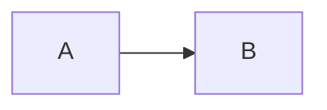

# Diagramas de Arquitetura ICARUS v5.0 (OraclusX)

Este diretório contém todos os diagramas de arquitetura do sistema ICARUS v5.0 em diferentes formatos.

## 📁 Estrutura de Arquivos

```
docs/diagrams/
├── README.md                      # Este arquivo
├── integracoes-externas.puml      # PlantUML - Integrações Externas
├── camada-dados.puml              # PlantUML - Camada de Dados
└── export/                        # Diagramas exportados (PNG/SVG/PDF)
```

## 📊 Diagramas Disponíveis

### 1. **Arquitetura Geral**

- **Localização**: `/arquitetura` (interface web)
- **Descrição**: Visão geral do sistema com Frontend, Backend, Agentes e Integrações
- **Formato**: Mermaid (renderizado no navegador)

### 2. **Fluxo de Agentes IA**

- **Localização**: `/agentes` (interface web)
- **Descrição**: Pipeline de agentes autônomos e orquestração
- **Formato**: Mermaid (renderizado no navegador)

### 3. **Integrações Externas**

- **Localização**: `/integracoes-diagrama` (interface web)
- **Arquivo**: `integracoes-externas.puml`
- **Descrição**: IoT/RFID/Blockchain, Fornecedores e Órgãos Regulatórios
- **Formatos**: Mermaid + PlantUML

### 4. **Camada de Dados**

- **Localização**: `/camada-dados` (interface web)
- **Arquivo**: `camada-dados.puml`
- **Descrição**: PostgreSQL, Buckets, Realtime, Vector Store
- **Formatos**: Mermaid + PlantUML

---

## 🛠️ Como Visualizar os Diagramas

### Opção 1: Interface Web (Recomendado)

Execute o projeto e acesse as páginas de documentação:

```bash
# Iniciar o servidor
pnpm dev

# Acessar no navegador
http://localhost:5173/arquitetura
http://localhost:5173/agentes
http://localhost:5173/integracoes-diagrama
http://localhost:5173/camada-dados
```

**Nota:** Os diagramas Mermaid são renderizados automaticamente no navegador.

---

### Opção 2: Mermaid Online

1. **Mermaid Live Editor** (Oficial)
   - URL: https://mermaid.live/
   - Copie o código Mermaid da interface web
   - Cole no editor
   - Exporte como PNG/SVG/PDF

2. **Mermaid2Img** (Rápido)
   - URL: https://mermaid.ink/
   - Suporta exportação direta via URL

3. **Simple Mermaid** (Colaborativo)
   - URL: https://simplemermaid.com/
   - Permite edição em equipe

---

### Opção 3: PlantUML

#### Online (Sem instalação)

1. **PlantUML Server** (Oficial)

   ```
   https://www.plantuml.com/plantuml/uml/
   ```

   - Abra o arquivo `.puml`
   - Copie o conteúdo
   - Cole no editor online
   - Clique em "Submit" para gerar o diagrama
   - Exporte como PNG/SVG

2. **PlantText**
   ```
   https://www.planttext.com/
   ```

   - Interface mais moderna
   - Preview em tempo real

#### Local (CLI)

```bash
# Instalar PlantUML (requer Java)
brew install plantuml   # macOS
apt install plantuml    # Linux
# Windows: baixar de https://plantuml.com/download

# Gerar PNG
plantuml docs/diagrams/integracoes-externas.puml
plantuml docs/diagrams/camada-dados.puml

# Gerar SVG (vetorial)
plantuml -tsvg docs/diagrams/integracoes-externas.puml
plantuml -tsvg docs/diagrams/camada-dados.puml

# Gerar PDF
plantuml -tpdf docs/diagrams/integracoes-externas.puml
plantuml -tpdf docs/diagrams/camada-dados.puml
```

---

## 📤 Exportar Diagramas

### Mermaid → PNG/SVG

#### Usando Mermaid CLI

```bash
# Instalar Mermaid CLI
npm install -g @mermaid-js/mermaid-cli

# Criar arquivo temporário com código Mermaid
echo "graph LR..." > temp.mmd

# Exportar
mmdc -i temp.mmd -o output.png
mmdc -i temp.mmd -o output.svg
mmdc -i temp.mmd -o output.pdf
```

#### Usando API Mermaid.ink

```bash
# Gerar URL de imagem
# Encode o código Mermaid em base64 e use:
https://mermaid.ink/img/<base64-code>

# Exemplo com curl
curl -o diagram.png "https://mermaid.ink/img/<base64-code>"
```

---

### PlantUML → PNG/SVG/PDF

```bash
# PNG (padrão)
plantuml docs/diagrams/*.puml

# SVG (vetorial, escalável)
plantuml -tsvg docs/diagrams/*.puml

# PDF (para documentação)
plantuml -tpdf docs/diagrams/*.puml

# EPS (para impressão)
plantuml -teps docs/diagrams/*.puml

# Todos os formatos de uma vez
plantuml -tpng -tsvg -tpdf docs/diagrams/*.puml
```

---

## 🎨 Personalização dos Diagramas

### Mermaid: Temas Disponíveis

```javascript
%%{init:{"theme":"default"}}%%      // Tema claro (padrão)
%%{init:{"theme":"dark"}}%%         // Tema escuro
%%{init:{"theme":"forest"}}%%       // Verde (usado atualmente)
%%{init:{"theme":"neutral"}}%%      // Neutro/monocromático
%%{init:{"theme":"base"}}%%         // Base minimalista
```

Para alterar, edite o código Mermaid nas páginas React:

- `src/pages/Architecture.tsx`
- `src/pages/AgentsFlow.tsx`
- `src/pages/IntegrationsDiagram.tsx`
- `src/pages/DataLayerDiagram.tsx`

---

### PlantUML: Temas Disponíveis

Os arquivos `.puml` já incluem o tema `cerulean-outline`. Outros temas:

```plantuml
!theme cerulean-outline   // Atual (azul profissional)
!theme sketchy-outline    // Esboço/rascunho
!theme spacelab           // Moderno e limpo
!theme superhero          // Escuro com cores vibrantes
!theme united             // Corporativo
!theme toy                // Lúdico/colorido
```

Para alterar, edite a linha `!theme` nos arquivos `.puml`.

---

## 🔗 Integrações com Documentação

### Embutir em Markdown

#### Mermaid

````markdown
# Arquitetura


````

````

#### PlantUML
```markdown
# Arquitetura

````

---

### Embutir em HTML

#### Mermaid (com CDN)

```html
<script type="module">
  import mermaid from "https://cdn.jsdelivr.net/npm/mermaid@10/dist/mermaid.esm.min.mjs";
  mermaid.initialize({ startOnLoad: true });
</script>

<pre class="mermaid">
graph LR
  A --> B
</pre>
```

#### PlantUML (Imagem)

```html

```

---

## 📚 Referências

### Mermaid

- **Documentação Oficial**: https://mermaid.js.org/
- **Live Editor**: https://mermaid.live/
- **Syntax Cheat Sheet**: https://mermaid.js.org/intro/syntax-reference.html

### PlantUML

- **Documentação Oficial**: https://plantuml.com/
- **Online Server**: https://www.plantuml.com/plantuml/
- **Syntax Guide**: https://plantuml.com/guide

---

## 🤝 Contribuindo

Para adicionar novos diagramas:

1. **Mermaid**: Crie uma nova página React em `src/pages/`
2. **PlantUML**: Adicione o arquivo `.puml` em `docs/diagrams/`
3. **Exporte**: Gere as versões PNG/SVG usando as ferramentas acima
4. **Documente**: Atualize este README

---

## 📝 Checklist de Exportação

- [ ] Exportar Integrações Externas (PNG/SVG/PDF)
- [ ] Exportar Camada de Dados (PNG/SVG/PDF)
- [ ] Verificar qualidade das imagens (resolução mínima: 1920x1080)
- [ ] Adicionar à pasta `docs/diagrams/export/`
- [ ] Atualizar documentação técnica (`ARQUITETURA_ICARUS_V5.md`)
- [ ] Compartilhar com stakeholders

---

## 📞 Suporte

Para dúvidas sobre os diagramas:

- **Email**: contato@icarus.com.br
- **Documentação Interna**: `/arquitetura` (sistema web)

---

© 2024 ICARUS v5.0 (OraclusX) - Todos os direitos reservados.
