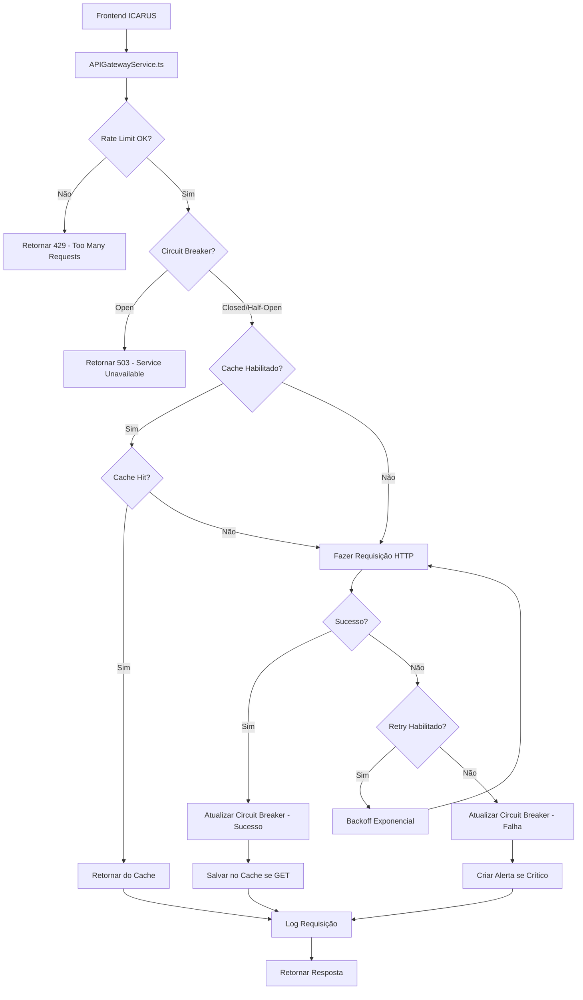

# 🌐 API Gateway - Gerenciamento de Integrações Externas

## Visão Geral

O **API Gateway** é o módulo centralizado para gerenciar todas as integrações com APIs externas do ICARUS. Ele implementa padrões de resiliência, segurança e performance para garantir comunicação confiável com serviços críticos como SEFAZ, ANVISA, CFM e outros.

## 🎯 Funcionalidades Principais

### 1. **Rate Limiting Inteligente**
- Limite de requisições por endpoint
- Controle por usuário ou global
- Janelas de tempo configuráveis (default: 100 req/60s)
- Bloqueio temporário ao exceder limite
- Desbloqueio automático após janela

### 2. **Circuit Breaker**
- Proteção contra falhas em cascata
- 3 estados: `closed` (normal), `open` (falha), `half_open` (teste)
- Abertura automática após N falhas consecutivas (default: 5)
- Timeout configurável para reabrir (default: 60s)
- Transição gradual para evitar sobrecarga

### 3. **Cache Inteligente**
- Cache de respostas GET por endpoint
- TTL configurável por endpoint
- Chave de cache baseada em parâmetros
- Estatísticas de hit rate
- Limpeza automática de cache expirado

### 4. **Retry Automático**
- Tentativas configuráveis (default: 3x)
- Backoff exponencial (1s, 2s, 4s, ...)
- Retry apenas em erros recuperáveis
- Logging de tentativas

### 5. **Monitoramento Completo**
- Dashboard em tempo real
- Métricas de performance (tempo de resposta)
- Taxa de sucesso/erro por endpoint
- Health checks periódicos
- Sistema de alertas automático

### 6. **Auditoria e Logging**
- Log de 100% das requisições
- Request/Response completos
- IP, User Agent, timestamp
- Integração com sistema de auditoria LGPD
- Exportação de logs para análise

## 🏗️ Arquitetura



## 📊 APIs Configuradas

### SEFAZ (Secretaria da Fazenda)
- **Emissão NF-e**: POST para emitir Nota Fiscal
- **Consulta NF-e**: POST para consultar status
- **Cancelamento NF-e**: POST para cancelar NF-e
- **Autenticação**: Certificado Digital (A1/A3)
- **Rate Limit**: 50 req/min (emissão), 100 req/min (consulta)
- **Criticidade**: Crítica

### ANVISA (Agência Nacional de Vigilância Sanitária)
- **Consulta Registro**: GET para validar registro de produto
- **Rastreabilidade**: POST para rastrear lote/série
- **Autenticação**: API Key
- **Rate Limit**: 200 req/min (consulta), 100 req/min (rastreabilidade)
- **Cache**: 1 hora (registros), sem cache (rastreabilidade)
- **Criticidade**: Alta

### CFM (Conselho Federal de Medicina)
- **Consulta CRM**: GET para validar CRM de médico
- **Autenticação**: None (público)
- **Rate Limit**: 50 req/min
- **Cache**: 24 horas
- **Criticidade**: Média

### Receita Federal
- **Consulta CNPJ**: GET via Brasil API
- **Consulta CPF**: GET via Brasil API
- **Autenticação**: None
- **Rate Limit**: 300 req/min
- **Cache**: 24 horas
- **Criticidade**: Média

### ViaCEP
- **Consulta CEP**: GET para buscar endereço
- **Autenticação**: None
- **Rate Limit**: 500 req/min
- **Cache**: 30 dias (endereços não mudam frequentemente)
- **Criticidade**: Baixa

### Infosimples
- **Consulta CNPJ Completo**: GET para dados avançados
- **Autenticação**: API Key
- **Rate Limit**: 100 req/min
- **Cache**: 24 horas
- **Criticidade**: Alta

## 🗄️ Estrutura do Banco de Dados

### Tabelas Criadas:
1. **`api_endpoints`** - Configuração dos endpoints (URL, auth, rate limits)
2. **`api_requests_log`** - Log de todas as requisições
3. **`api_rate_limits`** - Controle de rate limiting por endpoint/usuário
4. **`api_circuit_breaker`** - Estado do circuit breaker por endpoint
5. **`api_cache`** - Cache de respostas
6. **`api_health_checks`** - Histórico de health checks
7. **`api_alerts`** - Alertas de problemas (erro alto, circuito aberto, etc.)

### Functions PostgreSQL:
1. **`check_rate_limit(endpoint_id, user_id)`** - Verifica se pode fazer requisição
2. **`update_circuit_breaker(endpoint_id, success)`** - Atualiza estado do circuit breaker
3. **`get_from_cache(endpoint_id, cache_key)`** - Obtém resposta do cache
4. **`save_to_cache(...)`** - Salva resposta no cache
5. **`cleanup_expired_cache()`** - Remove cache expirado

### Views Otimizadas:
1. **`vw_api_metrics`** - Métricas agregadas por endpoint (requests, erros, tempo médio)

## 💻 Uso no Código

### Exemplo 1: Emitir NF-e via SEFAZ

```typescript
import { SEFAZService } from '@/lib/services/APIGatewayService';

// Emitir NF-e
const resultado = await SEFAZService.emitirNFe({
  destinatario: {
    cnpj: '12345678000190',
    razaoSocial: 'Hospital XYZ',
    // ...
  },
  produtos: [
    {
      codigo: 'OPME-001',
      descricao: 'Stent Coronariano',
      quantidade: 1,
      valorUnitario: 5000.00,
      registroANVISA: '80123450001',
      // ...
    },
  ],
  // ...
});

if (resultado.success) {
  console.log('NF-e emitida:', resultado.data.chaveAcesso);
} else {
  console.error('Erro ao emitir NF-e:', resultado.error);
  // Rate limit excedido, circuit breaker aberto, timeout, etc.
}
```

### Exemplo 2: Validar Registro ANVISA

```typescript
import { ANVISAGatewayService } from '@/lib/services/APIGatewayService';

// Consultar registro (com cache de 1 hora)
const resultado = await ANVISAGatewayService.consultarRegistro('80123450001');

if (resultado.success) {
  console.log('Produto válido:', resultado.data);
  console.log('Do cache?', resultado.fromCache); // true se veio do cache
  console.log('Tempo de resposta:', resultado.responseTime); // em ms
} else {
  console.error('Erro:', resultado.error);
}
```

### Exemplo 3: Consultar CRM (com retry automático)

```typescript
import { CFMGatewayService } from '@/lib/services/APIGatewayService';

// Tentará 3x com backoff exponencial se falhar
const resultado = await CFMGatewayService.consultarMedico('123456', 'SP');

if (resultado.success) {
  console.log('Médico:', resultado.data.nome);
  console.log('Tentativas:', resultado.retryAttempt); // 0 se sucesso na 1ª
} else {
  console.error('Erro após 3 tentativas:', resultado.error);
}
```

## 📈 Dashboard de Monitoramento

O componente `APIGatewayDashboard.tsx` fornece:

### Aba: Visão Geral
- **KPIs Principais**:
  - Total de requisições
  - Taxa de sucesso (%)
  - Tempo médio de resposta
  - Cache hit rate
  - Endpoints saudáveis
  - Alertas ativos
- **Gráfico**: Performance por endpoint (sucesso vs erro)
- **Alertas Críticos**: Banner destacado para problemas urgentes

### Aba: Endpoints
- **Tabela Completa**:
  - Nome do endpoint
  - Serviço (SEFAZ, ANVISA, CFM, etc.)
  - Total de requisições
  - Taxa de sucesso
  - Tempo médio de resposta
  - Cache hit rate
  - Estado do circuit breaker
- **Ações**:
  - Ver detalhes
  - Resetar circuit breaker (se aberto)

### Aba: Alertas
- **Lista de Alertas Ativos**:
  - Severidade (crítica, alta, média, baixa)
  - Tipo (high_error_rate, circuit_open, rate_limit_exceeded, etc.)
  - Mensagem descritiva
  - Timestamp
- **Ações**:
  - Resolver alerta
  - Ver detalhes completos

### Aba: Performance
- **Gráfico**: Tempo de resposta por endpoint
- **Card**: Cache Performance
  - Top 5 endpoints com melhor cache hit rate
  - Botão para limpar cache expirado
- **Card**: Circuit Breaker Status
  - Distribuição de estados (closed, open, half_open)
  - Progress bars visuais

## 🔐 Segurança

### Autenticação
- **None**: APIs públicas (ViaCEP, Brasil API)
- **API Key**: ANVISA, Infosimples (header `X-API-Key`)
- **Bearer Token**: APIs com OAuth2
- **Certificate**: SEFAZ (A1/A3 digital)
- **Basic Auth**: Legacy APIs

### Rate Limiting
- Proteção contra abuso
- Limites configuráveis por endpoint
- Controle por usuário ou global
- Logs de tentativas bloqueadas

### Circuit Breaker
- Previne sobrecarga de APIs instáveis
- Falha rápida (fail-fast) quando circuito aberto
- Recuperação gradual (half-open)

## 📊 Métricas e KPIs

### Performance
- **Tempo de Resposta**: Média, mínimo, máximo, P95, P99
- **Taxa de Sucesso**: % de requisições com status 2xx
- **Taxa de Erro**: % de requisições com status 4xx/5xx
- **Throughput**: Requisições por segundo

### Cache
- **Hit Rate**: % de requisições atendidas pelo cache
- **Miss Rate**: % de requisições que precisaram ir à API
- **Tamanho do Cache**: Número de entradas armazenadas
- **Taxa de Expiração**: Entradas removidas por hora

### Resiliência
- **Circuit Breaker State**: Distribuição de estados
- **Falhas Consecutivas**: Número de falhas antes de abrir
- **Tempo de Recuperação**: Tempo médio para reabrir circuito
- **Rate Limit Exceeded**: Quantidade de requisições bloqueadas

## 🚨 Alertas Automáticos

O sistema cria alertas automaticamente para:

1. **Circuit Breaker Aberto**: API está fora do ar
2. **Alta Taxa de Erro**: > 10% de erros em 5 minutos
3. **Resposta Lenta**: Tempo médio > 2 segundos
4. **Rate Limit Excedido**: Limite sendo atingido frequentemente
5. **Cache Miss Alto**: Hit rate < 50% em APIs cacheáveis
6. **Health Check Failed**: Endpoint não responde

### Severidades:
- **Crítica**: Sistema pode parar (ex: SEFAZ down)
- **Alta**: Degradação severa (ex: ANVISA lenta)
- **Média**: Impacto moderado (ex: CFM cache miss)
- **Baixa**: Informativo (ex: ViaCEP rate limit próximo)

## 🔄 Fluxo Completo de uma Requisição

1. **Frontend** chama `APIGatewayService.request({ endpoint: 'sefaz_nfe_emitir', body: {...} })`
2. **Gateway** busca configuração do endpoint no banco
3. **Rate Limit** verifica se pode prosseguir (função PostgreSQL)
4. **Circuit Breaker** verifica estado (tabela `api_circuit_breaker`)
5. **Cache** tenta obter resposta do cache (se GET e habilitado)
6. **HTTP Request** faz requisição real com axios
7. **Retry** repete até 3x com backoff exponencial se falhar
8. **Circuit Breaker** atualiza estado (sucesso ou falha)
9. **Cache** salva resposta se GET e sucesso
10. **Log** registra tudo na tabela `api_requests_log`
11. **Alerta** cria alerta se endpoint crítico falhar
12. **Resposta** retorna para o frontend

## 📦 Estatísticas do Módulo

- **Migrations SQL**: 1 arquivo (~800 linhas)
- **Service TypeScript**: 1 arquivo (~700 linhas)
- **Component React**: 1 arquivo (~600 linhas)
- **Tabelas Criadas**: 7
- **Functions PostgreSQL**: 5
- **Views**: 1
- **APIs Configuradas**: 7
- **Seed Data**: 7 endpoints

## 🎯 Benefícios

### Para a Operação
- ✅ Resiliência contra falhas de APIs externas
- ✅ Performance otimizada com cache
- ✅ Visibilidade completa de integrações
- ✅ Redução de custos (menos requisições por cache)

### Para o Compliance
- ✅ Log de 100% das integrações (LGPD Art. 37)
- ✅ Rastreabilidade de chamadas regulatórias
- ✅ Auditoria de acessos a ANVISA/SEFAZ

### Para a Gestão
- ✅ Dashboard em tempo real
- ✅ Alertas proativos de problemas
- ✅ Métricas de SLA de fornecedores
- ✅ Análise de custos de APIs pagas (Infosimples)

## 🚀 Próximos Passos

Com o API Gateway implementado, o sistema está pronto para:

1. **BLOCO 2.1**: Integrar BI Dashboard com métricas do Gateway
2. **BLOCO 2.2**: Usar KPIs do Gateway no Dashboard Consolidado
3. **BLOCO 2.3**: Expandir Integrations Manager com webhooks

## 📝 Notas Importantes

### Certificado Digital SEFAZ
Para emissão de NF-e, é necessário:
- Certificado A1 (arquivo .pfx) ou A3 (token/smartcard)
- Configurar no `auth_config` do endpoint
- Renovação anual obrigatória

### API Keys
As seguintes APIs requerem chave:
- **ANVISA**: Solicitar no portal da ANVISA
- **Infosimples**: Plano pago, solicitar em infosimples.com

### Ambientes
- **Homologação**: Usar URLs de teste (SEFAZ homologação)
- **Produção**: Trocar URLs e certificados antes de produção

---

## 🎉 Conclusão

O **API Gateway** é um componente crítico do ICARUS, garantindo que todas as integrações externas (SEFAZ, ANVISA, CFM) sejam confiáveis, seguras e monitoradas. Com rate limiting, circuit breaker, cache inteligente e retry automático, o sistema está preparado para operar em ambientes de alta carga e com APIs instáveis.

**Status**: ✅ 100% COMPLETO  
**Versão**: 1.0  
**Data**: Outubro 2025

