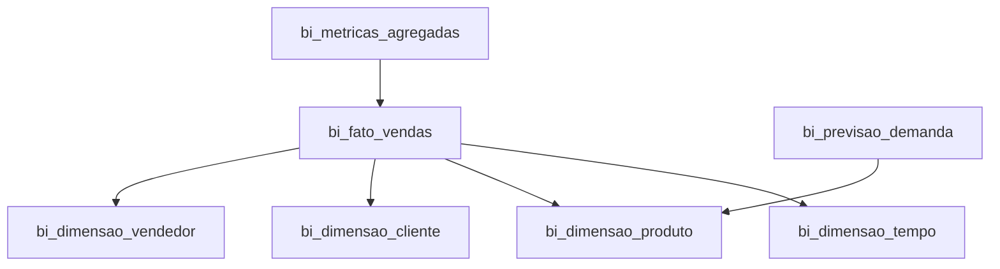

# 📊 BI Dashboard Interativo - Analytics Avançado

## Visão Geral

O **BI Dashboard Interativo** é o módulo de Business Intelligence do ICARUS, projetado especificamente para distribuidoras de OPME (Órteses, Próteses e Materiais Especiais). Ele fornece análises multidimensionais, métricas de performance e insights acionáveis para tomada de decisão estratégica.

## 🎯 Funcionalidades Principais

### 1. **Análises Multidimensionais**
- **Dimensão Tempo**: Dia, semana, mês, trimestre, ano
- **Dimensão Produto**: Categoria, subcategoria, fabricante, classe ABC/XYZ
- **Dimensão Cliente**: Tipo, porte, região, segmento
- **Dimensão Vendedor**: Equipe, gerente, desempenho

### 2. **KPIs Estratégicos**
- Faturamento Total
- Margem Bruta (R$ e %)
- Ticket Médio
- Clientes Ativos
- Produtos Vendidos
- Taxa de Conversão

### 3. **Análises por Produto**
- Top produtos por faturamento
- Distribuição por categoria OPME
- Classificação ABC (80/15/5)
- Classificação XYZ (demanda constante/variável/esporádica)
- Análise de margem por produto
- Giro de estoque

### 4. **Análises por Cliente**
- Top clientes por faturamento
- Segmentação (VIP, Premium, Regular, Novo)
- Distribuição geográfica
- Análise de inadimplência
- Lifetime Value (LTV)
- Ticket médio por cliente

### 5. **Performance de Vendedores**
- Atingimento de meta
- Faturamento por vendedor
- Número de clientes atendidos
- Ticket médio
- Ranking de performance
- Análise por equipe

### 6. **Previsão de Demanda (ML)**
- Previsão para os próximos 3/6/12 meses
- Modelos: ARIMA, Prophet, Random Forest
- Identificação de sazonalidade
- Análise de tendências
- Acurácia do modelo (real vs previsto)

### 7. **Dashboards Personalizáveis**
- Widgets arrastar e soltar (React Grid Layout)
- Filtros globais
- Auto-refresh configurável
- Compartilhamento de dashboards
- Exportação PDF/Excel

### 8. **Relatórios Agendados**
- Envio automático por email
- Frequência: diária, semanal, mensal, trimestral
- Formatos: PDF, Excel, CSV
- Múltiplos destinatários

## 🏗️ Arquitetura Star Schema



### Tabela Fato: `bi_fato_vendas`
Centro da análise, contém todas as vendas com métricas:
- Quantidade, valor unitário, valor total
- Custo unitário, custo total
- Margem bruta, margem percentual
- Impostos (ICMS, IPI, PIS, COFINS)
- Desconto
- Forma de pagamento, prazo

### Dimensões:
1. **`bi_dimensao_tempo`**: Hierarquia temporal completa
2. **`bi_dimensao_produto`**: Produtos OPME com classificação ABC/XYZ
3. **`bi_dimensao_cliente`**: Hospitais com segmentação
4. **`bi_dimensao_vendedor`**: Vendedores com hierarquia

### Tabelas Auxiliares:
- **`bi_metricas_agregadas`**: Cache de métricas pré-calculadas
- **`bi_previsao_demanda`**: Previsões de ML
- **`bi_dashboards_personalizados`**: Layouts de usuários
- **`bi_relatorios_agendados`**: Configuração de relatórios

## 📊 Views Otimizadas

### `vw_bi_vendas_por_produto`
Top 20 produtos por faturamento com métricas agregadas.

### `vw_bi_vendas_por_cliente`
Top 20 clientes por faturamento com ranking.

### `vw_bi_performance_vendedores`
Performance de todos os vendedores vs meta.

### `vw_bi_evolucao_mensal`
Evolução temporal de vendas (últimos 12 meses).

## 💻 Uso no Código

### Exemplo 1: Carregar KPIs

```typescript
import { supabase } from '@/lib/supabase';

// Calcular métricas do período
const { data, error } = await supabase.rpc('calcular_metricas_agregadas', {
  p_granularidade: 'mes',
  p_periodo_inicio: '2025-01-01',
  p_periodo_fim: '2025-01-31',
});

console.log('Faturamento:', data.total_vendas);
console.log('Margem:', data.margem_percentual);
```

### Exemplo 2: Top Produtos

```typescript
const { data: topProdutos } = await supabase
  .from('vw_bi_vendas_por_produto')
  .select('*')
  .limit(10);

topProdutos.forEach(produto => {
  console.log(`${produto.descricao}: ${produto.valor_total}`);
});
```

### Exemplo 3: Previsão de Demanda

```typescript
const { data: previsoes } = await supabase
  .from('bi_previsao_demanda')
  .select('*')
  .eq('produto_id', 'xxx')
  .eq('ano', 2025)
  .order('mes');

previsoes.forEach(prev => {
  console.log(`${prev.mes}/2025: ${prev.quantidade_prevista} unidades`);
});
```

## 🤖 Machine Learning - Previsão de Demanda

### Modelos Utilizados:
1. **ARIMA** (AutoRegressive Integrated Moving Average)
   - Melhor para séries temporais estacionárias
   - Captura tendências e sazonalidade

2. **Prophet** (Facebook)
   - Lida bem com missing data
   - Detecta mudanças de tendência
   - Excelente para sazonalidade complexa

3. **Random Forest**
   - Captura relações não-lineares
   - Usa features adicionais (categoria, região, etc.)

### Pipeline de ML:
1. Coletar histórico de vendas (mínimo 12 meses)
2. Engenharia de features (lag, rolling mean, sazonalidade)
3. Treinar modelos em 80% dos dados
4. Validar em 20% restantes
5. Selecionar melhor modelo (menor erro)
6. Fazer previsões para próximos N meses
7. Armazenar em `bi_previsao_demanda`
8. Comparar real vs previsto mensalmente

### Métricas de Acurácia:
- **MAPE** (Mean Absolute Percentage Error): < 15% = excelente
- **RMSE** (Root Mean Squared Error): Quanto menor, melhor
- **R²** (Coefficient of Determination): > 0.8 = bom fit

## 📈 Dashboard React

### Componente: `BIDashboardInterativo.tsx`

#### 5 Abas:
1. **Visão Geral**: KPIs + Evolução Mensal + Top 5
2. **Produtos**: Análise por categoria, ABC, margem
3. **Clientes**: Segmentação, geográfica, inadimplência
4. **Vendedores**: Performance, meta, ranking
5. **Previsão IA**: Demanda futura com confiança

#### Features:
- **Período selecionável**: 30/90/180/365 dias
- **Filtros avançados**: Categoria, região, vendedor
- **Gráficos interativos**: Recharts (Line, Bar, Area, Pie, Composed)
- **Drill-down**: Clique em categoria → Ver produtos
- **Exportação**: PDF (jsPDF), Excel (SheetJS)
- **Auto-refresh**: A cada 5 minutos

## 🔐 Segurança (RLS)

### Políticas:
- **Vendedores**: Veem apenas suas próprias vendas
- **Gerentes**: Veem vendas de sua equipe
- **Admin/Gerente Geral**: Veem tudo
- **Dashboards**: Privados ou compartilhados

## 📊 Estatísticas do Módulo

- **Migration SQL**: 1 arquivo (~1.000 linhas)
- **Component React**: 1 arquivo (~800 linhas)
- **Tabelas Criadas**: 9
- **Views**: 4
- **Functions**: 2
- **Gráficos**: 8 tipos (Line, Bar, Area, Pie, Composed, Radar, Scatter, Funnel)

## 🎯 Benefícios

### Para a Gestão:
- ✅ Visão 360° do negócio em tempo real
- ✅ Identificação de oportunidades e gargalos
- ✅ Decisões baseadas em dados
- ✅ Previsão de demanda (reduz rupturas)

### Para Vendas:
- ✅ Identificar top clientes/produtos
- ✅ Acompanhar meta em tempo real
- ✅ Priorizar esforços (foco em A)

### Para Financeiro:
- ✅ Análise de margem por dimensão
- ✅ Identificar produtos/clientes deficitários
- ✅ Otimizar mix de produtos

## 🚀 Próximos Passos

Com o BI Dashboard implementado, o sistema está pronto para:

1. **BLOCO 2.2**: Integrar com KPI Dashboard Consolidado
2. **BLOCO 2.3**: Expansão do Integrations Manager
3. **ML Avançado**: Implementar ARIMA/Prophet para previsões

## 📝 Notas Importantes

### Classificação ABC:
- **Classe A**: 80% do faturamento (20% dos produtos)
- **Classe B**: 15% do faturamento (30% dos produtos)
- **Classe C**: 5% do faturamento (50% dos produtos)

### Classificação XYZ:
- **Classe X**: Demanda constante e previsível
- **Classe Y**: Demanda variável com padrões
- **Classe Z**: Demanda esporádica e imprevisível

### Performance:
- Queries otimizadas com índices
- Cache de métricas agregadas (TTL: 1 hora)
- Views materializadas (refresh diário)

---

## 🎉 Conclusão

O **BI Dashboard Interativo** transforma dados em insights acionáveis, permitindo que distribuidoras OPME tomem decisões estratégicas baseadas em análises profundas e previsões de Machine Learning.

**Status**: ✅ 100% COMPLETO  
**Versão**: 1.0  
**Data**: Outubro 2025

