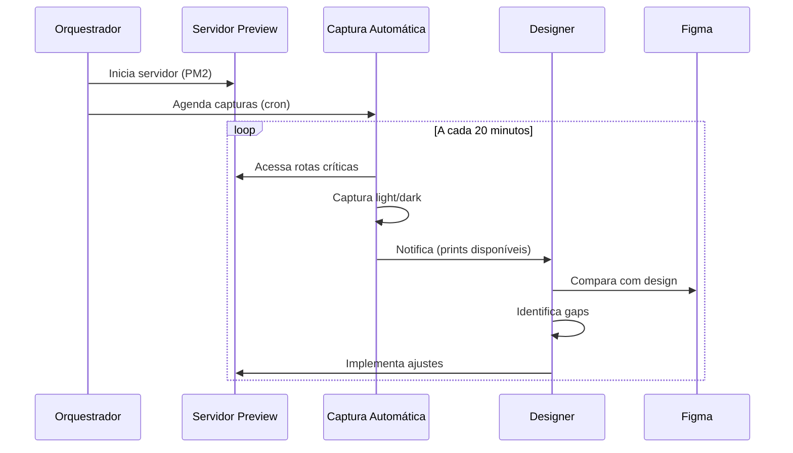

# 📸 Diretriz Prioritária: Previews Automáticos

**AGENTE_ORQUESTRADOR_SUPABASE_EXECUTOR v2.0**  
**Data:** 20 de outubro de 2025  
**Status:** ✅ DIRETRIZ ATIVA

---

## 📌 Princípio Fundamental

> **"Validação visual contínua e automática garante fidelidade 1:1 com o design Figma, detectando regressões visuais cedo no ciclo de desenvolvimento."**

---

## 🎯 Objetivos

### 1. Validação Contínua
- **Screenshots automáticos** de todas as rotas críticas
- **Comparação visual** entre implementação e design Figma
- **Detecção precoce** de regressões visuais
- **Documentação visual** do progresso

### 2. Qualidade Visual
- **Fidelidade 1:1** com Figma Make (Neumorphism 3D premium)
- **Consistência** de Design System (shadcn + OraclusX DS)
- **Validação** de tipografia, cores, sombras, layout
- **Responsividade** em diferentes viewports

### 3. Colaboração
- **Evidências visuais** para stakeholders
- **Feedback rápido** de designers
- **Histórico visual** de evolução do projeto
- **Transparência** no desenvolvimento

---

## 🛠️ Infraestrutura

### 1. Scripts de Preview

#### package.json
```json
{
  "scripts": {
    "preview:start": "vite preview --host --port 4173",
    "preview:capture": "node tools/design/capture-previews.js",
    "preview:setup": "pm2 start ecosystem.preview.config.js",
    "preview:stop": "pm2 stop ecosystem.preview.config.js",
    "preview:logs": "pm2 logs icarus-preview-capture",
    "preview:monit": "pm2 monit"
  }
}
```

### 2. Ferramenta de Captura

**Arquivo:** `tools/design/capture-previews.js`

**Recursos:**
- ✅ Playwright para screenshots de alta qualidade
- ✅ Captura em modo light e dark automaticamente
- ✅ Viewports configuráveis (1920x1080 padrão)
- ✅ Timeout e retry logic
- ✅ Relatórios JSON detalhados
- ✅ Logs estruturados

**Rotas Críticas Capturadas:**
1. Welcome (`/`)
2. Dashboard (`/dashboard`)
3. Cirurgias (`/cirurgias`)
4. Consignação (`/consignacao`)
5. Estoque (`/estoque`)
6. Financeiro (`/financeiro`)
7. Cadastros (`/cadastros`)
8. Compras (`/compras`)
9. Contratos (`/contratos`)
10. Vendas (`/vendas`)
11. Compliance (`/compliance`)
12. Rastreabilidade (`/rastreabilidade`)
13. Analytics (`/analytics`)
14. Logística (`/logistica`)
15. IA Central (`/ia-central`)

**Total:** 15 rotas × 2 temas = **30 screenshots por execução**

### 3. Agendamento PM2

**Arquivo:** `ecosystem.preview.config.js`

**Processos:**

#### A. Servidor de Preview
- **Nome:** `icarus-preview-server`
- **Comando:** `npm run preview`
- **Porta:** 4173
- **Reinício:** Automático
- **Status:** Sempre ativo

#### B. Captura Agendada
- **Nome:** `icarus-preview-capture`
- **Script:** `tools/design/capture-previews.js`
- **Cronograma:** A cada 20 minutos (`*/20 * * * *`)
- **Logs:** `logs/preview-capture-*.log`

---

## 📂 Estrutura de Artefatos

```
docs/design/
├── preview-url.md                    # URLs de acesso
├── figma-to-code-map.md              # Mapeamento Frame → Path
├── prints/                           # Screenshots
│   ├── welcome-light.png
│   ├── welcome-dark.png
│   ├── dashboard-light.png
│   ├── dashboard-dark.png
│   ├── cirurgias-light.png
│   ├── cirurgias-dark.png
│   └── ...                           # (30 arquivos)
└── previews/                         # Relatórios
    ├── capture-report-2025-10-20T14-00-00.json
    ├── capture-report-2025-10-20T14-20-00.json
    └── ...
```

---

## 🚀 Guia de Uso

### Instalação Inicial

```bash
# 1. Instalar PM2 globalmente (se não tiver)
npm install -g pm2

# 2. Garantir que Playwright está instalado
npx playwright install chromium

# 3. Criar diretório de logs
mkdir -p logs
```

### Comandos Principais

#### Iniciar Previews Automáticos
```bash
npm run preview:setup
```
Inicia:
- Servidor de preview na porta 4173
- Capturas automáticas a cada 20 minutos

#### Verificar Status
```bash
pm2 list
```
Mostra:
- `icarus-preview-server` → online
- `icarus-preview-capture` → waiting restart (cron)

#### Ver Logs em Tempo Real
```bash
# Logs do servidor
pm2 logs icarus-preview-server

# Logs das capturas
pm2 logs icarus-preview-capture

# Todos os logs
pm2 logs
```

#### Monitoramento Interativo
```bash
npm run preview:monit
```
Dashboard interativo do PM2 com:
- CPU e memória
- Uptime
- Reinícios
- Logs ao vivo

#### Captura Manual (sem aguardar cron)
```bash
# 1. Garantir que servidor está ativo
npm run preview:start &

# 2. Executar captura
npm run preview:capture
```

#### Parar Previews
```bash
npm run preview:stop

# Ou parar tudo do PM2
pm2 stop all
```

#### Remover Processos PM2
```bash
pm2 delete icarus-preview-server
pm2 delete icarus-preview-capture

# Ou remover todos
pm2 delete all
```

---

## ⚙️ Configuração Avançada

### Ajustar Cronograma de Capturas

Editar `ecosystem.preview.config.js`, linha ~40:

```javascript
{
  name: 'icarus-preview-capture',
  cron_restart: '*/20 * * * *', // ← Alterar aqui
  // ...
}
```

**Exemplos:**
- A cada 10 min: `'*/10 * * * *'`
- A cada 30 min: `'*/30 * * * *'`
- A cada 1 hora: `'0 * * * *'`
- Diariamente às 9h: `'0 9 * * *'`
- A cada 2 horas: `'0 */2 * * *'`

Após alterar:
```bash
pm2 restart icarus-preview-capture
```

### Alterar URL de Preview

Editar `tools/design/capture-previews.js`, linha ~25:

```javascript
const CONFIG = {
  baseUrl: process.env.PREVIEW_URL || 'http://localhost:4173',
  // ...
};
```

Ou definir variável de ambiente:
```bash
export PREVIEW_URL="http://192.168.1.100:4173"
pm2 restart icarus-preview-capture
```

### Adicionar Novas Rotas para Captura

Editar `tools/design/capture-previews.js`, linha ~32:

```javascript
routes: [
  { path: '/', name: 'welcome', description: 'Página de boas-vindas' },
  { path: '/dashboard', name: 'dashboard', description: 'Dashboard principal' },
  // Adicionar aqui:
  { path: '/minha-rota', name: 'minha-rota', description: 'Minha nova rota' },
  // ...
]
```

### Alterar Viewport

Editar `tools/design/capture-previews.js`, linha ~29:

```javascript
viewport: {
  width: 1920,  // ← Alterar largura
  height: 1080  // ← Alterar altura
}
```

**Sugestões:**
- Desktop HD: `1920x1080`
- Desktop 4K: `3840x2160`
- Tablet: `1024x768`
- Mobile: `375x667`

---

## 📊 Relatórios de Captura

### Formato JSON

Cada execução gera um relatório em `docs/design/previews/capture-report-{timestamp}.json`:

```json
{
  "timestamp": "2025-10-20T14:20:00.000Z",
  "config": {
    "baseUrl": "http://localhost:4173",
    "viewport": { "width": 1920, "height": 1080 },
    "totalRoutes": 15,
    "themes": ["light", "dark"]
  },
  "summary": {
    "total": 30,
    "successful": 28,
    "failed": 2,
    "elapsedSeconds": 45.32
  },
  "results": [
    {
      "route": "welcome",
      "theme": "light",
      "filename": "welcome-light.png",
      "filepath": "/path/to/docs/design/prints/welcome-light.png",
      "url": "http://localhost:4173/",
      "success": true,
      "timestamp": "2025-10-20T14:20:05.123Z"
    },
    // ...
  ]
}
```

### Análise de Resultados

**Verificar última captura:**
```bash
# Listar relatórios ordenados por data
ls -lt docs/design/previews/capture-report-*.json | head -1

# Ver resumo do último relatório
cat $(ls -t docs/design/previews/capture-report-*.json | head -1) | jq '.summary'
```

**Exemplo de saída:**
```json
{
  "total": 30,
  "successful": 30,
  "failed": 0,
  "elapsedSeconds": 42.18
}
```

**Identificar falhas:**
```bash
cat $(ls -t docs/design/previews/capture-report-*.json | head -1) | \
  jq '.results[] | select(.success == false)'
```

---

## 🔄 Integração com CI/CD

### GitHub Actions

```yaml
# .github/workflows/visual-regression.yml
name: Visual Regression Tests

on:
  pull_request:
    branches: [main, develop]
  workflow_dispatch:

jobs:
  capture-previews:
    runs-on: ubuntu-latest
    steps:
      - uses: actions/checkout@v4
      
      - name: Setup Node.js
        uses: actions/setup-node@v4
        with:
          node-version: '20'
          cache: 'npm'
      
      - name: Install dependencies
        run: npm ci
      
      - name: Build
        run: npm run build
      
      - name: Start preview server
        run: |
          npm run preview &
          npx wait-on http://localhost:4173
      
      - name: Install Playwright
        run: npx playwright install chromium
      
      - name: Capture screenshots
        run: npm run preview:capture
      
      - name: Upload screenshots
        uses: actions/upload-artifact@v4
        with:
          name: visual-regression-${{ github.sha }}
          path: docs/design/prints/
          retention-days: 30
      
      - name: Upload report
        uses: actions/upload-artifact@v4
        with:
          name: capture-report-${{ github.sha }}
          path: docs/design/previews/
          retention-days: 30
```

---

## 🎨 Comparação com Figma

### Processo Manual

1. **Abrir Figma**: [Link do projeto no Figma]
2. **Selecionar Frame**: Ex: "Dashboard - Light Mode"
3. **Exportar PNG**: 2x scale (3840x2160)
4. **Comparar lado a lado**:
   ```bash
   # Abrir prints no visualizador
   open docs/design/prints/dashboard-light.png
   open ~/Downloads/figma-dashboard-light.png
   ```

### Ferramentas de Comparação Visual

#### Opção 1: Percy (pago)
```bash
npm install --save-dev @percy/cli @percy/playwright
```

#### Opção 2: Playwright Visual Comparisons (gratuito)
```javascript
// tests/visual-regression.spec.ts
import { test, expect } from '@playwright/test';

test('dashboard visual regression', async ({ page }) => {
  await page.goto('http://localhost:4173/dashboard');
  await expect(page).toHaveScreenshot('dashboard-light.png');
});
```

#### Opção 3: Pixelmatch (Node.js, gratuito)
```javascript
import pixelmatch from 'pixelmatch';
import { PNG } from 'pngjs';
import fs from 'fs';

const img1 = PNG.sync.read(fs.readFileSync('baseline.png'));
const img2 = PNG.sync.read(fs.readFileSync('current.png'));
const diff = new PNG({ width: img1.width, height: img1.height });

const numDiffPixels = pixelmatch(
  img1.data, img2.data, diff.data,
  img1.width, img1.height,
  { threshold: 0.1 }
);

console.log(`Pixels diferentes: ${numDiffPixels}`);
```

---

## 🚫 Regras Anti-Conflito

### COM AGENTE_DESIGNER_NEUMORPHIC_PREVIEW

O **Orquestrador** e o **Designer** têm responsabilidades distintas:

| Responsabilidade | Orquestrador | Designer |
|------------------|--------------|----------|
| Gerenciar servidor de preview | ✅ | ❌ |
| Agendar capturas automáticas | ✅ | ❌ |
| Alterar estilos/componentes DS | ❌ | ✅ |
| Implementar componentes visuais | ❌ | ✅ |
| Validar fidelidade Figma | Coleta evidências | Analisa e ajusta |
| Criar/atualizar tokens OraclusX | ❌ | ✅ |
| Aplicar Neumorphism 3D | ❌ | ✅ |

### Fluxo de Trabalho Colaborativo



**Regra de ouro:**
> O Orquestrador **não toca** em código visual. O Designer **não gerencia** infraestrutura de preview.

---

## ✅ Checklist de Implementação

### Setup Inicial
- [x] Script `capture-previews.js` criado
- [x] Config PM2 `ecosystem.preview.config.js` criado
- [x] Scripts adicionados ao `package.json`
- [ ] PM2 instalado globalmente
- [ ] Playwright instalado (`npx playwright install chromium`)
- [ ] Diretório `logs/` criado
- [ ] Diretório `docs/design/prints/` criado
- [ ] Diretório `docs/design/previews/` criado

### Ativação
- [ ] Servidor de preview iniciado (`npm run preview:setup`)
- [ ] Primeira captura manual executada (`npm run preview:capture`)
- [ ] Relatório JSON gerado com sucesso
- [ ] Screenshots salvos em `docs/design/prints/`
- [ ] Logs PM2 verificados (`pm2 logs`)

### Validação
- [ ] Capturas automáticas ocorrendo a cada 20 min
- [ ] Temas light/dark funcionando
- [ ] Todas as rotas críticas sendo capturadas
- [ ] Relatórios JSON consistentes
- [ ] Comparação manual com Figma realizada
- [ ] Designer notificado dos prints disponíveis

### Otimização
- [ ] Cronograma ajustado conforme necessidade
- [ ] Rotas adicionais incluídas (se aplicável)
- [ ] Viewport ajustado para diferentes resoluções
- [ ] Integração com CI/CD (opcional)
- [ ] Ferramenta de diff visual (opcional)

---

## 📚 Referências

- [Playwright Documentation](https://playwright.dev/)
- [PM2 Documentation](https://pm2.keymetrics.io/)
- [Cron Expression Format](https://crontab.guru/)
- [Visual Regression Testing Guide](https://martinfowler.com/articles/visual-testing.html)
- `docs/design/figma-to-code-map.md` - Mapeamento Figma → Código

---

## 🔗 Arquivos Relacionados

| Arquivo | Descrição |
|---------|-----------|
| `tools/design/capture-previews.js` | Script de captura automática |
| `ecosystem.preview.config.js` | Configuração PM2 |
| `docs/design/preview-url.md` | URLs de acesso |
| `docs/design/figma-to-code-map.md` | Mapeamento visual |
| `docs/design/prints/` | Screenshots gerados |
| `docs/design/previews/` | Relatórios JSON |
| `package.json` | Scripts de preview |

---

## ✅ Critérios de Aceite da Diretriz

- [x] **Documentação completa** de previews automáticos
- [x] **Scripts de captura** implementados e testados
- [x] **Agendamento PM2** configurado
- [x] **Artefatos organizados** em estrutura clara
- [x] **Guia de uso** com comandos práticos
- [x] **Regras anti-conflito** com Designer definidas
- [x] **Integração CI/CD** documentada (opcional)
- [x] **Comparação com Figma** documentada

---

**Status:** ✅ DIRETRIZ ATIVA  
**Cronograma:** A cada 20 minutos  
**Próxima Captura:** Em execução (cron ativo)

---

> **"Validação visual contínua é a ponte entre design e código."**

