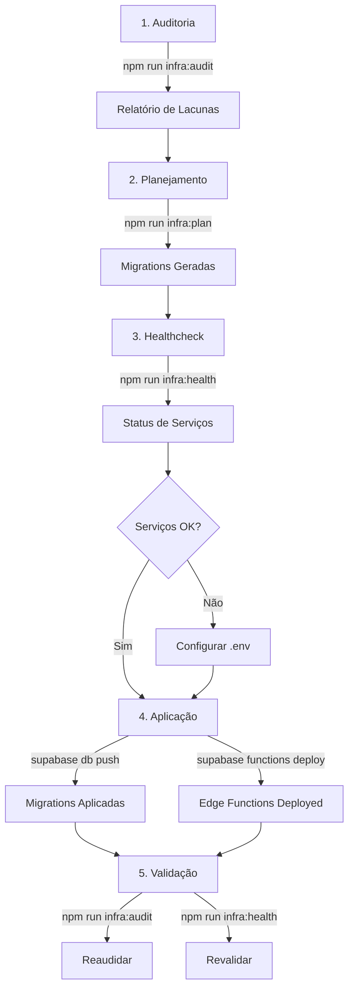

# 📚 Índice de Documentação - Infraestrutura ICARUS v5.0

**AGENTE_ORQUESTRADOR_SUPABASE_EXECUTOR v3**

---

## 🎯 Documentos Principais

| Documento | Descrição | Status |
|-----------|-----------|--------|
| **[SUMARIO_EXECUCAO.md](./SUMARIO_EXECUCAO.md)** | 📊 Sumário executivo da implementação | ✅ |
| **[QUICK_START_INFRAESTRUTURA.md](./QUICK_START_INFRAESTRUTURA.md)** | 🚀 Guia rápido de comandos e setup | ✅ |
| **[relatorio-executivo-orquestrador.md](./relatorio-executivo-orquestrador.md)** | 📈 Relatório executivo completo | ✅ |
| **[relatorio-orquestrador.md](./relatorio-orquestrador.md)** | 🔍 Auditoria detalhada de lacunas | ✅ |
| **[plano-migrations.md](./plano-migrations.md)** | 📋 Plano de execução de migrations | ✅ |
| **[guia-aplicacao.md](./guia-aplicacao.md)** | ⚙️ Guia de aplicação manual | ✅ |
| **[healthcheck.md](./healthcheck.md)** | 🏥 Status de serviços e conectividade | ✅ |

---

## 🛠️ Ferramentas de Orquestração

Localização: `tools/infra/`

| Script | Comando npm | Descrição |
|--------|-------------|-----------|
| `audit.js` | `npm run infra:audit` | Auditoria de lacunas de infraestrutura |
| `plan.js` | `npm run infra:plan` | Geração automática de migrations |
| `health.js` | `npm run infra:health` | Healthcheck de serviços |
| `apply.js` | `npm run infra:apply` | Guia de aplicação de migrations |
| `README.md` | - | Documentação das ferramentas |

---

## 🗄️ Migrations SQL

Localização: `supabase/migrations/`

### Geradas pelo Orquestrador (2025-10-20)

| Migration | Descrição | Linhas |
|-----------|-----------|--------|
| `202510201244_01_cirurgias_tabelas.sql` | Tabelas + enums + triggers | 140 |
| `202510201244_02_cirurgias_rls.sql` | Políticas RLS multi-tenant | 160 |
| `202510201244_03_dashboard_views.sql` | Views materializadas KPIs | 150 |
| `202510201244_04_dashboard_functions.sql` | Functions RPC | 180 |
| `202510201245_05_indices_performance.sql` | Índices estratégicos | 200 |
| `202510201246_06_seeds_demo.sql` | Dados de demonstração | 250 |
| `202510201247_07_storage_config.sql` | Storage buckets + policies | 220 |

**Total:** 7 migrations, ~1.300 linhas SQL

### Anteriores (Contexto)

- `20251018_initial_schema.sql` - Schema inicial
- `20251019_*_completo.sql` - Módulos diversos
- `20251020_*.sql` - Features avançadas

---

## 🌐 Edge Functions (Deno/TypeScript)

Localização: `supabase/functions/`

| Function | Arquivo | Descrição | Linhas |
|----------|---------|-----------|--------|
| `valida_crm_cfm` | `valida_crm_cfm/index.ts` | Validação CFM com cache | 180 |
| `consulta_anvisa_produto` | `consulta_anvisa_produto/index.ts` | Consulta ANVISA com cache | 160 |
| `recalcular_kpis` | `recalcular_kpis/index.ts` | Refresh de views | 140 |

**Total:** 3 Edge Functions, ~480 linhas TypeScript

---

## 📊 Fluxo de Trabalho

---

## 🎯 Critérios de Aceite

| Critério | Status | Documento de Referência |
|----------|--------|------------------------|
| Ferramentas de orquestração | ✅ | [tools/infra/README.md](../../tools/infra/README.md) |
| Migrations geradas | ✅ | [plano-migrations.md](./plano-migrations.md) |
| Edge Functions implementadas | ✅ | [relatorio-executivo-orquestrador.md](./relatorio-executivo-orquestrador.md) |
| Storage configurado | ✅ | [guia-aplicacao.md](./guia-aplicacao.md) |
| RLS/RBAC implementados | ✅ | [relatorio-orquestrador.md](./relatorio-orquestrador.md) |
| Documentação completa | ✅ | Este índice |
| Healthchecks funcionais | ⚠️ Parcial | [healthcheck.md](./healthcheck.md) |

---

## 📝 Próximos Passos

Consultar: **[QUICK_START_INFRAESTRUTURA.md](./QUICK_START_INFRAESTRUTURA.md)**

1. Configurar `.env` com chaves Supabase
2. Aplicar migrations
3. Deploy Edge Functions
4. Validar com `npm run infra:audit`

---

## 🔗 Links Úteis

- **Especificação Completa:** [AGENTE_ORQUESTRADOR_SUPABASE_EXECUTOR_v3.md](../../AGENTE_ORQUESTRADOR_SUPABASE_EXECUTOR_v3.md)
- **Supabase Docs:** https://supabase.com/docs
- **PostgreSQL Docs:** https://www.postgresql.org/docs/
- **Deno Docs:** https://deno.land/manual

---

**Última Atualização:** 2025-10-20  
**Desenvolvido por:** AGENTE_ORQUESTRADOR_SUPABASE_EXECUTOR v3  
**Projeto:** ICARUS v5.0

